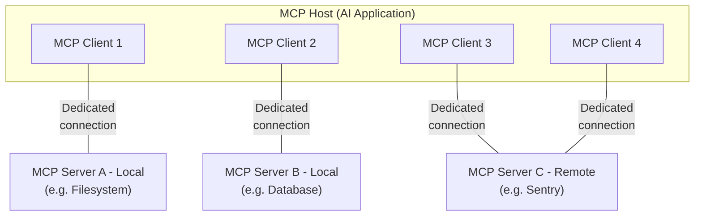

# 架构总览

本文概述模型上下文协议（Model Context Protocol，MCP），介绍其[范围](#scope)与[核心概念](#concepts-of-mcp)，并给出一个演示各核心概念的[示例](#example)。

由于 MCP SDK 已经封装了大量底层细节，对大多数开发者而言，最实用的可能就是[数据层协议](#data-layer-protocol)一节。该节讨论 MCP 服务器如何向 AI 应用提供上下文。

具体实现细节请参阅你所用[语言对应的 SDK](https://modelcontextprotocol.io/docs/2026-07-28/sdk) 的文档。

## 范围

模型上下文协议包含以下项目：

* [MCP 规范](https://modelcontextprotocol.io/specification/latest)：概述客户端与服务器实现要求的 MCP 规范。
* [MCP SDK](https://modelcontextprotocol.io/docs/2026-07-28/sdk)：实现 MCP 的各编程语言 SDK。
* **MCP 开发工具**：用于开发 MCP 服务器和客户端的工具，包括 [MCP Inspector](https://github.com/modelcontextprotocol/inspector)
* [MCP 参考服务器实现](https://github.com/modelcontextprotocol/servers)：MCP 服务器的参考实现。

> **注：**
> MCP 只关注上下文交换的协议本身——它并不规定 AI 应用如何使用 LLM，也不规定如何管理所提供的上下文。

## MCP 的概念

### 参与者

MCP 采用客户端-服务器架构：MCP 宿主（MCP host）——如 [Claude Code](https://www.anthropic.com/claude-code) 或 [Claude Desktop](https://www.claude.ai/download) 这样的 AI 应用——与一个或多个 MCP 服务器建立连接。MCP 宿主通过为每个 MCP 服务器创建一个 MCP 客户端来实现这一点，每个 MCP 客户端与其对应的 MCP 服务器之间维持一条专用连接。

使用 STDIO（标准输入输出）传输的本地 MCP 服务器通常只服务单个 MCP 客户端，而使用 Streamable HTTP 传输的远程 MCP 服务器通常同时服务多个 MCP 客户端。

MCP 架构中的关键参与者如下：

* **MCP 宿主**：协调并管理一个或多个 MCP 客户端的 AI 应用
* **MCP 客户端**：维持与 MCP 服务器的连接、并从 MCP 服务器获取上下文供 MCP 宿主使用的组件
* **MCP 服务器**：向 MCP 客户端提供上下文的程序

**举例**：Visual Studio Code 就是一个 MCP 宿主。当 Visual Studio Code 连接到某个 MCP 服务器（例如 [Sentry MCP 服务器](https://docs.sentry.io/product/sentry-mcp/)）时，Visual Studio Code 运行时会实例化一个 MCP 客户端对象来维持与该 Sentry MCP 服务器的连接。
当 Visual Studio Code 随后连接另一个 MCP 服务器（例如[本地文件系统服务器](https://github.com/modelcontextprotocol/servers/tree/main/src/filesystem)）时，Visual Studio Code 运行时会再实例化一个 MCP 客户端对象来维持这条连接。



注意，**MCP 服务器**指的是提供上下文数据的程序，与其运行位置无关。MCP 服务器既可以在本地运行，也可以在远程运行。例如，当 Claude Desktop 启动[文件系统服务器](https://github.com/modelcontextprotocol/servers/tree/main/src/filesystem)时，由于该服务器使用 STDIO 传输，它会运行在同一台机器上，这类服务器通常称为「本地」MCP 服务器。而官方的 [Sentry MCP 服务器](https://docs.sentry.io/product/sentry-mcp/)运行在 Sentry 平台上，使用 Streamable HTTP 传输，这类服务器通常称为「远程」MCP 服务器。

### 分层

MCP 由两层组成：

* **数据层（data layer）**：定义基于 JSON-RPC 的客户端-服务器通信协议，包括能力与版本的发现，以及工具、资源、提示词、通知等核心原语。
* **传输层（transport layer）**：定义使客户端与服务器之间能够交换数据的通信机制与通道，包括特定于传输的连接建立、消息帧（framing）封装与授权。

从概念上讲，数据层是内层，传输层是外层。

#### 数据层

数据层实现了基于 [JSON-RPC 2.0](https://www.jsonrpc.org/) 的交换协议，定义了消息的结构与语义。
这一层包括：

* **发现（Discovery）**：让客户端通过 `server/discover` 请求查询服务器支持的协议版本、能力与身份
* **服务器功能**：让服务器提供核心功能，包括供 AI 执行操作的工具、承载上下文数据的资源，以及用作客户端往来交互模板的提示词
* **客户端功能**：让服务器能够向用户征询输入。采样（sampling）自协议版本 `2026-07-28` 起[已弃用](https://modelcontextprotocol.io/specification/2026-07-28/deprecated)。
* **实用功能**：支持用于实时更新的通知、针对长时间运行操作的进度追踪等附加能力

#### 传输层

传输层管理客户端与服务器之间的通信通道和认证，负责连接建立、消息帧封装，以及 MCP 各参与方之间的安全通信。

MCP 支持两种传输机制：

* **Stdio 传输**：使用标准输入/输出流在同一台机器上的本地进程之间直接通信，性能最优且没有网络开销。
* **Streamable HTTP 传输**：客户端到服务器的消息使用 HTTP POST 发送，并可选使用 Server-Sent Events 获得流式能力。这种传输支持远程服务器通信，并支持标准 HTTP 认证方式，包括 bearer token、API key 和自定义请求头。MCP 建议使用 OAuth 获取认证令牌。

传输层为协议层屏蔽了通信细节，使所有传输机制都能使用同一种 JSON-RPC 2.0 消息格式。

### 数据层协议

MCP 的核心部分之一，是定义 MCP 客户端与 MCP 服务器之间的模式（schema）与语义。开发者很可能会觉得数据层——尤其是[原语](#primitives)这一组概念——是 MCP 最有意思的部分：它定义了开发者把上下文从 MCP 服务器共享给 MCP 客户端的方式。

MCP 使用 [JSON-RPC 2.0](https://www.jsonrpc.org/) 作为底层 RPC 协议。客户端和服务器相互发送请求并作出响应；不需要响应时可使用通知。

#### 无状态与发现

MCP 是一种<Tooltip tip="每个请求都自带处理它所需的全部信息，服务器不会从先前的请求推断任何状态">无状态协议</Tooltip>。每个请求都在自己的 `_meta` 字段中携带协议版本以及与该请求相关的<Tooltip tip="客户端或服务器支持的功能与操作，例如工具、资源或提示词">能力</Tooltip>，因此服务器可以独立处理每个请求。除非另有配置，客户端也应在同一字段中标识自己的身份。服务器通过必须实现的 [`server/discover`](https://modelcontextprotocol.io/specification/2026-07-28/server/discover) 请求公布自己支持的版本与能力，客户端可以在发送任何其他请求之前先发送它。详细信息见[规范](https://modelcontextprotocol.io/specification/2026-07-28/basic/index#statelessness)，[示例](#example)部分则演示了逐请求的元数据与发现流程。

#### 原语

MCP 原语是 MCP 中最重要的概念。它定义了客户端与服务器能彼此提供什么，规定了可以共享给 AI 应用的上下文信息类型，以及可以执行的操作范围。

MCP 定义了三种可由*服务器*暴露的核心原语：

* **工具（Tools）**：AI 应用可以调用以执行操作的函数（例如文件操作、API 调用、数据库查询）
* **资源（Resources）**：向 AI 应用提供上下文信息的数据源（例如文件内容、数据库记录、API 响应）
* **提示词（Prompts）**：帮助组织与语言模型交互结构的可复用模板（例如系统提示词、few-shot 示例）

每种原语都有相应的方法用于发现（`*/list`）、获取（`*/get`），某些情况下还有执行（`tools/call`）。
MCP 客户端会用 `*/list` 方法发现可用的原语。例如，客户端可以先列出所有可用工具（`tools/list`），再执行它们。这种设计使列表能够动态变化。

举一个具体例子：假设有一个提供数据库上下文的 MCP 服务器，它可以暴露用于查询数据库的工具、包含数据库结构（schema）的资源，以及一个包含 few-shot 示例、演示如何与这些工具交互的提示词。

关于服务器原语的更多细节，见[服务器概念](https://modelcontextprotocol.io/docs/2026-07-28/learn/server-concepts)。

MCP 还定义了可由*客户端*暴露的原语。这些原语让 MCP 服务器的作者可以构建更丰富的交互。

* **征询（Elicitation）**：允许服务器向用户请求更多信息。当服务器作者想从用户那里获取更多信息，或请求确认某个操作时，这一原语很有用。服务器通过 `elicitation/create` 方法请求用户输入。

征询请求通过[多次往返请求（Multi Round-Trip Requests）](https://modelcontextprotocol.io/specification/2026-07-28/basic/patterns/mrtr)模式传递，具体解释见[征询概述](https://modelcontextprotocol.io/docs/2026-07-28/learn/client-concepts#elicitation)。

**已弃用**：以下客户端原语自协议版本 `2026-07-28` 起已弃用。

* **采样（Sampling）**：允许服务器向客户端所在的 AI 应用请求语言模型补全。当服务器作者需要用到语言模型，又想保持模型无关、不在 MCP 服务器中内置语言模型 SDK 时，这一原语很有用。服务器通过 `sampling/createMessage` 方法请求补全，同样通过多次往返请求模式传递。新实现应直接对接 LLM 提供商的 API。
* **日志（Logging）**：让服务器能够向客户端发送日志消息，用于调试和监控。新实现应将日志输出到 `stderr`（stdio 传输）或使用 OpenTelemetry。

关于客户端原语的更多细节，见[客户端概念](https://modelcontextprotocol.io/docs/2026-07-28/learn/client-concepts)。

除服务器与客户端原语外，协议还支持在核心协议之上构建的可选[扩展](https://modelcontextprotocol.io/extensions/overview)。例如，[Tasks 扩展](https://modelcontextprotocol.io/extensions/tasks/overview)让服务器为长时间运行的请求返回一个持久句柄，客户端可据此轮询状态并在稍后取回结果。

#### 通知

协议支持实时通知，使服务器与客户端之间能够动态更新。例如，当服务器的可用工具发生变化（如新功能上线或既有工具被修改）时，服务器可以发送工具更新通知，告知已连接的客户端这些变化。通知以 JSON-RPC 2.0 通知消息的形式发送（不期待响应）。变更通知需要客户端主动订阅：客户端打开一个长生命周期的 [`subscriptions/listen`](https://modelcontextprotocol.io/specification/2026-07-28/basic/patterns/subscriptions) 流，并在其中声明想接收的通知类型，服务器就在该流上投递匹配的通知。

## 示例

### 数据层

本节逐步讲解一次 MCP 客户端-服务器交互，聚焦数据层协议。我们将用 JSON-RPC 2.0 消息演示发现、工具操作与通知。

  
    如[无状态与发现](#statelessness-and-discovery)一节所述，每个 MCP 请求都会在其 `_meta` 字段中携带协议版本和客户端能力，客户端还应在那里附上自己的身份。客户端若想在发出其他请求之前先了解服务器的支持情况，可以发送 `server/discover` 请求——这是每个服务器都必须实现的。发现响应通常可缓存，即可以被复用，因而不必为每个请求都执行一遍发现流程。

    <CodeGroup>
      ```json Discover Request theme={null}
      {
        "jsonrpc": "2.0",
        "id": 1,
        "method": "server/discover",
        "params": {
          "_meta": {
            "io.modelcontextprotocol/protocolVersion": "2026-07-28",
            "io.modelcontextprotocol/clientInfo": {
              "name": "example-client",
              "version": "1.0.0"
            },
            "io.modelcontextprotocol/clientCapabilities": {
              "elicitation": {}
            }
          }
        }
      }
      ```

      ```json Discover Response theme={null}
      {
        "jsonrpc": "2.0",
        "id": 1,
        "result": {
          "resultType": "complete",
          "supportedVersions": ["2026-07-28"],
          "capabilities": {
            "tools": {
              "listChanged": true
            },
            "resources": {}
          },
          "_meta": {
            "io.modelcontextprotocol/serverInfo": {
              "name": "example-server",
              "version": "1.0.0"
            }
          },
          "ttlMs": 3600000,
          "cacheScope": "public"
        }
      }
      ```
    </CodeGroup>

    #### 理解发现交换过程

    `_meta` 字段与发现响应共同承担几个作用：

    1. **协议版本选择**：`io.modelcontextprotocol/protocolVersion` 字段声明客户端在本次请求中使用的版本，响应中的 `supportedVersions` 列出服务器接受的版本。如果服务器不支持所请求的版本，会以 `UnsupportedProtocolVersionError` 拒绝该请求并列出自己支持的版本，客户端再改用双方都支持的版本重试。
    2. **能力发现**：客户端在每次请求的 `io.modelcontextprotocol/clientCapabilities` 中声明自己的能力，服务器则通过 `server/discover` 返回自己的 `capabilities` 对象。这告诉双方彼此能处理哪些[原语](#primitives)（工具、资源、提示词）、变更[通知](#notifications)是否可用，从而避免尝试不支持的操作。
    3. **身份交换**：请求 `_meta` 中的 `io.modelcontextprotocol/clientInfo` 字段与结果 `_meta` 中的 `io.modelcontextprotocol/serverInfo` 字段提供标识与版本信息，用于调试和兼容性判断。

    在这个例子中，这轮交换展示了 MCP 能力是如何声明的：

    **客户端能力**：

    * `"elicitation": {}` —— 客户端声明：当服务器提出请求时，它能够从用户那里收集额外输入

    **服务器能力**：

    * `"tools": {"listChanged": true}` —— 服务器支持工具原语，并能响应 [`subscriptions/listen`](https://modelcontextprotocol.io/specification/2026-07-28/basic/patterns/subscriptions) 中的 `toolsListChanged` 过滤器。请求了该过滤器的客户端会在工具列表变化时收到 `notifications/tools/list_changed`。
    * `"resources": {}` —— 服务器同样支持资源原语（能处理 `resources/list` 与 `resources/read` 方法）

    调用 `server/discover` 是可选的。由于每个请求都携带同样的 `_meta` 字段，客户端完全可以直接发送任意请求，并在返回版本错误时再作处理。发现提供了一种便捷方式：用一次请求同时获取服务器的身份、能力和支持的版本。

    #### 这在 AI 应用中如何运作

    AI 应用的 MCP 客户端管理器连接配置好的服务器，并保存发现到的能力供后续使用。应用据此判断哪些服务器能提供特定类型的功能（工具、资源、提示词）以及是否支持实时更新。在 Python SDK 中，发现发生在客户端连接的过程中，结果随后可从客户端对象上获取。

    ```python Pseudo-code for AI application discovery theme={null}
    # Pseudo Code
    async with Client(stdio_client(server_config)) as client:
        if client.server_capabilities.tools:
            app.register_mcp_server(client, supports_tools=True)
        app.set_server_ready(client)
    ```

  
    客户端可以通过发送 `tools/list` 请求来发现可用工具。这个请求是 MCP 工具发现机制的基础：它让客户端在使用工具之前，先了解服务器上有哪些工具可用。

    <CodeGroup>
      ```json Tools List Request theme={null}
      {
        "jsonrpc": "2.0",
        "id": 2,
        "method": "tools/list",
        "params": {
          "_meta": {
            "io.modelcontextprotocol/protocolVersion": "2026-07-28",
            "io.modelcontextprotocol/clientInfo": {
              "name": "example-client",
              "version": "1.0.0"
            },
            "io.modelcontextprotocol/clientCapabilities": {
              "elicitation": {}
            }
          }
        }
      }
      ```

      ```json Tools List Response theme={null}
      {
        "jsonrpc": "2.0",
        "id": 2,
        "result": {
          "resultType": "complete",
          "tools": [
            {
              "name": "calculator_arithmetic",
              "title": "Calculator",
              "description": "Perform mathematical calculations including basic arithmetic, trigonometric functions, and algebraic operations",
              "inputSchema": {
                "type": "object",
                "properties": {
                  "expression": {
                    "type": "string",
                    "description": "Mathematical expression to evaluate (e.g., '2 + 3 * 4', 'sin(30)', 'sqrt(16)')"
                  }
                },
                "required": ["expression"]
              }
            },
            {
              "name": "weather_current",
              "title": "Weather Information",
              "description": "Get current weather information for any location worldwide",
              "inputSchema": {
                "type": "object",
                "properties": {
                  "location": {
                    "type": "string",
                    "description": "City name, address, or coordinates (latitude,longitude)"
                  },
                  "units": {
                    "type": "string",
                    "enum": ["metric", "imperial", "kelvin"],
                    "description": "Temperature units to use in response",
                    "default": "metric"
                  }
                },
                "required": ["location"]
              }
            }
          ],
          "ttlMs": 300000,
          "cacheScope": "public"
        }
      }
      ```
    </CodeGroup>

    #### 理解工具发现请求

    `tools/list` 请求除每个 MCP 请求都会携带的标准 `_meta` 字段外，不需要任何其他参数。它还可接受一个可选的 `cursor` 参数用于[分页](https://modelcontextprotocol.io/specification/2026-07-28/server/utilities/pagination)，上面的示例省略了该参数。

    #### 理解工具发现响应

    响应中包含一个 `tools` 数组，提供每个可用工具的完整元数据。这种基于数组的结构让服务器能同时暴露多个工具，同时在不同功能之间保持清晰边界。

    响应中的每个工具对象都包含几个关键字段：

    * **`name`**：工具在服务器命名空间内的唯一标识，是工具执行时的主键，应遵循清晰的命名模式（例如 `calculator_arithmetic`，而不只是 `calculate`）
    * **`title`**：人类可读的工具显示名称，客户端可以将其展示给用户
    * **`description`**：对工具做什么、何时使用的详细说明
    * **`inputSchema`**：定义预期输入参数的 JSON Schema，用于类型校验，并清晰说明哪些参数必填、哪些可选

    结果标记为 `"resultType": "complete"`，并携带两个缓存字段。`ttlMs` 是以毫秒为单位的新鲜度提示，因此这份工具列表可以缓存五分钟。`cacheScope` 指明谁可以复用该响应。完整规则由规范中的[缓存实用功能](https://modelcontextprotocol.io/specification/2026-07-28/server/utilities/caching)定义。

    #### 这在 AI 应用中如何运作

    AI 应用从所有已连接的 MCP 服务器拉取可用工具，并把它们合并成一个语言模型可以访问的统一工具注册表。这让 LLM 知道自己能执行哪些操作，并在对话过程中自动生成相应的工具调用。

    ```python Pseudo-code for AI application tool discovery theme={null}
    # Pseudo-code using MCP Python SDK patterns
    available_tools = []
    for client in app.mcp_clients():
        tools_response = await client.list_tools()
        available_tools.extend(tools_response.tools)
    conversation.register_available_tools(available_tools)
    ```

    聚合大量服务器的客户端可以使用[渐进式工具发现](https://modelcontextprotocol.io/docs/2026-07-28/develop/clients/client-best-practices#progressive-tool-discovery)，而不必一开始就加载全部工具。

  

    现在，客户端可以使用 `tools/call` 方法执行工具了。这演示了 MCP 原语在实践中的用法：发现可用工具之后，客户端就能带上合适的参数调用它们。

    #### 理解工具执行请求

    `tools/call` 请求遵循结构化格式，确保类型安全以及客户端与服务器之间的清晰通信。注意，这里用的是发现响应中正确的工具名（`weather_current`），而不是简化名称：

    <CodeGroup>
      ```json Tool Call Request theme={null}
      {
        "jsonrpc": "2.0",
        "id": 3,
        "method": "tools/call",
        "params": {
          "name": "weather_current",
          "arguments": {
            "location": "San Francisco",
            "units": "imperial"
          },
          "_meta": {
            "io.modelcontextprotocol/protocolVersion": "2026-07-28",
            "io.modelcontextprotocol/clientInfo": {
              "name": "example-client",
              "version": "1.0.0"
            },
            "io.modelcontextprotocol/clientCapabilities": {
              "elicitation": {}
            }
          }
        }
      }
      ```

      ```json Tool Call Response theme={null}
      {
        "jsonrpc": "2.0",
        "id": 3,
        "result": {
          "resultType": "complete",
          "content": [
            {
              "type": "text",
              "text": "Current weather in San Francisco: 68°F, partly cloudy with light winds from the west at 8 mph. Humidity: 65%"
            }
          ]
        }
      }
      ```
    </CodeGroup>

    #### 工具执行的关键要素

    请求结构包含几个重要组成部分：

    1. **`name`**：必须与发现响应中的工具名（`weather_current`）完全一致，以确保服务器能正确识别要执行的工具。
    2. **`arguments`**：包含由工具 `inputSchema` 定义的输入参数。本例中：
       * `location`："San Francisco"（必填参数）
       * `units`："imperial"（可选参数，未指定时默认为 "metric"）
    3. **`_meta`**：携带标准的逐请求字段：每个 MCP 请求都必须包含的协议版本与客户端能力，外加客户端身份（除非另有配置，客户端都应附上）。
    4. **JSON-RPC 结构**：使用标准 JSON-RPC 2.0 格式，以唯一的 `id` 关联请求与响应。

    #### 理解工具执行响应

    响应展示了 MCP 灵活的内容系统：

    1. **`content` 数组**：工具响应返回内容对象数组，支持文本、图像、资源等多种格式的丰富响应
    2. **内容类型**：每个内容对象都有一个 `type` 字段。本例中 `"type": "text"` 表示纯文本内容，但 MCP 针对不同场景支持多种内容类型。
    3. **结构化输出**：响应提供的是可据此采取行动的信息，AI 应用可将其用作与语言模型交互的上下文。

    这种执行模式让 AI 应用能够动态调用服务器功能，并接收可融入与语言模型对话的结构化响应。

    #### 这在 AI 应用中如何运作

    当语言模型在对话中决定使用某个工具时，AI 应用会拦截该工具调用，把它路由到对应的 MCP 服务器执行，然后把结果作为对话流程的一部分返回给 LLM。这使 LLM 能够访问实时数据，并在外部世界中执行操作。

    ```python theme={null}
    # Pseudo-code for AI application tool execution
    async def handle_tool_call(conversation, tool_name, arguments):
        client = app.find_mcp_client_for_tool(tool_name)
        result = await client.call_tool(tool_name, arguments)
        conversation.add_tool_result(result.content)
    ```
  

  
    MCP 支持实时通知，让服务器无需被轮询就能把变化告知客户端。这一部分演示通知系统——它是保持客户端同步与响应能力的关键特性。

    #### 订阅变更

    变更通知需要主动订阅。为了接收通知，客户端发送 [`subscriptions/listen`](https://modelcontextprotocol.io/specification/2026-07-28/basic/patterns/subscriptions) 请求打开一条长生命周期的通知流，并在请求的 `notifications` 过滤器中声明想要的事件类型。这里客户端订阅的是工具列表变化：

    ```json Listen Request theme={null}
    {
      "jsonrpc": "2.0",
      "id": 4,
      "method": "subscriptions/listen",
      "params": {
        "_meta": {
          "io.modelcontextprotocol/protocolVersion": "2026-07-28",
          "io.modelcontextprotocol/clientInfo": {
            "name": "example-client",
            "version": "1.0.0"
          },
          "io.modelcontextprotocol/clientCapabilities": {
            "elicitation": {}
          }
        },
        "notifications": {
          "toolsListChanged": true
        }
      }
    }
    ```

    每个客户端请求都会在 `_meta` 中携带 `io.modelcontextprotocol/protocolVersion` 与 `io.modelcontextprotocol/clientCapabilities` 字段，通常还有 `io.modelcontextprotocol/clientInfo`，这样服务器无需依赖连接状态就能识别客户端。

    服务器以 `notifications/subscriptions/acknowledged` 确认订阅。这是第一条在 `_meta` 中携带该订阅 ID 的消息（在此之前，服务器不会为该订阅发送任何其他通知）。它的 `notifications` 字段反映服务器同意履行的所请求过滤器的子集，不支持的通知类型会被省略：

    ```json Acknowledgment theme={null}
    {
      "jsonrpc": "2.0",
      "method": "notifications/subscriptions/acknowledged",
      "params": {
        "_meta": {
          "io.modelcontextprotocol/subscriptionId": 4
        },
        "notifications": {
          "toolsListChanged": true
        }
      }
    }
    ```

    #### 理解工具列表变更通知

    确认之后，当服务器的可用工具发生变化（例如新功能上线、既有工具被修改，或工具暂时不可用）时，服务器会在该流上投递一条通知：

    ```json Notification theme={null}
    {
      "jsonrpc": "2.0",
      "method": "notifications/tools/list_changed",
      "params": {
        "_meta": {
          "io.modelcontextprotocol/subscriptionId": 4
        }
      }
    }
    ```

    #### MCP 通知的关键特性

    1. **无需响应**：注意，通知中没有 `id` 字段。这遵循 JSON-RPC 2.0 的通知语义——既不期待响应，也不会发送响应。
    2. **基于主动订阅**：该通知只会发送给在 `subscriptions/listen` 过滤器中请求了 `"toolsListChanged": true` 的客户端，并且只有在其工具能力中声明了 `"listChanged": true` 的服务器才能提供（如第 1 步所示）。
    3. **订阅 ID 标记**：流上的每条通知都在 `_meta` 中携带 `io.modelcontextprotocol/subscriptionId`。它的值是打开该流的 `subscriptions/listen` 请求的 JSON-RPC ID（本例中为 `4`），客户端据此把每条通知与产生它的订阅关联起来。
    4. **事件驱动**：服务器根据内部状态变化决定何时发送通知，使 MCP 连接具备动态性和响应能力。
    5. **尽力而为**：不保证每条通知都会被发送或收到，跨越传输重连时尤其如此。客户端还应借助轮询来保持结果的新鲜度。

    #### 客户端对通知的响应

    收到这条通知后，客户端通常会重新请求更新后的工具列表。由此形成一个刷新循环，使客户端对可用工具的认知保持最新：

    ```json Request theme={null}
    {
      "jsonrpc": "2.0",
      "id": 5,
      "method": "tools/list",
      "params": {
        "_meta": {
          "io.modelcontextprotocol/protocolVersion": "2026-07-28",
          "io.modelcontextprotocol/clientInfo": {
            "name": "example-client",
            "version": "1.0.0"
          },
          "io.modelcontextprotocol/clientCapabilities": {
            "elicitation": {}
          }
        }
      }
    }
    ```

    #### 通知为何重要

    通知系统之所以重要，原因有几点：

    1. **动态环境**：工具可能随服务器状态、外部依赖或用户权限的变化而出现或消失
    2. **效率**：客户端无需轮询变化，更新发生时会收到通知
    3. **一致性**：确保客户端始终掌握关于服务器可用能力的准确信息
    4. **实时协作**：让 AI 应用具备响应能力，能够适应不断变化的上下文

    这一通知模式并不限于工具，也适用于其他 MCP 原语，从而在客户端与服务器之间实现全面的实时同步。

    #### 这在 AI 应用中如何运作

    AI 应用会为自己关心的变更保持一条打开的通知流。通知一到，它就立即刷新工具注册表，并更新 LLM 可用的能力。这确保进行中的对话始终能用上最新的工具集合，LLM 也能随新功能的上线动态适应。

    ```python theme={null}
    # Pseudo-code for AI application notification handling
    async def follow_tool_changes(client):
        async with client.listen(tools_list_changed=True) as sub:
            async for _event in sub:
                tools_response = await client.list_tools()
                app.update_available_tools(client, tools_response.tools)
                if app.conversation.is_active():
                    app.conversation.notify_llm_of_new_capabilities()
    ```
  
