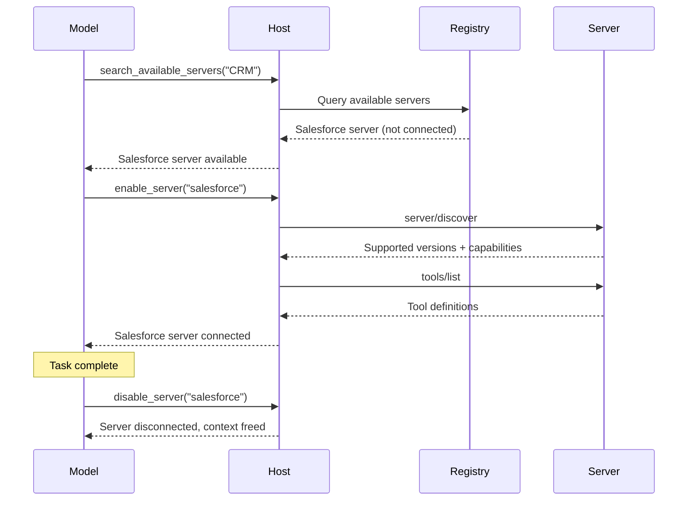
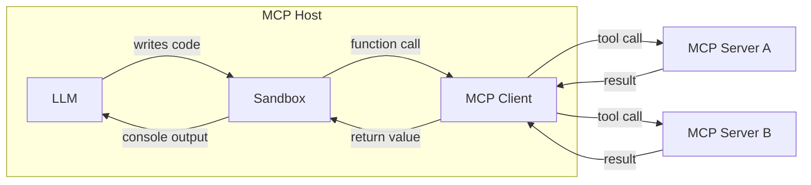

# 客户端最佳实践

> 让 MCP 宿主应用在接入大量服务器与工具时依然可扩展的一系列模式。

随着智能体（agent）等 MCP 宿主应用连接越来越多的 MCP 服务器、可访问的工具累积到成百上千个，朴素的工具管理方式就会失效。一开始就把全部工具定义装进模型的上下文窗口，会浪费 token、增加延迟，还会拉低模型性能。若再让大型中间结果在连续的工具调用之间经由模型传递，问题会进一步加剧。

有两种模式可以应对这些挑战：**渐进式发现（progressive discovery）**控制工具定义*何时*进入上下文，**程序化工具调用（programmatic tool calling）**控制工具*如何*被调用。

## 渐进式工具发现

朴素的 MCP 宿主实现会在每次对话开始时，把所有已连接服务器的工具定义直接交给模型。工具只有寥寥几个时，这样做完全合理；但当宿主接入数十个服务器、面对数百个工具时，光是这些定义就可能占掉上下文窗口的大部分——而此时模型甚至还没读到用户的消息。


渐进式发现规避了这一问题：

* 宿主照常通过 `tools/list` 获取工具定义，但延迟注入模型的上下文。
* 宿主向模型提供一个轻量级的 `search_tools` 元工具（meta-tool）。
* 宿主只在需要时才把完整定义装进上下文。

### 何时使用渐进式发现

渐进式发现最适合用在工具定义占用上下文窗口很大一部分的场景。如果工具集很小、工具定义只占上下文窗口的一小部分，加载全部工具完全没问题。一旦工具定义占掉可用上下文窗口的相当大一部分，客户端就应切换到渐进式发现。我们建议客户端通过设置阈值来判断何时切换：

* 按上下文窗口的百分比设定阈值，例如 1%-5%。
* 加载工具定义；一旦达到阈值，就切换到渐进式发现。

### 选择发现策略

模型调用 `search_tools` 工具后，就需要选定一种搜索策略：

* **基于关键词**：关键词匹配（BM25、正则表达式）。简单有效，尤其适合描述性强的工具名和工具描述。
* **基于嵌入（embedding）**：对工具描述做向量相似度检索。能更好地处理同义词与语义匹配。
* **基于子智能体**：由辅助模型（通常是 Claude Haiku 或 Gemini Flash 这类小而快的模型）为任务挑选工具。通常效果很好，但成本可能高于基于嵌入或基于关键词的方案。
* **混合式**：组合多种方法。例如对关键词排序与嵌入排序综合打分，或根据用例或查询选择不同策略。

一些模型提供商已经内置了工具搜索。例如 [OpenAI](https://developers.openai.com/api/docs/guides/tools-tool-search) 和 [Anthropic](https://platform.claude.com/docs/en/agents-and-tools/tool-use/tool-search-tool) 就原生支持；可查阅你的提供商文档，确认是否有等价功能。如果平台已提供，可优先于自定义实现。当提供商没有提供，或你需要特殊的检索逻辑（例如面向特定领域的排序、访问控制过滤）时，再自行构建。

下文的三层模式详细展示了一种基于搜索的自定义方案，但（目录、检视、执行）这一分层原则与检索机制无关，普遍适用。

### 使用渐进式发现

渐进式发现的一种常见实现采用基于搜索的三层方法：

**第 1 层：目录（Catalog）。** 宿主暴露少量用于搜索可用能力的元工具。`search_tools` 工具接受自然语言查询，返回匹配的工具名称及简要描述。

```typescript theme={null}
// The model calls a lightweight search tool
search_tools({ query: "update salesforce record" })

// Returns concise matches: names and one-line descriptions only
→ [
    { name: "salesforce_updateRecord", description: "Update fields on a Salesforce object" },
    { name: "salesforce_upsertRecord", description: "Insert or update based on external ID" }
  ]
```

**第 2 层：检视（Inspect）。** 模型确定候选工具后，只获取该工具的完整定义（输入 schema、输出 schema、文档）。

```typescript theme={null}
// The model inspects only the tool it needs
get_tool_details({ name: "salesforce_updateRecord" });
```

这会返回单个工具的完整 schema：

```json theme={null}
{
  "name": "salesforce_updateRecord",
  "description": "Updates a record in Salesforce",
  "inputSchema": {
    "type": "object",
    "properties": {
      "objectType": {
        "type": "string",
        "description": "Salesforce object type"
      },
      "recordId": { "type": "string", "description": "Record ID to update" },
      "data": { "type": "object", "description": "Fields to update" }
    },
    "required": ["objectType", "recordId", "data"]
  }
}
```

**第 3 层：执行（Execute）。** 模型只加载需要的定义，就能在完全掌握工具接口的情况下调用工具。

这种模式能大幅降低 token 用量，还可能提升工具选择的准确率：模型只需关注少数相关工具，而不必在数百个无关工具中逐一扫描。其他发现策略（嵌入、子智能体等）遵循同样的分层原则，只是把目录层的检索机制换成别的。

### 动态服务器管理

渐进式发现不仅适用于单个工具，还可以扩展到整个服务器。宿主无需在启动时连接所有已配置的服务器，而是可以：

1. 维护一份可用服务器及其能力概要的注册表。
2. 仅当模型判断需要某台服务器的能力时才连接它。
3. 断开与当前任务不再相关的服务器，释放上下文。



这种做法对通用智能体尤其有效，因为用户意图事先未知。智能体启动时只配备一组最少的常驻服务器，其余按需连接。再结合 [agent skills](https://modelcontextprotocol.io/docs/2026-07-28/develop/build-with-agent-skills)，技能文件可以声明自己需要哪些 MCP 服务器，宿主只在该技能被调用时才去连接它们。

### 实现指南

实现渐进式发现时：

| 指南 | 理由 |
| --- | --- |
| **提供多种详细程度** | 让模型在「仅名称」「名称+描述」「完整 schema」几种响应之间做选择。 |
| **缓存工具定义** | 从服务器取到定义后，在宿主侧做记忆化（memoize），之后重新注入时无需再发起一次 `tools/list` 往返。它与当前已在模型上下文中的内容相互独立。 |
| **在 `list_changed` 时刷新** | 服务器发送 `notifications/tools/list_changed` 时，为搜索目录重建索引。 |
| **按服务器对工具分组** | 按来源服务器组织展示工具，便于模型对相关能力进行推理。 |

### 缓存

每个列表结果（如 `tools/list`），以及每个 `server/discover` 和 `resources/read` 结果，都携带 `ttlMs` 和 `cacheScope` 提示。请按规范中[缓存实用工具](https://modelcontextprotocol.io/specification/2026-07-28/server/utilities/caching)的定义遵循这些提示。尤其注意：一旦收到 `list_changed` 通知，即使 TTL 尚未到期，也应把已缓存的列表视为过期。

### 与提示词缓存的交互

大多数提供商会缓存提示词前缀（包括 `tools` 数组）。在对话中途增删工具定义会使缓存失效，由此产生的缓存未命中，其 token 开销可能比删掉的那些定义还高。要保持缓存有效：

* 把新发现的定义追加到缓存断点之后，而不是对 `tools` 数组重新排序；或者让所有调用都经由同一个稳定的 `call_tool({name, args})` 元工具，使该数组永不变化。
* 把服务器断连视为会话边界级的操作，而非逐轮操作。
* 除上文给出的工具搜索链接外，还应查阅你所用提供商的缓存文档。

## 程序化工具调用 / 代码模式

在直接工具调用（direct tool calling）下，每次工具调用都是一次往返：模型生成工具调用，客户端执行，完整结果再回流到模型的上下文。当任务需要串联多个工具（读取一份文档、做转换、再写到别处）时，每个中间结果都要经过模型，消耗 token、增加延迟——哪怕这些中间结果与模型毫无关系。

程序化工具调用（有时也称「代码模式」，code mode）为客户端提供了一种高效**组合工具调用**的方式：模型不再直接调用工具，而是编写调用工具的代码。代码在沙箱（sandbox）环境中执行，只有最终结果返回给模型。

程序化工具调用功能强大，可以更高效地使用 MCP 工具与资源，但需要客户端实现沙箱环境。


### 工作原理

宿主把 MCP 工具 schema 转换为沙箱内可用的类型化 API。模型需要工具时，便编写一段脚本并执行。

**第 1 步：从 MCP schema 生成程序化 API。** 宿主读取每个服务器的工具定义，并基于各工具的参数与 `outputSchema` 产出类型化函数：

```typescript theme={null}
// Auto-generated from the Logging MCP server's tool schema
interface LogEntry {
  timestamp: string;
  message: string;
  level: string;
}

function logging_getLogs(input: {
  level: "error" | "warn" | "info";
  since: number;
}): Promise<{ entries: LogEntry[] }> {
  return mcp.callTool<{ entries: LogEntry[] }>("logging_getLogs", input);
}

// Auto-generated from the Ticketing MCP server's tool schema
function ticketing_createIssue(input: {
  title: string;
  body?: string;
  priority: "low" | "medium" | "high";
}): Promise<{ issueId: string }> {
  return mcp.callTool<{ issueId: string }>("ticketing_createIssue", input);
}
```

MCP 服务器可以为每个工具提供可选的 [`outputSchema`](https://modelcontextprotocol.io/specification/2026-07-28/server/tools#output-schema)。存在输出 schema 时，宿主就能产出精确的返回类型（如上面的 `LogEntry`）。

没有输出 schema 时，优先选择简单的路线：

* **使用泛型，继续推进。** 接受 `any` 或 `string`，把非结构化输出留到下游处理。真正的解决办法是让服务器作者提供 `outputSchema`。
* **用快速模型提取类型化结果**，适用于循环之外的一次性调用。通过与 MCP 工具调用相同的函数桩拦截路径，暴露一个由宿主中介（broker）提供的 `extract(value, ExpectedType)` 辅助函数，使沙箱自身永不打开网络连接。该辅助函数会路由到一个小模型（例如 Claude Haiku 或 Gemini Flash），把值规整为 `ExpectedType`。这会增加每次调用的延迟，且可能产生幻觉或丢失字段，因此使用前先按 `ExpectedType` 校验结果。

**第 2 步：模型基于这些 API 编写代码。** 模型不再分别发起工具调用、让完整结果在调用之间流经上下文，而是编写一段脚本。设想这样一个任务：「找出过去一小时内的所有错误日志，并为每种去重后的错误各建一张工单」。在直接工具调用下，数千条日志会流经模型的上下文；而用代码，模型直接在沙箱中过滤：

```typescript theme={null}
// Model-generated code, executes in sandbox
const logs = await logging_getLogs({
  level: "error",
  since: Date.now() - 3600000,
});

// Filter and deduplicate inside the sandbox, not in the model's context
const uniqueErrors = new Map<string, LogEntry>();
for (const log of logs.entries) {
  if (!uniqueErrors.has(log.message)) {
    uniqueErrors.set(log.message, log);
  }
}

for (const [message, log] of uniqueErrors) {
  await ticketing_createIssue({
    title: `Error: ${message}`,
    body: `First seen: ${log.timestamp}\nOccurrences: ${
      logs.entries.filter((l) => l.message === message).length
    }`,
    priority: "high",
  });
}

console.log(
  `Filed ${uniqueErrors.size} tickets from ${logs.entries.length} error logs`,
);
```

**第 3 步：沙箱执行代码。** 沙箱内的函数调用会被拦截，并经宿主中介路由到对应的 MCP 服务器。日志数据与工单创建在服务器之间直接流转，全程不进入模型的上下文。只有 `console.log` 的输出——一行摘要——会返回给模型。

### 选择沙箱

选择哪种沙箱，取决于你想让模型编写什么语言、你的宿主应用使用什么语言，以及你需要多强的隔离。下表列出的是示例运行时而非背书；请结合自身用例评估其成熟度：

| 沙箱内语言 | 运行时 / 库 | 宿主语言 | 方式 |
| --- | --- | --- | --- |
| **JavaScript** | [Deno](https://github.com/denoland/deno)、`isolated-vm` | Rust / Node / CLI | 基于 V8 的运行时，具备细粒度权限；可禁用全部权限实现完全锁定。 |
| **Python** | [Monty](https://github.com/pydantic/monty) *（实验性）* | Rust | 为 AI 用例打造的极简 Python 解释器，默认无 I/O。 |
| **TypeScript** | [pctx](https://github.com/portofcontext/pctx) *（早期阶段）* | Python / Rust | 以库的形式整合代码模式概念，并提供底层 Rust 支持。 |
| **任意语言（经 Wasm）** | [Wasmtime](https://github.com/bytecodealliance/wasmtime) | Rust / C / Go | 把任意语言编译为 Wasm，以基于能力的安全机制运行。 |

无论选择哪种沙箱，集成模式都一样：宿主注入函数桩，经进程内通道或 stdio 通道拦截调用（这样网络权限可以保持完全拒绝），再将其作为 `tools/call` 请求分发给 MCP 服务器。

### 执行架构

该实现包含三个组成部分：



**沙箱**在没有直接网络访问的隔离环境中运行模型生成的代码。它与外界的唯一接口是生成的函数桩，函数桩把调用路由回宿主。

**宿主**充当中介：接收来自沙箱的函数调用，映射到正确的 MCP 服务器，执行工具调用，再把结果返回给沙箱。授权令牌与凭据由宿主持有，绝不会暴露给生成的代码。

**模型**只能看到沙箱返回的内容，通常是 `console.log` 语句的输出或最终返回值。这让模型（以及客户端开发者）能精确控制哪些内容进入上下文窗口。

### 安全注意事项

程序化工具调用引入了一个需要认真做沙箱隔离的代码执行面：

* **按调用授权**：就规范而言，中介仍然是 MCP 宿主。对沙箱发起的调用，应采用与直接调用相同的人工介入确认（human-in-the-loop）策略（参见[工具：安全](https://modelcontextprotocol.io/specification/2026-07-28/server/tools#security-considerations)）。批准脚本并不等于对其运行时发起的每一次工具调用都给予一揽子许可；宿主可以给出类别级批准（例如「允许本次脚本运行调用 `ticketing_createIssue`」），而不必每次迭代都请求确认，但中介仍须对照该授权逐一评估每次调用。
* **跨服务器数据流**：一个服务器的工具结果对另一个服务器而言是不可信输入。中介对中转调用应采用与直接调用相同的输入审查策略；仅靠输出截断并不能防止数据外泄。
* **网络隔离**：沙箱不应有直接网络访问。所有对外通信都经由宿主中介，由它执行授权与访问控制。
* **不暴露凭据**：API 密钥与令牌由宿主持有。生成的代码只调用类型化函数，由宿主在转发给服务器时附加认证。
* **资源限制**：为沙箱执行设置超时与内存上限，防止脚本失控。
* **输出过滤**：沙箱控制台输出在回传给模型前，先做校验与截断。

### 错误处理

MCP 工具错误以携带 [`isError: true`](https://modelcontextprotocol.io/specification/2026-07-28/server/tools#error-handling) 的成功响应形式返回，而非传输故障。生成的包装函数应把它转换为抛出的异常，让模型编写的代码能用 `try`/`catch` 处理。若某个未捕获的错误导致脚本终止，应把它作为脚本的结果返回给模型，便于其自我修正；模型则需负责报告已实际产生的部分副作用。

## 组合两种模式

渐进式发现与程序化工具调用相辅相成。模型先用发现工具确定自己需要哪些工具，加载它们的 schema，然后编写一段脚本，在一次执行中调用多个工具。这一组合能把工具定义与工具结果的 token 成本*都*降到最低，让模型的上下文专注于推理，而不是被当作数据通道。
