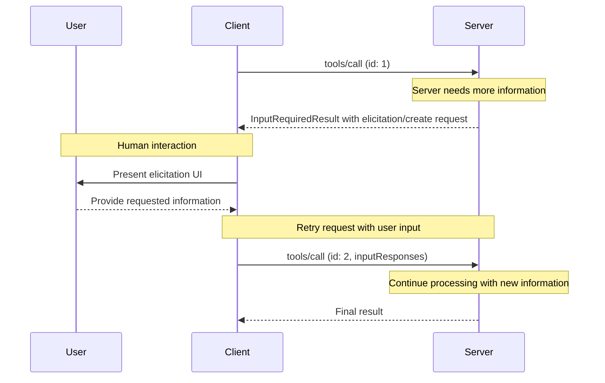
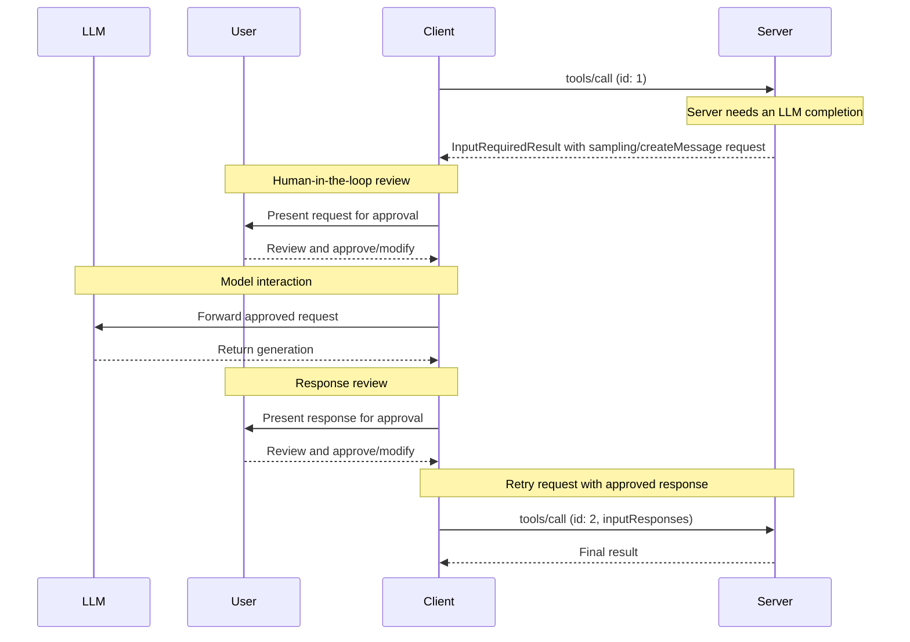

# 理解 MCP 客户端

MCP 客户端由宿主应用实例化，用于与特定的 MCP 服务器通信。宿主应用（如 Claude.ai 或某个 IDE）负责整体用户体验，并协调多个客户端。每个客户端只处理与单个服务器之间的直接通信。

理解这一区别很重要：*宿主*（host）是用户直接交互的应用，而*客户端*（client）是实现服务器连接的协议层组件。

## 客户端核心功能

客户端除了利用服务器提供的上下文之外，还可以向服务器提供若干功能。这些客户端功能让服务器作者能够构建更丰富的交互。

| 功能                    | 说明                                                                                                                                                                                              | 示例                                                                                              |
| ----------------------- | --------------------------------------------------------------------------------------------------------------------------------------------------------------------------------------------------------------------------------------- | ------------------------------------------------------------------------------------------------- |
| **征询（elicitation）** | 征询让服务器能在交互过程中向用户征求特定信息，为服务器提供了一种按需收集信息的结构化方式。                                                                                                                  | 预订旅行的服务器可以询问用户的机票座位偏好、房型或联系电话，以完成预订。                                   |
| **根目录（roots）**     | 根目录允许客户端指定服务器应关注哪些目录，通过一种协调机制传达预期范围。根目录自协议版本 `2026-07-28` 起[已弃用](https://modelcontextprotocol.io/specification/2026-07-28/deprecated)。                        | 预订旅行的服务器可以被授权访问某个特定目录，并从中读取用户的日历。                                         |
| **采样（sampling）**    | 采样允许服务器通过客户端请求 LLM 补全，从而实现智能体工作流。这种方式让客户端完全掌控用户权限与安全措施。采样自协议版本 `2026-07-28` 起已弃用。                                                              | 预订旅行的服务器可以把一份航班列表发给 LLM，请 LLM 为用户挑选最佳航班。                                     |

### 征询

征询让服务器能够在交互过程中向用户征求特定信息，构建更动态、响应更及时的工作流。

#### 概述

征询为服务器提供了一种按需收集所需信息的结构化方式。服务器不必预先要求用户提供全部信息，也不必在数据缺失时直接失败，而是可以暂停操作，向用户征求特定输入。由此形成更灵活的交互：服务器顺应用户需求调整，而不是拘泥于固定模式。

征询支持两种模式：

* **表单模式（form mode）**：服务器请求客户端向用户收集结构化数据。请求中包含一个 schema，客户端用它构建输入表单并校验响应。
* **URL 模式（URL mode）**：服务器提供一个供用户打开的 URL。交互在带外（out of band）进行，数据绝不会经过客户端，因此该模式适用于凭据输入、第三方 OAuth 授权等敏感流程。

征询遵循[多次往返请求](https://modelcontextprotocol.io/specification/2026-07-28/basic/patterns/mrtr)（Multi Round-Trip Requests，MRTR）模式。当服务器在处理 `tools/call` 之类请求的过程中需要用户输入时，会返回一个 `InputRequiredResult`，其 `inputRequests` 字段携带一个或多个 `elicitation/create` 请求。客户端收集输入后重试原始请求，附上收集到的 `inputResponses`，并回传服务器附带的所有 `requestState`。

**征询流程：**



这一流程实现了动态的信息收集：服务器可以在需要时请求特定数据，用户通过合适的 UI 提供信息，服务器再借助新获取的上下文完成重试请求的处理。

**征询请求示例（内嵌于 `InputRequiredResult.inputRequests` 中送达）：**

```typescript theme={null}
{
  method: "elicitation/create",
  params: {
    mode: "form",
    message: "Please confirm your Barcelona vacation booking details:",
    requestedSchema: {
      type: "object",
      properties: {
        confirmBooking: {
          type: "boolean",
          description: "Confirm the booking (Flights + Hotel = $3,000)"
        },
        seatPreference: {
          type: "string",
          enum: ["window", "aisle", "no preference"],
          description: "Preferred seat type for flights"
        },
        roomType: {
          type: "string",
          enum: ["sea view", "city view", "garden view"],
          description: "Preferred room type at hotel"
        },
        travelInsurance: {
          type: "boolean",
          default: false,
          description: "Add travel insurance ($150)"
        }
      },
      required: ["confirmBooking"]
    }
  }
}
```

#### 示例：度假预订审批

旅行预订服务器以最后的预订确认环节为例，展示了征询的强大之处。当用户选定心仪的巴塞罗那度假套餐后，服务器需要先征得最终确认、补齐缺失的细节，才能继续。

服务器用一个结构化请求来征询预订确认，其中包含行程摘要（6 月 15-22 日的巴塞罗那航班、海滨酒店、总计 \$3,000），并附带可填写额外偏好的字段——例如座位选择、房型或旅行保险选项。

随着预订推进，服务器还会征询完成预订所需的联系方式，例如航班预订所需的旅客信息、对酒店的特殊要求，或紧急联系人信息。

#### 用户交互模型

征询交互的设计目标是清晰、贴合上下文，并尊重用户的自主权：

**请求呈现**：客户端展示征询请求时，会清楚交代是哪个服务器在询问、为何需要这些信息以及将如何使用。请求消息说明用途，schema 则提供结构与校验。

**响应选项**：用户可以通过合适的 UI 控件（文本框、下拉框、复选框）提供所需信息，可以拒绝提供并附上可选的说明，也可以取消整个操作。客户端会先按提供的 schema 校验响应，再返回给服务器。

**URL 处理**：在 URL 模式下，客户端会展示完整 URL，征得用户明确同意后才打开，且绝不自动抓取该 URL。客户端只会知道用户是否同意，交互本身只发生在用户与目标站点之间。

**隐私考量**：服务器不得使用表单模式索取密码、API key、access token 或支付凭据等敏感信息。这类交互应使用 URL 模式，让数据留在带外，绝不经过客户端或 LLM 上下文。客户端会对可疑请求发出警告，并让用户在发送前检查表单数据。

### 根目录

> **注意：**
> 根目录自协议版本 `2026-07-28` 起[已弃用](https://modelcontextprotocol.io/specification/2026-07-28/deprecated)并列入移除计划。新实现应改用工具参数、资源 URI 或服务器配置来传递目录或文件。

根目录为服务器的操作划定文件系统边界，让客户端可以指定服务器应关注哪些目录。

#### 概述

根目录是客户端向服务器传达文件系统访问边界的机制，由一组文件 URI 组成，指明服务器可以在哪些目录中操作，帮助服务器理解可用文件与文件夹的范围。根目录传达的是预期边界，并不强制实施安全限制。真正的安全必须在操作系统层面通过文件权限和/或沙箱来保障。

**根目录结构：**

```json theme={null}
{
  "uri": "file:///Users/agent/travel-planning",
  "name": "Travel Planning Workspace"
}
```

根目录专指文件系统路径，且始终使用 `file://` URI 方案。它们帮助服务器理解项目边界、工作区组织结构和可访问的目录。随着用户切换不同的项目或文件夹，根目录列表也会变化；服务器会在下一次请求根目录列表时获知更新后的边界。

#### 示例：旅行规划工作区

一个同时打理多位客户行程的旅行智能体，可以借助根目录来组织文件系统访问。设想一个工作区，为旅行规划的各个方面分别设有不同目录。

客户端向旅行规划服务器提供以下文件系统根目录：

* `file:///Users/agent/travel-planning` - 主工作区，存放所有旅行文件
* `file:///Users/agent/travel-templates` - 可复用的行程模板与资源
* `file:///Users/agent/client-documents` - 客户的护照与旅行证件

当智能体创建巴塞罗那行程时，行为良好的服务器会遵守这些边界——在指定的根目录内访问模板、保存新行程、引用客户证件。服务器访问根目录内的文件时，通常使用以根目录为基准的相对路径，或借助遵守根目录边界的文件搜索工具。

如果智能体打开了类似 `file:///Users/agent/archive/2023-trips` 的归档文件夹，客户端会把它加入根目录列表，服务器在下一次 `roots/list` 请求时就会看到新边界。

想要了解尊重根目录的服务器完整实现，请参阅官方 servers 仓库中的[文件系统服务器](https://github.com/modelcontextprotocol/servers/tree/main/src/filesystem)。

#### 设计理念

根目录是客户端与服务器之间的协调机制，而非安全边界。规范要求服务器「SHOULD respect root boundaries」（应当尊重根目录边界），而非「MUST enforce」（必须强制执行），因为服务器运行的代码是客户端无法控制的。

根目录最适合这样的场景：服务器可信或经过审核，用户理解其建议性质，且目标是防止误操作而非阻止恶意行为。它擅长上下文范围圈定（告诉服务器该聚焦哪里）、防止误操作（帮助行为良好的服务器守住边界）以及组织工作流（例如自动管理项目边界）。

#### 用户交互模型

根目录通常由宿主应用根据用户操作自动管理，不过有些应用也提供手动管理根目录的入口：

**自动检测根目录**：用户打开文件夹时，客户端会自动将其暴露为根目录。打开一个旅行工作区，客户端就可以把该目录暴露为根目录，帮助服务器了解当前工作涉及哪些行程和文档。

**手动配置根目录**：高级用户可以通过配置来指定根目录。例如，添加 `/travel-templates` 以纳入可复用资源，同时排除包含财务记录的目录。

### 采样

> **注意：**
> 采样自协议版本 `2026-07-28` 起[已弃用](https://modelcontextprotocol.io/specification/2026-07-28/deprecated)并列入移除计划。新实现应改为直接集成 LLM 提供商的 API。

采样允许服务器通过客户端请求语言模型补全，在保持安全与用户掌控的同时实现智能体行为。

#### 概述

采样让服务器无需直接集成 AI 模型或为其付费，就能执行依赖 AI 的任务——服务器可以转而请求已拥有 AI 模型访问权限的客户端代为处理。这种方式让客户端完全掌控用户权限与安全措施。采样请求发生在其他操作（如工具分析数据）的上下文之内，又作为独立的模型调用处理，因此在不同上下文之间保持了清晰边界，也让上下文窗口得到更高效的利用。

采样遵循[征询](#elicitation)一节所述的[多次往返请求](https://modelcontextprotocol.io/specification/2026-07-28/basic/patterns/mrtr)流程，只是 `InputRequiredResult` 携带的是 `sampling/createMessage` 请求。

服务器还可以在采样中请求使用工具，做法是在请求中加入 `tools` 数组和可选的 `toolChoice` 字段。这里的工具定义仅作用于该次采样请求，不必与服务器自身暴露的工具对应。客户端通过 `sampling.tools` 能力声明支持，服务器不得向未声明该能力的客户端发送带工具的采样请求。详见规范中的[采样](https://modelcontextprotocol.io/specification/2026-07-28/client/sampling#tools-in-sampling)。

**采样流程：**



该流程通过多个人工介入（human-in-the-loop）检查点保障安全。用户可以先审阅并修改最初的请求与生成的响应，客户端再据此重试原始请求。

**请求参数示例：**

```typescript theme={null}
{
  messages: [
    {
      role: "user",
      content: {
        type: "text",
        text: "Analyze these flight options and recommend the best choice:\n" +
              "[47 flights with prices, times, airlines, and layovers]\n" +
              "User preferences: morning departure, max 1 layover"
      }
    }
  ],
  modelPreferences: {
    hints: [{
      name: "claude-sonnet-4-20250514"  // Suggested model
    }],
    costPriority: 0.3,      // Less concerned about API cost
    speedPriority: 0.2,     // Can wait for thorough analysis
    intelligencePriority: 0.9  // Need complex trade-off evaluation
  },
  systemPrompt: "You are a travel expert helping users find the best flights based on their preferences",
  maxTokens: 1500
}
```

#### 示例：航班分析工具

设想一个旅行预订服务器，它有一个名为 `findBestFlight` 的工具，利用采样分析可用航班并推荐最优选择。当用户说「帮我订下个月飞巴塞罗那的最佳航班」时，这个工具需要 AI 协助来评估复杂的取舍。

该工具查询各航空公司的 API，收集到 47 个航班选项，随后请求 AI 协助分析：「分析这些航班选项并推荐最佳选择：\[47 个航班的价格、时间、航空公司和中转信息] 用户偏好：早班出发、最多中转 1 次。」

客户端发起采样请求，让 AI 评估各种取舍——比如更便宜的红眼航班与更方便的早班出发之间的权衡。工具再依据这份分析给出前三个推荐。

#### 用户交互模型

尽管不是强制要求，采样在设计上支持人工介入控制。用户可以通过多种机制保持监督：

**批准控制**：采样请求可以要求用户明确同意。客户端可以展示服务器想分析什么、为什么需要分析。用户可以批准、拒绝或修改请求。

**透明度特性**：客户端可以展示确切的提示词、所选模型和 token 上限，让用户在 AI 响应返回服务器之前先行审阅。

**配置选项**：用户可以设置模型偏好、为可信操作配置自动批准，或要求一切操作均须批准。客户端还可以提供敏感信息脱敏选项。

**安全考量**：客户端和服务器在采样过程中都必须妥善处理敏感数据。客户端应实施速率限制并校验所有消息内容。人工介入的设计确保服务器发起的 AI 交互在未获得用户明确同意的情况下，既无法危及安全，也无法访问敏感数据。
