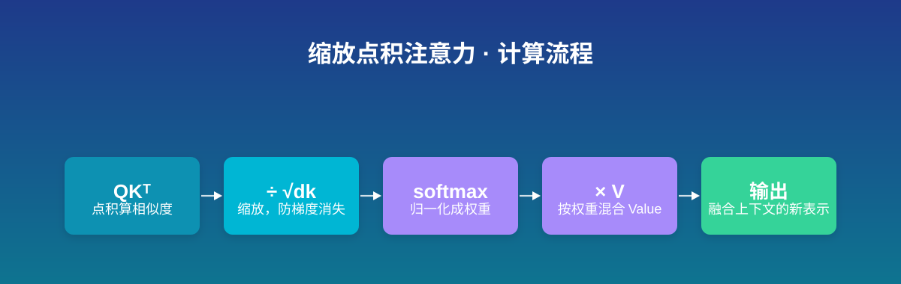
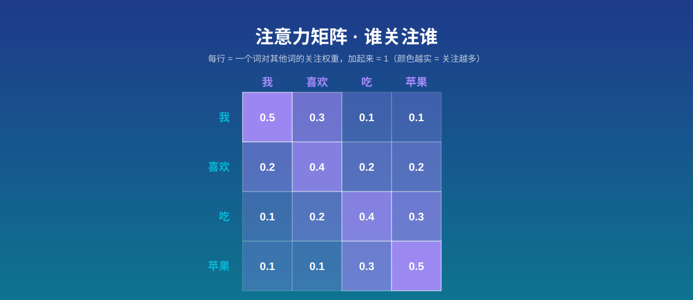

**注意力机制（Attention）** 是让模型在处理信息时，能像人一样「有重点地看」——对相关的部分多分配些注意力，对无关的部分少分配些。其中最核心、也最广为使用的一种，叫**自注意力（Self-Attention）**：让序列里的每个位置都去「打量」其他位置，再根据上下文重新理解自己。

## 一个生活场景：「苹果」到底是哪个苹果

先看两句话：

> 我喜欢吃**苹果**。
> 我喜欢用**苹果**电脑。

同一个「苹果」，在你的大脑里完全是两个意思：第一句是水果，第二句是科技公司。你之所以能瞬间区分，是因为大脑自动结合了上下文——「吃」让「苹果」偏向水果义，「电脑」让它偏向品牌义。

**注意力机制干的正是这件事**：它让一个词去「看」句子里的其他词，根据相关程度重新「混合」出一个带有上下文语义的新向量。这正是 Transformer、GPT、BERT 这类现代模型能精准理解语言的关键——它们都靠注意力来捕捉上下文。

## Q、K、V：一场「图书馆检索」的类比

要理解自注意力的内部运作，绕不开三个核心角色——Query、Key、Value。用一个图书馆找书的类比就能轻松拿下：

- **Query（查询词，Q）**：你心里想问的问题，比如「我想找讲深度学习的入门书」。
- **Key（索引键，K）**：每本书在书架上贴的标签、关键词，比如「机器学习入门」「深度学习教程」。
- **Value（内容值，V）**：书的实际内容本身。

匹配过程是这样的：用你的 Query 去和每本书的 Key 做相似度比对——越匹配的书分数越高。然后把这些分数变成权重（加起来为 1），按权重把对应的 Value 混合起来，就得到了最终的「答案」。

在自注意力里，**每个词同时扮演这三个角色**：它有自己的 Query、自己的 Key、自己的 Value。句子里的每个词，都用自己的 Query 去和其他所有词的 Key 比对，决定要从哪些词那里「吸取」信息，再按权重把这些词的 Value 加起来，作为自己新的表示。

## 核心公式：缩放点积注意力

把上面的过程写成一行公式，就是大名鼎鼎的**缩放点积注意力（Scaled Dot-Product Attention）**：

$$
\text{Attention}(Q, K, V) = \text{softmax}\left(\frac{QK^T}{\sqrt{d_k}}\right) V
$$

逐个符号拆开看：

- **$Q$**：所有 Query 拼成的矩阵，每行是一个词的查询向量。
- **$K$**：所有 Key 拼成的矩阵，每行是一个词的索引向量。
- **$K^T$**：$K$ 的转置（行列互换），让 $Q$ 能和 $K$ 做点积。
- **$QK^T$**：点积矩阵——第 $i$ 行第 $j$ 列 = 第 $i$ 个词的 Query 和第 $j$ 个词的 Key 的相似度，越大越相关。
- **$d_k$**：Key 向量的维度（每个 Key 由多少个数组成）。
- **$\sqrt{d_k}$**：缩放因子——除以它，让点积的数值保持温和。
- **$\text{softmax}(\cdot)$**：把每一行分数归一化成「权重」（和为 1、全为正数），也就是「关注程度」。
- **$\cdot\, V$**：用这些权重去加权平均所有的 Value，得到每个词融合了上下文后的新表示。

**一句话直觉**：用 Q 和 K 算「我有多关注你」，归一化成权重，再按权重混合 V——就这么简单。



### 为什么要除以 $\sqrt{d_k}$？

这是这个公式最容易被忽视、却最关键的一个细节。当 Key 的维度 $d_k$ 比较大时，$QK^T$ 的数值会跟着放大（直观理解：维度越高，累加的项越多，方差越大）。**过大的数喂给 softmax 会出问题**：softmax 里含指数函数 $e^x$，输入一旦偏大，输出就会极度不平均——一个权重接近 1，其他几乎为 0。

这时候 softmax 的**梯度会近乎消失**（落在函数的「饱和区」），模型在训练时几乎学不动。除以 $\sqrt{d_k}$ 把方差拉回 1 附近，softmax 输出温和、梯度健康，训练才稳定。

## 手算一个极简例子

设 $d_k = 2$，有两个词，它们的 Query 和 Key 已经给出：

$$
Q = \begin{pmatrix} 1 & 0 \\ 0 & 1 \end{pmatrix}, \quad
K = \begin{pmatrix} 1 & 0 \\ 0 & 1 \end{pmatrix}, \quad
V = \begin{pmatrix} 10 \\ 20 \end{pmatrix}
$$

**第 1 步**：算 $QK^T$（这里 $K^T = K$）：

$$
QK^T = \begin{pmatrix} 1 & 0 \\ 0 & 1 \end{pmatrix}
$$

**第 2 步**：除以 $\sqrt{d_k} = \sqrt{2} \approx 1.414$：

$$
\frac{QK^T}{\sqrt{2}} \approx \begin{pmatrix} 0.707 & 0 \\ 0 & 0.707 \end{pmatrix}
$$

**第 3 步**：每行做 softmax。第一行是 $(0.707,\, 0)$：

$$
\text{softmax}(0.707,\, 0) = \left(\frac{e^{0.707}}{e^{0.707}+e^{0}},\ \frac{e^{0}}{e^{0.707}+e^{0}}\right) \approx (0.67,\ 0.33)
$$

第二行对称地得到 $(0.33,\ 0.67)$。**自检**：每行加起来正好是 1，非负，符合预期。

**第 4 步**：加权混合 $V$。第一行权重 $(0.67,\ 0.33)$，结果是 $0.67 \times 10 + 0.33 \times 20 = 13.3$。第二行同理得到 $16.7$。

可以看到：第一个词更关注自己（权重 0.67），但也吸收了一点第二个词的信息；第二个词正好相反。这就是注意力在「混合上下文」。

## 注意力矩阵：一张图看懂「谁关注谁」

把上面的 softmax 结果排成一张方阵，就是**注意力矩阵（Attention Matrix）**。如果序列有 8 个位置，就得到一张 $8 \times 8$ 的矩阵。下面用一个 4 词例子的矩阵示意：



理解这张矩阵，记住三个要点：

- **第 $i$ 行第 $j$ 列**：表示位置 $i$ 对位置 $j$ 的关注权重，也就是「位置 $i$ 从位置 $j$ 那里吸取多少信息」。
- **每行归一化**：每行的所有数加起来等于 1（因为 softmax 是按行做的）。每行表示「位置 $i$ 把自己的注意力 100% 地分配给各个位置」。
- **非对称**：位置 A 对 B 的关注程度，**不等于** B 对 A 的关注程度。因为 A 的 Query 可能和 B 的 Key 很匹配，但反过来未必——所以注意力矩阵一般不是对称矩阵。

形象点说：你「关注」某个人，不代表那个人也「关注」你。注意力矩阵捕捉的就是这种**单向的、有方向性的关注关系**。

## 在 AI 体系中的位置

注意力机制属于**深度学习 / 自然语言处理**领域的核心组件，是 2017 年 Google 论文 *Attention Is All You Need* 提出的 Transformer 架构的灵魂。它直接关联两个概念：

- **Transformer**：完全基于自注意力搭建的网络，是 GPT、BERT、Claude、Gemini 等几乎所有现代大语言模型的地基。
- **多头注意力（Multi-Head Attention）**：把单头注意力做多次，每次关注不同方面的关系（语法、语义、指代……），是自注意力的常见扩展。

## PyTorch 代码：公式长什么样

公式中每一步对应的代码：

```python
import torch
import torch.nn.functional as F

# scores 对应公式里的 QK^T / sqrt(d_k)
scores = Q @ K.transpose(-2, -1) / (K.size(-1) ** 0.5)

# attn_weights 对应 softmax 那一步，得到注意力权重矩阵
attn_weights = F.softmax(scores, dim=-1)

# 最终输出对应公式末尾的乘以 V
output = attn_weights @ V
```

## 完整代码

下面是一个可直接复制运行的完整示例：用一层自注意力处理一段长度为 4、维度为 8 的假数据。

```python
import torch
import torch.nn as nn
import torch.nn.functional as F

# 自注意力模块：把输入映射成 Q/K/V，再做缩放点积注意力
class SelfAttention(nn.Module):
    def __init__(self, d_model):
        super().__init__()
        # 三个线性层，分别生成 Q、K、V（对应公式里的三个矩阵）
        self.W_q = nn.Linear(d_model, d_model)  # 生成 Query
        self.W_k = nn.Linear(d_model, d_model)  # 生成 Key
        self.W_v = nn.Linear(d_model, d_model)  # 生成 Value

    def forward(self, x):
        # x 形状：(序列长度, 特征维度)
        Q = self.W_q(x)  # 每个位置生成自己的查询向量
        K = self.W_k(x)  # 每个位置生成自己的索引向量
        V = self.W_v(x)  # 每个位置生成自己的内容向量

        # 缩放点积：QK^T / sqrt(d_k)
        scores = Q @ K.transpose(-2, -1) / (K.size(-1) ** 0.5)
        # softmax 按行归一化，得到注意力权重
        attn_weights = F.softmax(scores, dim=-1)
        # 按权重混合 V
        return attn_weights @ V

# 构造假数据：4 个位置、每个位置 8 维向量（模拟 4 个词的嵌入）
torch.manual_seed(42)
x = torch.randn(4, 8)

# 实例化自注意力层
attn = SelfAttention(d_model=8)
output = attn(x)

# 模拟一个训练步：把输出送进一个简单任务，算 loss 并反向传播
target = torch.randn_like(output)  # 假目标
loss = F.mse_loss(output, target)  # 用均方误差做演示
loss.backward()  # 反向传播，计算梯度

print("输入形状：", x.shape)
print("输出形状：", output.shape)
print("Loss：", loss.item())
```

## 小结

注意力机制的本质就一句话：**让模型在处理每个位置时，能动态地从其他位置吸取相关信息**。其中 Q、K、V 分别扮演「查询词、索引键、内容值」三个角色，缩放点积公式 $\text{softmax}(QK^T/\sqrt{d_k})\,V$ 把「算相似度→归一化→加权混合」压缩成一行；除以 $\sqrt{d_k}$ 是为了防止 softmax 梯度消失，让训练稳定。理解了它，你就拿到了通往 Transformer 和现代大语言模型的第一把钥匙。

## 参考资料

1. Attention Is All You Need - Vaswani et al., 2017
   https://arxiv.org/abs/1706.03762
2. 注意力评分函数 - 《动手学深度学习》
   https://d2l.ai/chapter_attention-mechanisms-and-transformers/attention-scoring-functions.html
3. What is an Attention Mechanism? - IBM Think
   https://www.ibm.com/think/topics/attention-mechanism
