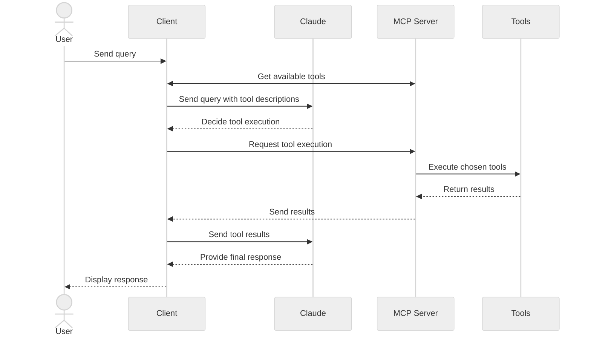

<BiRow>
<template #en>

> Get started building your own client that can integrate with all MCP servers.

</template>
<template #zh>

> 快速上手：构建你自己的客户端，与所有 MCP 服务器集成。

</template>
</BiRow>

<BiRow>
<template #en>

In this tutorial, you'll learn how to build an LLM-powered chatbot client that connects to MCP servers.

</template>
<template #zh>

在本教程中，你将学习如何构建一个由 LLM 驱动、可连接 MCP 服务器的聊天机器人客户端。

</template>
</BiRow>

<BiRow>
<template #en>

Before you begin, it helps to have gone through our [Build an MCP Server](https://modelcontextprotocol.io/docs/2026-07-28/develop/build-server) tutorial so you can understand how clients and servers communicate.

</template>
<template #zh>

开始之前，建议先读完我们的[构建 MCP 服务器](https://modelcontextprotocol.io/docs/2026-07-28/develop/build-server)教程，以便理解客户端与服务器之间如何通信。

</template>
</BiRow>

<BiRow>
<template #en>

[You can find the complete code for this tutorial here.](https://github.com/modelcontextprotocol/quickstart-resources/tree/main/mcp-client-python)

</template>
<template #zh>

[本教程的完整代码在这里。](https://github.com/modelcontextprotocol/quickstart-resources/tree/main/mcp-client-python)

</template>
</BiRow>

<BiRow>
<template #en>

## System Requirements

</template>
<template #zh>

## 系统要求

</template>
</BiRow>

<BiRow>
<template #en>

Before starting, ensure your system meets these requirements:

</template>
<template #zh>

开始之前，请确保你的系统满足以下要求：

</template>
</BiRow>

<BiRow>
<template #en>

* Mac or Windows computer
* Latest Python version installed
* Latest version of `uv` installed
* You must use the Python MCP SDK 2.0.0 or higher

</template>
<template #zh>

* Mac 或 Windows 计算机
* 已安装最新版本的 Python
* 已安装最新版本的 `uv`
* 必须使用 2.0.0 或更高版本的 Python MCP SDK

</template>
</BiRow>

<BiRow>
<template #en>

## Setting Up Your Environment

</template>
<template #zh>

## 配置环境

</template>
</BiRow>

<BiRow>
<template #en>

First, create a new Python project with `uv`:

</template>
<template #zh>

首先，用 `uv` 创建一个新的 Python 项目：

</template>
</BiRow>

<BiRow>
<template #en>

::: code-group
  ```bash title="[macOS/Linux]"
  # Create project directory
  uv init mcp-client
  cd mcp-client

  # Create virtual environment
  uv venv

  # Activate virtual environment
  source .venv/bin/activate

  # Install required packages
  uv add mcp anthropic python-dotenv

  # Remove boilerplate files
  rm main.py

  # Create our main file
  touch client.py
  ```

  ```powershell title="[Windows]"
  # Create project directory
  uv init mcp-client
  cd mcp-client

  # Create virtual environment
  uv venv

  # Activate virtual environment
  .venv\Scripts\activate

  # Install required packages
  uv add mcp anthropic python-dotenv

  # Remove boilerplate files
  del main.py

  # Create our main file
  new-item client.py
  ```
:::

</template>
<template #zh>

::: code-group
  ```bash title="[macOS/Linux]"
  # Create project directory
  uv init mcp-client
  cd mcp-client

  # Create virtual environment
  uv venv

  # Activate virtual environment
  source .venv/bin/activate

  # Install required packages
  uv add mcp anthropic python-dotenv

  # Remove boilerplate files
  rm main.py

  # Create our main file
  touch client.py
  ```

  ```powershell title="[Windows]"
  # Create project directory
  uv init mcp-client
  cd mcp-client

  # Create virtual environment
  uv venv

  # Activate virtual environment
  .venv\Scripts\activate

  # Install required packages
  uv add mcp anthropic python-dotenv

  # Remove boilerplate files
  del main.py

  # Create our main file
  new-item client.py
  ```
:::

</template>
</BiRow>

<BiRow>
<template #en>

## Setting Up Your API Key

</template>
<template #zh>

## 配置 API Key

</template>
</BiRow>

<BiRow>
<template #en>

You'll need an Anthropic API key from the [Anthropic Console](https://console.anthropic.com/settings/keys).

</template>
<template #zh>

你需要从 [Anthropic Console](https://console.anthropic.com/settings/keys) 获取一个 Anthropic API Key。

</template>
</BiRow>

<BiRow>
<template #en>

Create a `.env` file to store it:

</template>
<template #zh>

创建一个 `.env` 文件来存放它：

</template>
</BiRow>

<BiRow>
<template #en>

```bash
echo "ANTHROPIC_API_KEY=your-api-key-goes-here" > .env
```

</template>
<template #zh>

```bash
echo "ANTHROPIC_API_KEY=your-api-key-goes-here" > .env
```

</template>
</BiRow>

<BiRow>
<template #en>

Add `.env` to your `.gitignore`:

</template>
<template #zh>

将 `.env` 添加到 `.gitignore`：

</template>
</BiRow>

<BiRow>
<template #en>

```bash
echo ".env" >> .gitignore
```

</template>
<template #zh>

```bash
echo ".env" >> .gitignore
```

</template>
</BiRow>

<BiRow>
<template #en>

> **注意：**
> Make sure you keep your `ANTHROPIC_API_KEY` secure!

</template>
<template #zh>

> **注意：**
> 务必保管好你的 `ANTHROPIC_API_KEY`！

</template>
</BiRow>

<BiRow>
<template #en>

## Creating the Client

</template>
<template #zh>

## 创建客户端

</template>
</BiRow>

<BiRow>
<template #en>

### Imports and Setup

</template>
<template #zh>

### 导入与初始设置

</template>
</BiRow>

<BiRow>
<template #en>

First, let's set up our imports and the pieces the rest of the file shares:

</template>
<template #zh>

首先，设置导入语句和文件其余部分共用的几个基础对象：

</template>
</BiRow>

<BiRow>
<template #en>

```python
import asyncio
import sys

from mcp import Client, StdioServerParameters
from mcp.client.stdio import stdio_client
from mcp_types import TextContent

from anthropic import Anthropic
from dotenv import load_dotenv

load_dotenv()  # load environment variables from .env

MODEL = "claude-opus-5"
anthropic = Anthropic()
```

</template>
<template #zh>

```python
import asyncio
import sys

from mcp import Client, StdioServerParameters
from mcp.client.stdio import stdio_client
from mcp_types import TextContent

from anthropic import Anthropic
from dotenv import load_dotenv

load_dotenv()  # load environment variables from .env

MODEL = "claude-opus-5"
anthropic = Anthropic()
```

</template>
</BiRow>

<BiRow>
<template #en>

`Client` is the single object your program talks to the server through. Listing the tools, calling one, reading a resource: each of those is a method on it.

</template>
<template #zh>

`Client` 是程序与服务器通信的唯一对象。列出工具、调用某个工具、读取资源——这些操作都是它的方法。

</template>
</BiRow>

<BiRow>
<template #en>

### Server Connection Management

</template>
<template #zh>

### 服务器连接管理

</template>
</BiRow>

<BiRow>
<template #en>

Next, we'll work out which process to launch for a given server script:

</template>
<template #zh>

接下来，确定对于给定的服务器脚本应该启动哪个进程：

</template>
</BiRow>

<BiRow>
<template #en>

```python
def server_params(server_script_path: str) -> StdioServerParameters:
    """Describe the subprocess that runs an MCP server

    Args:
        server_script_path: Path to the server script (.py or .js)
    """
    if server_script_path.endswith(".py"):
        command = "python"
    elif server_script_path.endswith(".js"):
        command = "node"
    else:
        raise ValueError("Server script must be a .py or .js file")

    return StdioServerParameters(command=command, args=[server_script_path])
```

</template>
<template #zh>

```python
def server_params(server_script_path: str) -> StdioServerParameters:
    """Describe the subprocess that runs an MCP server

    Args:
        server_script_path: Path to the server script (.py or .js)
    """
    if server_script_path.endswith(".py"):
        command = "python"
    elif server_script_path.endswith(".js"):
        command = "node"
    else:
        raise ValueError("Server script must be a .py or .js file")

    return StdioServerParameters(command=command, args=[server_script_path])
```

</template>
</BiRow>

<BiRow>
<template #en>

`StdioServerParameters` is configuration, not a connection. `stdio_client()` turns it into a stdio transport, and `Client` opens that transport when you enter its `async with` block. We'll do both in `main()`.

</template>
<template #zh>

`StdioServerParameters` 是配置，不是连接。`stdio_client()` 把它变成一个 stdio（标准输入输出）传输，而 `Client` 会在你进入其 `async with` 块时打开该传输。这两步我们都放在 `main()` 里完成。

</template>
</BiRow>

<BiRow>
<template #en>

### Query Processing Logic

</template>
<template #zh>

### 查询处理逻辑

</template>
</BiRow>

<BiRow>
<template #en>

Now let's add the core functionality for processing queries and handling tool calls:

</template>
<template #zh>

现在来添加处理查询和工具调用的核心功能：

</template>
</BiRow>

<BiRow>
<template #en>

```python
async def process_query(client: Client, query: str) -> str:
    """Process a query using Claude and available tools"""
    messages = [
        {
            "role": "user",
            "content": query
        }
    ]

    tool_list = await client.list_tools()
    available_tools = [{
        "name": tool.name,
        "description": tool.description,
        "input_schema": tool.input_schema
    } for tool in tool_list.tools]

    # Initial Claude API call
    response = anthropic.messages.create(
        model=MODEL,
        max_tokens=1000,
        messages=messages,
        tools=available_tools
    )

    # Process response and handle tool calls
    final_text = []
    tool_results = []

    for content in response.content:
        if content.type == 'text':
            final_text.append(content.text)
        elif content.type == 'tool_use':
            tool_name = content.name
            tool_args = content.input

            # Execute tool call
            result = await client.call_tool(tool_name, tool_args)
            final_text.append(f"[Calling tool {tool_name} with args {tool_args}]")

            tool_results.append({
                "type": "tool_result",
                "tool_use_id": content.id,
                "content": "\n".join(
                    block.text
                    for block in result.content
                    if isinstance(block, TextContent)
                ),
                "is_error": result.is_error
            })

    if tool_results:
        messages.append({"role": "assistant", "content": response.content})
        messages.append({"role": "user", "content": tool_results})

        # Get next response from Claude
        response = anthropic.messages.create(
            model=MODEL,
            max_tokens=1000,
            messages=messages,
            tools=available_tools
        )

        for content in response.content:
            if content.type == 'text':
                final_text.append(content.text)

    return "\n".join(final_text)
```

</template>
<template #zh>

```python
async def process_query(client: Client, query: str) -> str:
    """Process a query using Claude and available tools"""
    messages = [
        {
            "role": "user",
            "content": query
        }
    ]

    tool_list = await client.list_tools()
    available_tools = [{
        "name": tool.name,
        "description": tool.description,
        "input_schema": tool.input_schema
    } for tool in tool_list.tools]

    # Initial Claude API call
    response = anthropic.messages.create(
        model=MODEL,
        max_tokens=1000,
        messages=messages,
        tools=available_tools
    )

    # Process response and handle tool calls
    final_text = []
    tool_results = []

    for content in response.content:
        if content.type == 'text':
            final_text.append(content.text)
        elif content.type == 'tool_use':
            tool_name = content.name
            tool_args = content.input

            # Execute tool call
            result = await client.call_tool(tool_name, tool_args)
            final_text.append(f"[Calling tool {tool_name} with args {tool_args}]")

            tool_results.append({
                "type": "tool_result",
                "tool_use_id": content.id,
                "content": "\n".join(
                    block.text
                    for block in result.content
                    if isinstance(block, TextContent)
                ),
                "is_error": result.is_error
            })

    if tool_results:
        messages.append({"role": "assistant", "content": response.content})
        messages.append({"role": "user", "content": tool_results})

        # Get next response from Claude
        response = anthropic.messages.create(
            model=MODEL,
            max_tokens=1000,
            messages=messages,
            tools=available_tools
        )

        for content in response.content:
            if content.type == 'text':
                final_text.append(content.text)

    return "\n".join(final_text)
```

</template>
</BiRow>

<BiRow>
<template #en>

`call_tool` returns a `CallToolResult`. Its `content` is a list of blocks, which is why we narrow to `TextContent` before reading `.text`. A tool that raises does not raise here: it answers with `is_error` set, and passing that flag on lets Claude read the message and try something else.

</template>
<template #zh>

`call_tool` 返回一个 `CallToolResult`。它的 `content` 是一个块列表，所以在读取 `.text` 之前，我们先收窄到 `TextContent`。工具内部抛出的异常不会在这里再次抛出：它会带着置位的 `is_error` 标志返回，把这个标志传递下去，Claude 就能读到错误消息并转而尝试其他做法。

</template>
</BiRow>

<BiRow>
<template #en>

### Interactive Chat Interface

</template>
<template #zh>

### 交互式聊天界面

</template>
</BiRow>

<BiRow>
<template #en>

Now we'll add the chat loop:

</template>
<template #zh>

现在添加聊天循环：

</template>
</BiRow>

<BiRow>
<template #en>

```python
async def chat_loop(client: Client) -> None:
    """Run an interactive chat loop"""
    print("\nMCP Client Started!")
    print("Type your queries or 'quit' to exit.")

    while True:
        try:
            query = (await asyncio.to_thread(input, "\nQuery: ")).strip()
        except EOFError:
            break

        if query.lower() == 'quit':
            break

        try:
            response = await process_query(client, query)
            print("\n" + response)
        except Exception as e:
            print(f"\nError: {e}")
```

</template>
<template #zh>

```python
async def chat_loop(client: Client) -> None:
    """Run an interactive chat loop"""
    print("\nMCP Client Started!")
    print("Type your queries or 'quit' to exit.")

    while True:
        try:
            query = (await asyncio.to_thread(input, "\nQuery: ")).strip()
        except EOFError:
            break

        if query.lower() == 'quit':
            break

        try:
            response = await process_query(client, query)
            print("\n" + response)
        except Exception as e:
            print(f"\nError: {e}")
```

</template>
</BiRow>

<BiRow>
<template #en>

`input()` blocks, so it runs on a worker thread. That keeps the event loop free to service the connection while you type.

</template>
<template #zh>

`input()` 会阻塞，因此把它放到工作线程上运行。这样在你输入时，事件循环仍可继续服务连接。

</template>
</BiRow>

<BiRow>
<template #en>

### Main Entry Point

</template>
<template #zh>

### 主入口

</template>
</BiRow>

<BiRow>
<template #en>

Finally, we'll add the main execution logic:

</template>
<template #zh>

最后，添加主执行逻辑：

</template>
</BiRow>

<BiRow>
<template #en>

```python
async def main() -> None:
    if len(sys.argv) < 2:
        print("Usage: python client.py <path_to_server_script>")
        sys.exit(1)

    async with Client(stdio_client(server_params(sys.argv[1]))) as client:
        tool_list = await client.list_tools()
        tool_names = [tool.name for tool in tool_list.tools]
        print("\nConnected to server with tools:", tool_names)

        await chat_loop(client)

if __name__ == "__main__":
    asyncio.run(main())
```

</template>
<template #zh>

```python
async def main() -> None:
    if len(sys.argv) < 2:
        print("Usage: python client.py <path_to_server_script>")
        sys.exit(1)

    async with Client(stdio_client(server_params(sys.argv[1]))) as client:
        tool_list = await client.list_tools()
        tool_names = [tool.name for tool in tool_list.tools]
        print("\nConnected to server with tools:", tool_names)

        await chat_loop(client)

if __name__ == "__main__":
    asyncio.run(main())
```

</template>
</BiRow>

<BiRow>
<template #en>

That `async with` is the entire connection lifecycle. Entering it launches the server and agrees a protocol version with it; leaving it disconnects and shuts the subprocess down. There is nothing to close by hand.

</template>
<template #zh>

这个 `async with` 就是连接的整个生命周期。进入时启动服务器并与其协商好协议版本；离开时断开连接并关闭子进程。无需手动关闭任何东西。

</template>
</BiRow>

<BiRow>
<template #en>

You can find the complete `client.py` file [here](https://github.com/modelcontextprotocol/quickstart-resources/blob/main/mcp-client-python/client.py).

</template>
<template #zh>

完整的 `client.py` 文件可以在[这里](https://github.com/modelcontextprotocol/quickstart-resources/blob/main/mcp-client-python/client.py)查看。

</template>
</BiRow>

<BiRow>
<template #en>

## Key Components Explained

</template>
<template #zh>

## 关键组件解析

</template>
</BiRow>

<BiRow>
<template #en>

### 1. Client Initialization

</template>
<template #zh>

### 1. 客户端初始化

</template>
</BiRow>

<BiRow>
<template #en>

* A single `Client` carries the connection, and `async with` is its whole lifecycle
* There is no connect/close pair to call and nothing to clean up afterwards
* Configures the Anthropic client for Claude interactions

</template>
<template #zh>

* 一个 `Client` 对象承载连接，`async with` 即其完整生命周期
* 没有成对的 connect/close 方法可调用，事后也无需清理
* 配置 Anthropic 客户端用于与 Claude 交互

</template>
</BiRow>

<BiRow>
<template #en>

### 2. Server Connection

</template>
<template #zh>

### 2. 服务器连接

</template>
</BiRow>

<BiRow>
<template #en>

* Supports both Python and Node.js servers
* Validates server script type
* Launches the server as a subprocess and speaks stdio to it
* Lists the available tools once the connection is open

</template>
<template #zh>

* 同时支持 Python 和 Node.js 服务器
* 校验服务器脚本类型
* 以子进程方式启动服务器，并通过 stdio 与之通信
* 连接建立后列出可用工具

</template>
</BiRow>

<BiRow>
<template #en>

### 3. Query Processing

</template>
<template #zh>

### 3. 查询处理

</template>
</BiRow>

<BiRow>
<template #en>

* Maintains conversation context
* Handles Claude's responses and tool calls
* Manages the message flow between Claude and tools
* Combines results into a coherent response

</template>
<template #zh>

* 维护会话上下文
* 处理 Claude 的响应和工具调用
* 管理 Claude 与工具之间的消息流转
* 把结果组合成连贯的回复

</template>
</BiRow>

<BiRow>
<template #en>

### 4. Interactive Interface

</template>
<template #zh>

### 4. 交互式界面

</template>
</BiRow>

<BiRow>
<template #en>

* Provides a simple command-line interface
* Handles user input and displays responses
* Includes basic error handling
* Allows graceful exit

</template>
<template #zh>

* 提供简单的命令行界面
* 处理用户输入并显示回复
* 包含基本的错误处理
* 支持优雅退出

</template>
</BiRow>

<BiRow>
<template #en>

### 5. Resource Management

</template>
<template #zh>

### 5. 资源管理

</template>
</BiRow>

<BiRow>
<template #en>

* Leaving the `async with` block disconnects and shuts the server subprocess down
* A failing query is reported without ending the session
* Typing `quit`, or closing standard input, exits cleanly

</template>
<template #zh>

* 离开 `async with` 块会断开连接并关闭服务器子进程
* 查询失败只报告错误，不会结束会话
* 输入 `quit` 或关闭标准输入即可干净退出

</template>
</BiRow>

<BiRow>
<template #en>

## Common Customization Points

</template>
<template #zh>

## 常见定制点

</template>
</BiRow>

<BiRow>
<template #en>

1. **Tool Handling**
   * Modify `process_query()` to handle specific tool types
   * Add custom error handling for tool calls
   * Implement tool-specific response formatting
2. **Response Processing**
   * Customize how tool results are formatted
   * Add response filtering or transformation
   * Implement custom logging
3. **User Interface**
   * Add a GUI or web interface
   * Implement rich console output
   * Add command history or auto-completion

</template>
<template #zh>

1. **工具处理**
   * 修改 `process_query()` 以处理特定工具类型
   * 为工具调用添加自定义错误处理
   * 实现针对特定工具的响应格式化
2. **响应处理**
   * 自定义工具结果的格式化方式
   * 添加响应过滤或转换
   * 实现自定义日志
3. **用户界面**
   * 添加图形界面（GUI）或 Web 界面
   * 实现富文本控制台输出
   * 添加命令历史或自动补全

</template>
</BiRow>

<BiRow>
<template #en>

## Running the Client

</template>
<template #zh>

## 运行客户端

</template>
</BiRow>

<BiRow>
<template #en>

To run your client with any MCP server:

</template>
<template #zh>

要让你的客户端连接任意 MCP 服务器运行：

</template>
</BiRow>

<BiRow>
<template #en>

```bash
uv run client.py path/to/server.py # python server
uv run client.py path/to/build/index.js # node server
```

</template>
<template #zh>

```bash
uv run client.py path/to/server.py # python server
uv run client.py path/to/build/index.js # node server
```

</template>
</BiRow>

<BiRow>
<template #en>

> **注：**
> If you're continuing [the weather tutorial from the server quickstart](https://github.com/modelcontextprotocol/quickstart-resources/tree/main/weather-server-python), your command might look something like this: `python client.py .../quickstart-resources/weather-server-python/weather.py`

</template>
<template #zh>

> **注：**
> 如果你是在[服务器快速入门的天气教程](https://github.com/modelcontextprotocol/quickstart-resources/tree/main/weather-server-python)基础上继续，命令可能长这样：`python client.py .../quickstart-resources/weather-server-python/weather.py`

</template>
</BiRow>

<BiRow>
<template #en>

The client will:

</template>
<template #zh>

客户端将会：

</template>
</BiRow>

<BiRow>
<template #en>

1. Connect to the specified server
2. List available tools
3. Start an interactive chat session where you can:
   * Enter queries
   * See tool executions
   * Get responses from Claude

</template>
<template #zh>

1. 连接到指定的服务器
2. 列出可用工具
3. 启动一个交互式聊天会话，在其中你可以：
   * 输入查询
   * 查看工具执行
   * 获得 Claude 的回复

</template>
</BiRow>

<BiRow>
<template #en>

Here's an example of what it should look like if connected to the weather server from the server quickstart:

</template>
<template #zh>

下面是连接服务器快速入门中的天气服务器时的预期效果示例：

</template>
</BiRow>

<BiRow>
<template #en>

  

</template>
<template #zh>

  

</template>
</BiRow>

<BiRow>
<template #en>

## How It Works

</template>
<template #zh>

## 工作原理

</template>
</BiRow>

<BiRow>
<template #en>

When you submit a query:

</template>
<template #zh>

当你提交一个查询时：

</template>
</BiRow>

<BiRow>
<template #en>

1. The client gets the list of available tools from the server
2. Your query is sent to Claude along with tool descriptions
3. Claude decides which tools (if any) to use
4. The client executes any requested tool calls through the server
5. Results are sent back to Claude
6. Claude provides a natural language response
7. The response is displayed to you

</template>
<template #zh>

1. 客户端从服务器获取可用工具列表
2. 你的查询会连同工具描述一起发送给 Claude
3. Claude 决定使用哪些工具（如果需要）
4. 客户端通过服务器执行所请求的工具调用
5. 结果被发回给 Claude
6. Claude 给出自然语言回复
7. 回复会展示给你

</template>
</BiRow>

<BiRow>
<template #en>

## Best practices

</template>
<template #zh>

## 最佳实践

</template>
</BiRow>

<BiRow>
<template #en>

1. **Error Handling**
   * Check `result.is_error` rather than expecting a failing tool to raise
   * Provide meaningful error messages
   * Gracefully handle connection issues
2. **Resource Management**
   * Let the `async with` block own the connection
   * Keep it open for as long as you need the server
   * Handle server disconnections
3. **Security**
   * Store API keys securely in `.env`
   * Validate server responses
   * Be cautious with tool permissions
4. **Tool Names**
   * Tool names can be validated according to the format specified [here](https://modelcontextprotocol.io/specification/2026-07-28/server/tools#tool-names)
   * If a tool name conforms to the specified format, it should not fail validation by an MCP client

</template>
<template #zh>

1. **错误处理**
   * 检查 `result.is_error`，而不是指望失败的工具抛出异常
   * 提供有意义的错误信息
   * 优雅地处理连接问题
2. **资源管理**
   * 让 `async with` 块持有连接
   * 在需要服务器的整个期间保持连接打开
   * 处理服务器断开连接的情况
3. **安全性**
   * 将 API Key 安全地存放在 `.env` 中
   * 校验服务器响应
   * 谨慎对待工具权限
4. **工具名称**
   * 工具名称可按[此处](https://modelcontextprotocol.io/specification/2026-07-28/server/tools#tool-names)规定的格式校验
   * 如果工具名称符合规定格式，就不应被 MCP 客户端判为校验不通过

</template>
</BiRow>

<BiRow>
<template #en>

## Troubleshooting

</template>
<template #zh>

## 故障排查

</template>
</BiRow>

<BiRow>
<template #en>

### Server Path Issues

</template>
<template #zh>

### 服务器路径问题

</template>
</BiRow>

<BiRow>
<template #en>

* Double-check the path to your server script is correct
* Use the absolute path if the relative path isn't working
* For Windows users, make sure to use forward slashes (/) or escaped backslashes (\\) in the path
* Verify the server file has the correct extension (.py for Python or .js for Node.js)

</template>
<template #zh>

* 仔细检查服务器脚本路径是否正确
* 如果相对路径不生效，改用绝对路径
* Windows 用户请确保路径中使用正斜杠（/）或转义的反斜杠（\\）
* 确认服务器文件的扩展名正确（Python 用 .py，Node.js 用 .js）

</template>
</BiRow>

<BiRow>
<template #en>

Example of correct path usage:

</template>
<template #zh>

正确路径的用法示例：

</template>
</BiRow>

<BiRow>
<template #en>

```bash
# Relative path
uv run client.py ./server/weather.py

# Absolute path
uv run client.py /Users/username/projects/mcp-server/weather.py

# Windows path (either format works)
uv run client.py C:/projects/mcp-server/weather.py
uv run client.py C:\\projects\\mcp-server\\weather.py
```

</template>
<template #zh>

```bash
# Relative path
uv run client.py ./server/weather.py

# Absolute path
uv run client.py /Users/username/projects/mcp-server/weather.py

# Windows path (either format works)
uv run client.py C:/projects/mcp-server/weather.py
uv run client.py C:\\projects\\mcp-server\\weather.py
```

</template>
</BiRow>

<BiRow>
<template #en>

### Response Timing

</template>
<template #zh>

### 响应耗时

</template>
</BiRow>

<BiRow>
<template #en>

* The first response might take up to 30 seconds to return
* This is normal and happens while:
  * The server initializes
  * Claude processes the query
  * Tools are being executed
* Subsequent responses are typically faster
* Don't interrupt the process during this initial waiting period

</template>
<template #zh>

* 第一次响应可能需要长达 30 秒才返回
* 这属于正常现象，等待发生在以下期间：
  * 服务器初始化
  * Claude 处理查询
  * 工具正在执行
* 后续响应通常会快一些
* 在最初的等待期内不要中断进程

</template>
</BiRow>

<BiRow>
<template #en>

### Common Error Messages

</template>
<template #zh>

### 常见错误信息

</template>
</BiRow>

<BiRow>
<template #en>

If you see:

</template>
<template #zh>

如果你看到：

</template>
</BiRow>

<BiRow>
<template #en>

* `FileNotFoundError`: Check your server path
* `Connection refused`: Ensure the server is running and the path is correct
* `Tool execution failed`: Verify the tool's required environment variables are set
* `Timeout error`: Consider raising `read_timeout_seconds` on the `Client`

</template>
<template #zh>

* `FileNotFoundError`：检查你的服务器路径
* `Connection refused`：确保服务器正在运行且路径正确
* `Tool execution failed`：确认工具所需的环境变量已设置
* `Timeout error`：考虑调大 `Client` 上的 `read_timeout_seconds`

</template>
</BiRow>

<BiRow>
<template #en>

[You can find the complete code for this tutorial here.](https://github.com/modelcontextprotocol/quickstart-resources/tree/main/mcp-client-typescript)

</template>
<template #zh>

[本教程的完整代码在这里。](https://github.com/modelcontextprotocol/quickstart-resources/tree/main/mcp-client-typescript)

</template>
</BiRow>

<BiRow>
<template #en>

## System Requirements

</template>
<template #zh>

## 系统要求

</template>
</BiRow>

<BiRow>
<template #en>

Before starting, ensure your system meets these requirements:

</template>
<template #zh>

开始之前，请确保你的系统满足以下要求：

</template>
</BiRow>

<BiRow>
<template #en>

* Mac or Windows computer
* Node.js 20 or higher installed
* Latest version of `npm` installed
* Anthropic API key (Claude)

</template>
<template #zh>

* Mac 或 Windows 计算机
* 已安装 Node.js 20 或更高版本
* 已安装最新版本的 `npm`
* Anthropic API Key（Claude）

</template>
</BiRow>

<BiRow>
<template #en>

## Setting Up Your Environment

</template>
<template #zh>

## 配置环境

</template>
</BiRow>

<BiRow>
<template #en>

First, let's create and set up our project:

</template>
<template #zh>

首先，创建并配置我们的项目：

</template>
</BiRow>

<BiRow>
<template #en>

::: code-group
  ```bash title="[macOS/Linux]"
  # Create project directory
  mkdir mcp-client-typescript
  cd mcp-client-typescript

  # Initialize npm project
  npm init -y

  # Install dependencies
  npm install @anthropic-ai/sdk @modelcontextprotocol/client dotenv

  # Install dev dependencies
  npm install -D @types/node typescript

  # Create source file
  touch index.ts
  ```

  ```powershell title="[Windows]"
  # Create project directory
  md mcp-client-typescript
  cd mcp-client-typescript

  # Initialize npm project
  npm init -y

  # Install dependencies
  npm install @anthropic-ai/sdk @modelcontextprotocol/client dotenv

  # Install dev dependencies
  npm install -D @types/node typescript

  # Create source file
  new-item index.ts
  ```
:::

</template>
<template #zh>

::: code-group
  ```bash title="[macOS/Linux]"
  # Create project directory
  mkdir mcp-client-typescript
  cd mcp-client-typescript

  # Initialize npm project
  npm init -y

  # Install dependencies
  npm install @anthropic-ai/sdk @modelcontextprotocol/client dotenv

  # Install dev dependencies
  npm install -D @types/node typescript

  # Create source file
  touch index.ts
  ```

  ```powershell title="[Windows]"
  # Create project directory
  md mcp-client-typescript
  cd mcp-client-typescript

  # Initialize npm project
  npm init -y

  # Install dependencies
  npm install @anthropic-ai/sdk @modelcontextprotocol/client dotenv

  # Install dev dependencies
  npm install -D @types/node typescript

  # Create source file
  new-item index.ts
  ```
:::

</template>
</BiRow>

<BiRow>
<template #en>

Update your `package.json` to set `type: "module"` and a build script:

</template>
<template #zh>

更新 `package.json`，设置 `type: "module"` 和一个构建脚本：

</template>
</BiRow>

<BiRow>
<template #en>

```json title="package.json"
{
  "type": "module",
  "scripts": {
    "build": "tsc && chmod 755 build/index.js"
  }
}
```

</template>
<template #zh>

```json title="package.json"
{
  "type": "module",
  "scripts": {
    "build": "tsc && chmod 755 build/index.js"
  }
}
```

</template>
</BiRow>

<BiRow>
<template #en>

Create a `tsconfig.json` in the root of your project:

</template>
<template #zh>

在项目根目录创建一个 `tsconfig.json`：

</template>
</BiRow>

<BiRow>
<template #en>

```json title="tsconfig.json"
{
  "compilerOptions": {
    "target": "ES2022",
    "module": "Node16",
    "moduleResolution": "Node16",
    "types": ["node"],
    "outDir": "./build",
    "rootDir": "./",
    "strict": true,
    "esModuleInterop": true,
    "skipLibCheck": true,
    "forceConsistentCasingInFileNames": true
  },
  "include": ["index.ts"],
  "exclude": ["node_modules"]
}
```

</template>
<template #zh>

```json title="tsconfig.json"
{
  "compilerOptions": {
    "target": "ES2022",
    "module": "Node16",
    "moduleResolution": "Node16",
    "types": ["node"],
    "outDir": "./build",
    "rootDir": "./",
    "strict": true,
    "esModuleInterop": true,
    "skipLibCheck": true,
    "forceConsistentCasingInFileNames": true
  },
  "include": ["index.ts"],
  "exclude": ["node_modules"]
}
```

</template>
</BiRow>

<BiRow>
<template #en>

## Setting Up Your API Key

</template>
<template #zh>

## 配置 API Key

</template>
</BiRow>

<BiRow>
<template #en>

You'll need an Anthropic API key from the [Anthropic Console](https://console.anthropic.com/settings/keys).

</template>
<template #zh>

你需要从 [Anthropic Console](https://console.anthropic.com/settings/keys) 获取一个 Anthropic API Key。

</template>
</BiRow>

<BiRow>
<template #en>

Create a `.env` file to store it:

</template>
<template #zh>

创建一个 `.env` 文件来存放它：

</template>
</BiRow>

<BiRow>
<template #en>

```bash
echo "ANTHROPIC_API_KEY=<your key here>" > .env
```

</template>
<template #zh>

```bash
echo "ANTHROPIC_API_KEY=<your key here>" > .env
```

</template>
</BiRow>

<BiRow>
<template #en>

Add `.env` to your `.gitignore`:

</template>
<template #zh>

将 `.env` 添加到 `.gitignore`：

</template>
</BiRow>

<BiRow>
<template #en>

```bash
echo ".env" >> .gitignore
```

</template>
<template #zh>

```bash
echo ".env" >> .gitignore
```

</template>
</BiRow>

<BiRow>
<template #en>

> **注意：**
> Make sure you keep your `ANTHROPIC_API_KEY` secure!

</template>
<template #zh>

> **注意：**
> 务必保管好你的 `ANTHROPIC_API_KEY`！

</template>
</BiRow>

<BiRow>
<template #en>

## Creating the Client

</template>
<template #zh>

## 创建客户端

</template>
</BiRow>

<BiRow>
<template #en>

### Basic Client Structure

</template>
<template #zh>

### 客户端基本结构

</template>
</BiRow>

<BiRow>
<template #en>

First, let's set up our imports and create the basic client class in `index.ts`:

</template>
<template #zh>

首先，设置导入并在 `index.ts` 中创建基本的客户端类：

</template>
</BiRow>

<BiRow>
<template #en>

```typescript
import { Anthropic } from "@anthropic-ai/sdk";
import {
  MessageParam,
  Tool,
} from "@anthropic-ai/sdk/resources/messages/messages.mjs";
import { Client } from "@modelcontextprotocol/client";
import { StdioClientTransport } from "@modelcontextprotocol/client/stdio";
import readline from "readline/promises";
import dotenv from "dotenv";

dotenv.config();

const ANTHROPIC_API_KEY = process.env.ANTHROPIC_API_KEY;
if (!ANTHROPIC_API_KEY) {
  throw new Error("ANTHROPIC_API_KEY is not set");
}

class MCPClient {
  private mcp: Client;
  private anthropic: Anthropic;
  private transport: StdioClientTransport | null = null;
  private tools: Tool[] = [];

  constructor() {
    this.anthropic = new Anthropic({
      apiKey: ANTHROPIC_API_KEY,
    });
    this.mcp = new Client({ name: "mcp-client-cli", version: "1.0.0" });
  }
  // methods will go here
}
```

</template>
<template #zh>

```typescript
import { Anthropic } from "@anthropic-ai/sdk";
import {
  MessageParam,
  Tool,
} from "@anthropic-ai/sdk/resources/messages/messages.mjs";
import { Client } from "@modelcontextprotocol/client";
import { StdioClientTransport } from "@modelcontextprotocol/client/stdio";
import readline from "readline/promises";
import dotenv from "dotenv";

dotenv.config();

const ANTHROPIC_API_KEY = process.env.ANTHROPIC_API_KEY;
if (!ANTHROPIC_API_KEY) {
  throw new Error("ANTHROPIC_API_KEY is not set");
}

class MCPClient {
  private mcp: Client;
  private anthropic: Anthropic;
  private transport: StdioClientTransport | null = null;
  private tools: Tool[] = [];

  constructor() {
    this.anthropic = new Anthropic({
      apiKey: ANTHROPIC_API_KEY,
    });
    this.mcp = new Client({ name: "mcp-client-cli", version: "1.0.0" });
  }
  // methods will go here
}
```

</template>
</BiRow>

<BiRow>
<template #en>

### Server Connection Management

</template>
<template #zh>

### 服务器连接管理

</template>
</BiRow>

<BiRow>
<template #en>

Next, we'll implement the method to connect to an MCP server:

</template>
<template #zh>

接下来，实现连接 MCP 服务器的方法：

</template>
</BiRow>

<BiRow>
<template #en>

```typescript
async connectToServer(serverScriptPath: string) {
  try {
    const isJs = serverScriptPath.endsWith(".js");
    const isPy = serverScriptPath.endsWith(".py");
    if (!isJs && !isPy) {
      throw new Error("Server script must be a .js or .py file");
    }
    const command = isPy
      ? process.platform === "win32"
        ? "python"
        : "python3"
      : process.execPath;

    this.transport = new StdioClientTransport({
      command,
      args: [serverScriptPath],
    });
    await this.mcp.connect(this.transport);

    const toolsResult = await this.mcp.listTools();
    this.tools = toolsResult.tools.map((tool) => {
      return {
        name: tool.name,
        description: tool.description,
        input_schema: tool.inputSchema,
      };
    });
    console.log(
      "Connected to server with tools:",
      this.tools.map(({ name }) => name)
    );
  } catch (e) {
    console.log("Failed to connect to MCP server: ", e);
    throw e;
  }
}
```

</template>
<template #zh>

```typescript
async connectToServer(serverScriptPath: string) {
  try {
    const isJs = serverScriptPath.endsWith(".js");
    const isPy = serverScriptPath.endsWith(".py");
    if (!isJs && !isPy) {
      throw new Error("Server script must be a .js or .py file");
    }
    const command = isPy
      ? process.platform === "win32"
        ? "python"
        : "python3"
      : process.execPath;

    this.transport = new StdioClientTransport({
      command,
      args: [serverScriptPath],
    });
    await this.mcp.connect(this.transport);

    const toolsResult = await this.mcp.listTools();
    this.tools = toolsResult.tools.map((tool) => {
      return {
        name: tool.name,
        description: tool.description,
        input_schema: tool.inputSchema,
      };
    });
    console.log(
      "Connected to server with tools:",
      this.tools.map(({ name }) => name)
    );
  } catch (e) {
    console.log("Failed to connect to MCP server: ", e);
    throw e;
  }
}
```

</template>
</BiRow>

<BiRow>
<template #en>

### Query Processing Logic

</template>
<template #zh>

### 查询处理逻辑

</template>
</BiRow>

<BiRow>
<template #en>

Now let's add the core functionality for processing queries and handling tool calls:

</template>
<template #zh>

现在来添加处理查询和工具调用的核心功能：

</template>
</BiRow>

<BiRow>
<template #en>

```typescript
async processQuery(query: string) {
  const messages: MessageParam[] = [
    {
      role: "user",
      content: query,
    },
  ];

  const response = await this.anthropic.messages.create({
    model: "claude-opus-5",
    max_tokens: 1000,
    messages,
    tools: this.tools,
  });

  const finalText = [];

  for (const content of response.content) {
    if (content.type === "text") {
      finalText.push(content.text);
    } else if (content.type === "tool_use") {
      const toolName = content.name;
      const toolArgs = content.input as { [x: string]: unknown } | undefined;

      const result = await this.mcp.callTool({
        name: toolName,
        arguments: toolArgs,
      });
      finalText.push(
        `[Calling tool ${toolName} with args ${JSON.stringify(toolArgs)}]`
      );

      messages.push({
        role: "user",
        content: result.content
          .filter((block) => block.type === "text")
          .map((block) => block.text)
          .join("\n"),
      });

      const response = await this.anthropic.messages.create({
        model: "claude-opus-5",
        max_tokens: 1000,
        messages,
      });

      finalText.push(
        response.content[0].type === "text" ? response.content[0].text : ""
      );
    }
  }

  return finalText.join("\n");
}
```

</template>
<template #zh>

```typescript
async processQuery(query: string) {
  const messages: MessageParam[] = [
    {
      role: "user",
      content: query,
    },
  ];

  const response = await this.anthropic.messages.create({
    model: "claude-opus-5",
    max_tokens: 1000,
    messages,
    tools: this.tools,
  });

  const finalText = [];

  for (const content of response.content) {
    if (content.type === "text") {
      finalText.push(content.text);
    } else if (content.type === "tool_use") {
      const toolName = content.name;
      const toolArgs = content.input as { [x: string]: unknown } | undefined;

      const result = await this.mcp.callTool({
        name: toolName,
        arguments: toolArgs,
      });
      finalText.push(
        `[Calling tool ${toolName} with args ${JSON.stringify(toolArgs)}]`
      );

      messages.push({
        role: "user",
        content: result.content
          .filter((block) => block.type === "text")
          .map((block) => block.text)
          .join("\n"),
      });

      const response = await this.anthropic.messages.create({
        model: "claude-opus-5",
        max_tokens: 1000,
        messages,
      });

      finalText.push(
        response.content[0].type === "text" ? response.content[0].text : ""
      );
    }
  }

  return finalText.join("\n");
}
```

</template>
</BiRow>

<BiRow>
<template #en>

### Interactive Chat Interface

</template>
<template #zh>

### 交互式聊天界面

</template>
</BiRow>

<BiRow>
<template #en>

Now we'll add the chat loop and cleanup functionality:

</template>
<template #zh>

现在添加聊天循环和清理功能：

</template>
</BiRow>

<BiRow>
<template #en>

```typescript
async chatLoop() {
  const rl = readline.createInterface({
    input: process.stdin,
    output: process.stdout,
  });

  try {
    console.log("\nMCP Client Started!");
    console.log("Type your queries or 'quit' to exit.");

    while (true) {
      const message = await rl.question("\nQuery: ");
      if (message.toLowerCase() === "quit") {
        break;
      }
      const response = await this.processQuery(message);
      console.log("\n" + response);
    }
  } finally {
    rl.close();
  }
}

async cleanup() {
  await this.mcp.close();
}
```

</template>
<template #zh>

```typescript
async chatLoop() {
  const rl = readline.createInterface({
    input: process.stdin,
    output: process.stdout,
  });

  try {
    console.log("\nMCP Client Started!");
    console.log("Type your queries or 'quit' to exit.");

    while (true) {
      const message = await rl.question("\nQuery: ");
      if (message.toLowerCase() === "quit") {
        break;
      }
      const response = await this.processQuery(message);
      console.log("\n" + response);
    }
  } finally {
    rl.close();
  }
}

async cleanup() {
  await this.mcp.close();
}
```

</template>
</BiRow>

<BiRow>
<template #en>

### Main Entry Point

</template>
<template #zh>

### 主入口

</template>
</BiRow>

<BiRow>
<template #en>

Finally, we'll add the main execution logic:

</template>
<template #zh>

最后，添加主执行逻辑：

</template>
</BiRow>

<BiRow>
<template #en>

```typescript
async function main() {
  if (process.argv.length < 3) {
    console.log("Usage: node index.ts <path_to_server_script>");
    return;
  }
  const mcpClient = new MCPClient();
  try {
    await mcpClient.connectToServer(process.argv[2]);
    await mcpClient.chatLoop();
  } catch (e) {
    console.error("Error:", e);
    await mcpClient.cleanup();
    process.exit(1);
  } finally {
    await mcpClient.cleanup();
    process.exit(0);
  }
}

main();
```

</template>
<template #zh>

```typescript
async function main() {
  if (process.argv.length < 3) {
    console.log("Usage: node index.ts <path_to_server_script>");
    return;
  }
  const mcpClient = new MCPClient();
  try {
    await mcpClient.connectToServer(process.argv[2]);
    await mcpClient.chatLoop();
  } catch (e) {
    console.error("Error:", e);
    await mcpClient.cleanup();
    process.exit(1);
  } finally {
    await mcpClient.cleanup();
    process.exit(0);
  }
}

main();
```

</template>
</BiRow>

<BiRow>
<template #en>

## Running the Client

</template>
<template #zh>

## 运行客户端

</template>
</BiRow>

<BiRow>
<template #en>

To run your client with any MCP server:

</template>
<template #zh>

要让你的客户端连接任意 MCP 服务器运行：

</template>
</BiRow>

<BiRow>
<template #en>

```bash
# Build TypeScript
npm run build

# Run the client
node build/index.js path/to/server.py # python server
node build/index.js path/to/build/index.js # node server
```

</template>
<template #zh>

```bash
# Build TypeScript
npm run build

# Run the client
node build/index.js path/to/server.py # python server
node build/index.js path/to/build/index.js # node server
```

</template>
</BiRow>

<BiRow>
<template #en>

> **注：**
> If you're continuing [the weather tutorial from the server quickstart](https://github.com/modelcontextprotocol/quickstart-resources/tree/main/weather-server-typescript), your command might look something like this: `node build/index.js .../quickstart-resources/weather-server-typescript/build/index.js`

</template>
<template #zh>

> **注：**
> 如果你是在[服务器快速入门的天气教程](https://github.com/modelcontextprotocol/quickstart-resources/tree/main/weather-server-typescript)基础上继续，命令可能长这样：`node build/index.js .../quickstart-resources/weather-server-typescript/build/index.js`

</template>
</BiRow>

<BiRow>
<template #en>

**The client will:**

</template>
<template #zh>

**客户端将会：**

</template>
</BiRow>

<BiRow>
<template #en>

1. Connect to the specified server
2. List available tools
3. Start an interactive chat session where you can:
   * Enter queries
   * See tool executions
   * Get responses from Claude

</template>
<template #zh>

1. 连接到指定的服务器
2. 列出可用工具
3. 启动一个交互式聊天会话，在其中你可以：
   * 输入查询
   * 查看工具执行
   * 获得 Claude 的回复

</template>
</BiRow>

<BiRow>
<template #en>

## How It Works

</template>
<template #zh>

## 工作原理

</template>
</BiRow>

<BiRow>
<template #en>

When you submit a query:

</template>
<template #zh>

当你提交一个查询时：

</template>
</BiRow>

<BiRow>
<template #en>

1. The client gets the list of available tools from the server
2. Your query is sent to Claude along with tool descriptions
3. Claude decides which tools (if any) to use
4. The client executes any requested tool calls through the server
5. Results are sent back to Claude
6. Claude provides a natural language response
7. The response is displayed to you

</template>
<template #zh>

1. 客户端从服务器获取可用工具列表
2. 你的查询会连同工具描述一起发送给 Claude
3. Claude 决定使用哪些工具（如果需要）
4. 客户端通过服务器执行所请求的工具调用
5. 结果被发回给 Claude
6. Claude 给出自然语言回复
7. 回复会展示给你

</template>
</BiRow>

<BiRow>
<template #en>

## Best practices

</template>
<template #zh>

## 最佳实践

</template>
</BiRow>

<BiRow>
<template #en>

1. **Error Handling**
   * Use TypeScript's type system for better error detection
   * Wrap tool calls in try-catch blocks
   * Provide meaningful error messages
   * Gracefully handle connection issues
2. **Security**
   * Store API keys securely in `.env`
   * Validate server responses
   * Be cautious with tool permissions

</template>
<template #zh>

1. **错误处理**
   * 利用 TypeScript 的类型系统更好地发现错误
   * 用 try-catch 块包裹工具调用
   * 提供有意义的错误信息
   * 优雅地处理连接问题
2. **安全性**
   * 将 API Key 安全地存放在 `.env` 中
   * 校验服务器响应
   * 谨慎对待工具权限

</template>
</BiRow>

<BiRow>
<template #en>

## Troubleshooting

</template>
<template #zh>

## 故障排查

</template>
</BiRow>

<BiRow>
<template #en>

### Server Path Issues

</template>
<template #zh>

### 服务器路径问题

</template>
</BiRow>

<BiRow>
<template #en>

* Double-check the path to your server script is correct
* Use the absolute path if the relative path isn't working
* For Windows users, make sure to use forward slashes (/) or escaped backslashes (\\) in the path
* Verify the server file has the correct extension (.js for Node.js or .py for Python)

</template>
<template #zh>

* 仔细检查服务器脚本路径是否正确
* 如果相对路径不生效，改用绝对路径
* Windows 用户请确保路径中使用正斜杠（/）或转义的反斜杠（\\）
* 确认服务器文件的扩展名正确（Node.js 用 .js，Python 用 .py）

</template>
</BiRow>

<BiRow>
<template #en>

Example of correct path usage:

</template>
<template #zh>

正确路径的用法示例：

</template>
</BiRow>

<BiRow>
<template #en>

```bash
# Relative path
node build/index.js ./server/build/index.js

# Absolute path
node build/index.js /Users/username/projects/mcp-server/build/index.js

# Windows path (either format works)
node build/index.js C:/projects/mcp-server/build/index.js
node build/index.js C:\\projects\\mcp-server\\build\\index.js
```

</template>
<template #zh>

```bash
# Relative path
node build/index.js ./server/build/index.js

# Absolute path
node build/index.js /Users/username/projects/mcp-server/build/index.js

# Windows path (either format works)
node build/index.js C:/projects/mcp-server/build/index.js
node build/index.js C:\\projects\\mcp-server\\build\\index.js
```

</template>
</BiRow>

<BiRow>
<template #en>

### Response Timing

</template>
<template #zh>

### 响应耗时

</template>
</BiRow>

<BiRow>
<template #en>

* The first response might take up to 30 seconds to return
* This is normal and happens while:
  * The server initializes
  * Claude processes the query
  * Tools are being executed
* Subsequent responses are typically faster
* Don't interrupt the process during this initial waiting period

</template>
<template #zh>

* 第一次响应可能需要长达 30 秒才返回
* 这属于正常现象，等待发生在以下期间：
  * 服务器初始化
  * Claude 处理查询
  * 工具正在执行
* 后续响应通常会快一些
* 在最初的等待期内不要中断进程

</template>
</BiRow>

<BiRow>
<template #en>

### Common Error Messages

</template>
<template #zh>

### 常见错误信息

</template>
</BiRow>

<BiRow>
<template #en>

If you see:

</template>
<template #zh>

如果你看到：

</template>
</BiRow>

<BiRow>
<template #en>

* `Error: Cannot find module`: Check your build folder and ensure TypeScript compilation succeeded
* `Connection refused`: Ensure the server is running and the path is correct
* `Tool execution failed`: Verify the tool's required environment variables are set
* `ANTHROPIC_API_KEY is not set`: Check your .env file and environment variables
* `TypeError`: Ensure you're using the correct types for tool arguments
* `BadRequestError`: Ensure you have enough credits to access the Anthropic API

</template>
<template #zh>

* `Error: Cannot find module`：检查你的 build 目录，并确认 TypeScript 编译成功
* `Connection refused`：确保服务器正在运行且路径正确
* `Tool execution failed`：确认工具所需的环境变量已设置
* `ANTHROPIC_API_KEY is not set`：检查你的 .env 文件和环境变量
* `TypeError`：确保为工具参数使用了正确的类型
* `BadRequestError`：确保你有足够的额度访问 Anthropic API

</template>
</BiRow>

<BiRow>
<template #en>

> **注：**
> This is a quickstart demo based on Spring AI MCP auto-configuration and boot starters.
  To learn how to create sync and async MCP Clients manually, consult the [Java SDK Client](https://java.sdk.modelcontextprotocol.io/) documentation.

</template>
<template #zh>

> **注：**
> 这是一个基于 Spring AI MCP 自动配置和 boot starter 的快速入门示例。
> 若要学习如何手动创建同步与异步 MCP 客户端，请查阅 [Java SDK Client](https://java.sdk.modelcontextprotocol.io/) 文档。

</template>
</BiRow>

<BiRow>
<template #en>

This example demonstrates how to build an interactive chatbot that combines Spring AI's Model Context Protocol (MCP) with the [Brave Search MCP Server](https://github.com/modelcontextprotocol/servers-archived/tree/main/src/brave-search). The application creates a conversational interface powered by Anthropic's Claude AI model that can perform internet searches through Brave Search, enabling natural language interactions with real-time web data.
[You can find the complete code for this tutorial here.](https://github.com/spring-projects/spring-ai-examples/tree/main/model-context-protocol/web-search/brave-chatbot)

</template>
<template #zh>

本示例演示如何构建一个交互式聊天机器人，它把 Spring AI 的模型上下文协议（Model Context Protocol，MCP）实现与 [Brave Search MCP 服务器](https://github.com/modelcontextprotocol/servers-archived/tree/main/src/brave-search)结合在一起。该应用基于 Anthropic 的 Claude AI 模型创建对话界面，能够通过 Brave Search 执行互联网搜索，从而以自然语言与实时网络数据交互。
[本教程的完整代码在这里。](https://github.com/spring-projects/spring-ai-examples/tree/main/model-context-protocol/web-search/brave-chatbot)

</template>
</BiRow>

<BiRow>
<template #en>

## System Requirements

</template>
<template #zh>

## 系统要求

</template>
</BiRow>

<BiRow>
<template #en>

Before starting, ensure your system meets these requirements:

</template>
<template #zh>

开始之前，请确保你的系统满足以下要求：

</template>
</BiRow>

<BiRow>
<template #en>

* Java 17 or higher
* Maven 3.6+
* npx package manager
* Anthropic API key (Claude)
* Brave Search API key

</template>
<template #zh>

* Java 17 或更高版本
* Maven 3.6+
* npx 包管理器
* Anthropic API Key（Claude）
* Brave Search API Key

</template>
</BiRow>

<BiRow>
<template #en>

## Setting Up Your Environment

</template>
<template #zh>

## 配置环境

</template>
</BiRow>

<BiRow>
<template #en>

1. Install npx (Node Package eXecute):
   First, make sure to install [npm](https://docs.npmjs.com/downloading-and-installing-node-js-and-npm)
   and then run:

</template>
<template #zh>

1. 安装 npx（Node Package eXecute）：
   首先确保已安装 [npm](https://docs.npmjs.com/downloading-and-installing-node-js-and-npm)，然后运行：

</template>
</BiRow>

<BiRow>
<template #en>

   ```bash
   npm install -g npx
   ```

</template>
<template #zh>

   ```bash
   npm install -g npx
   ```

</template>
</BiRow>

<BiRow>
<template #en>

2. Clone the repository:

</template>
<template #zh>

2. 克隆仓库：

</template>
</BiRow>

<BiRow>
<template #en>

   ```bash
   git clone https://github.com/spring-projects/spring-ai-examples.git
   cd model-context-protocol/web-search/brave-chatbot
   ```

</template>
<template #zh>

   ```bash
   git clone https://github.com/spring-projects/spring-ai-examples.git
   cd model-context-protocol/web-search/brave-chatbot
   ```

</template>
</BiRow>

<BiRow>
<template #en>

3. Set up your API keys:

</template>
<template #zh>

3. 配置你的 API Key：

</template>
</BiRow>

<BiRow>
<template #en>

   ```bash
   export ANTHROPIC_API_KEY='your-anthropic-api-key-here'
   export BRAVE_API_KEY='your-brave-api-key-here'
   ```

</template>
<template #zh>

   ```bash
   export ANTHROPIC_API_KEY='your-anthropic-api-key-here'
   export BRAVE_API_KEY='your-brave-api-key-here'
   ```

</template>
</BiRow>

<BiRow>
<template #en>

4. Build the application:

</template>
<template #zh>

4. 构建应用：

</template>
</BiRow>

<BiRow>
<template #en>

   ```bash
   ./mvnw clean install
   ```

</template>
<template #zh>

   ```bash
   ./mvnw clean install
   ```

</template>
</BiRow>

<BiRow>
<template #en>

5. Run the application using Maven:
   ```bash
   ./mvnw spring-boot:run
   ```

</template>
<template #zh>

5. 使用 Maven 运行应用：
   ```bash
   ./mvnw spring-boot:run
   ```

</template>
</BiRow>

<BiRow>
<template #en>

> **注意：**
> Make sure you keep your `ANTHROPIC_API_KEY` and `BRAVE_API_KEY` keys secure!

</template>
<template #zh>

> **注意：**
> 务必保管好你的 `ANTHROPIC_API_KEY` 和 `BRAVE_API_KEY`！

</template>
</BiRow>

<BiRow>
<template #en>

## How it Works

</template>
<template #zh>

## 工作原理

</template>
</BiRow>

<BiRow>
<template #en>

The application integrates Spring AI with the Brave Search MCP server through several components:

</template>
<template #zh>

该应用通过若干组件将 Spring AI 与 Brave Search MCP 服务器集成：

</template>
</BiRow>

<BiRow>
<template #en>

### MCP Client Configuration

</template>
<template #zh>

### MCP 客户端配置

</template>
</BiRow>

<BiRow>
<template #en>

1. Required dependencies in pom.xml:

</template>
<template #zh>

1. `pom.xml` 中所需的依赖：

</template>
</BiRow>

<BiRow>
<template #en>

```xml
<dependency>
    <groupId>org.springframework.ai</groupId>
    <artifactId>spring-ai-starter-mcp-client</artifactId>
</dependency>
<dependency>
    <groupId>org.springframework.ai</groupId>
    <artifactId>spring-ai-starter-model-anthropic</artifactId>
</dependency>
```

</template>
<template #zh>

```xml
<dependency>
    <groupId>org.springframework.ai</groupId>
    <artifactId>spring-ai-starter-mcp-client</artifactId>
</dependency>
<dependency>
    <groupId>org.springframework.ai</groupId>
    <artifactId>spring-ai-starter-model-anthropic</artifactId>
</dependency>
```

</template>
</BiRow>

<BiRow>
<template #en>

2. Application properties (application.yml):

</template>
<template #zh>

2. 应用属性（application.yml）：

</template>
</BiRow>

<BiRow>
<template #en>

```yml
spring:
  ai:
    mcp:
      client:
        enabled: true
        name: brave-search-client
        version: 1.0.0
        type: SYNC
        request-timeout: 20s
        stdio:
          root-change-notification: true
          servers-configuration: classpath:/mcp-servers-config.json
        toolcallback:
          enabled: true
    anthropic:
      api-key: ${ANTHROPIC_API_KEY}
```

</template>
<template #zh>

```yml
spring:
  ai:
    mcp:
      client:
        enabled: true
        name: brave-search-client
        version: 1.0.0
        type: SYNC
        request-timeout: 20s
        stdio:
          root-change-notification: true
          servers-configuration: classpath:/mcp-servers-config.json
        toolcallback:
          enabled: true
    anthropic:
      api-key: ${ANTHROPIC_API_KEY}
```

</template>
</BiRow>

<BiRow>
<template #en>

This activates the `spring-ai-starter-mcp-client` to create one or more `McpClient`s based on the provided server configuration.
The `spring.ai.mcp.client.toolcallback.enabled=true` property enables the tool callback mechanism, that automatically registers all MCP tool as spring ai tools.
It is disabled by default.

</template>
<template #zh>

这会激活 `spring-ai-starter-mcp-client`，根据提供的服务器配置创建一个或多个 `McpClient`。
属性 `spring.ai.mcp.client.toolcallback.enabled=true` 会启用工具回调机制，自动把所有 MCP 工具注册为 Spring AI 工具。
该选项默认禁用。

</template>
</BiRow>

<BiRow>
<template #en>

3. MCP Server Configuration (`mcp-servers-config.json`):

</template>
<template #zh>

3. MCP 服务器配置（`mcp-servers-config.json`）：

</template>
</BiRow>

<BiRow>
<template #en>

```json
{
  "mcpServers": {
    "brave-search": {
      "command": "npx",
      "args": ["-y", "@modelcontextprotocol/server-brave-search"],
      "env": {
        "BRAVE_API_KEY": "<PUT YOUR BRAVE API KEY>"
      }
    }
  }
}
```

</template>
<template #zh>

```json
{
  "mcpServers": {
    "brave-search": {
      "command": "npx",
      "args": ["-y", "@modelcontextprotocol/server-brave-search"],
      "env": {
        "BRAVE_API_KEY": "<PUT YOUR BRAVE API KEY>"
      }
    }
  }
}
```

</template>
</BiRow>

<BiRow>
<template #en>

### Chat Implementation

</template>
<template #zh>

### 聊天实现

</template>
</BiRow>

<BiRow>
<template #en>

The chatbot is implemented using Spring AI's ChatClient with MCP tool integration:

</template>
<template #zh>

聊天机器人使用 Spring AI 的 ChatClient 并集成 MCP 工具来实现：

</template>
</BiRow>

<BiRow>
<template #en>

```java
var chatClient = chatClientBuilder
    .defaultSystem("You are useful assistant, expert in AI and Java.")
    .defaultToolCallbacks((Object[]) mcpToolAdapter.toolCallbacks())
    .defaultAdvisors(new MessageChatMemoryAdvisor(new InMemoryChatMemory()))
    .build();
```

</template>
<template #zh>

```java
var chatClient = chatClientBuilder
    .defaultSystem("You are useful assistant, expert in AI and Java.")
    .defaultToolCallbacks((Object[]) mcpToolAdapter.toolCallbacks())
    .defaultAdvisors(new MessageChatMemoryAdvisor(new InMemoryChatMemory()))
    .build();
```

</template>
</BiRow>

<BiRow>
<template #en>

Key features:

</template>
<template #zh>

关键特性：

</template>
</BiRow>

<BiRow>
<template #en>

* Uses Claude AI model for natural language understanding
* Integrates Brave Search through MCP for real-time web search capabilities
* Maintains conversation memory using InMemoryChatMemory
* Runs as an interactive command-line application

</template>
<template #zh>

* 使用 Claude AI 模型进行自然语言理解
* 通过 MCP 集成 Brave Search，获得实时网页搜索能力
* 使用 InMemoryChatMemory 维护对话记忆
* 作为交互式命令行应用运行

</template>
</BiRow>

<BiRow>
<template #en>

### Build and run

</template>
<template #zh>

### 构建与运行

</template>
</BiRow>

<BiRow>
<template #en>

```bash
./mvnw clean install
java -jar ./target/ai-mcp-brave-chatbot-0.0.1-SNAPSHOT.jar
```

</template>
<template #zh>

```bash
./mvnw clean install
java -jar ./target/ai-mcp-brave-chatbot-0.0.1-SNAPSHOT.jar
```

</template>
</BiRow>

<BiRow>
<template #en>

or

</template>
<template #zh>

或者

</template>
</BiRow>

<BiRow>
<template #en>

```bash
./mvnw spring-boot:run
```

</template>
<template #zh>

```bash
./mvnw spring-boot:run
```

</template>
</BiRow>

<BiRow>
<template #en>

The application will start an interactive chat session where you can ask questions. The chatbot will use Brave Search when it needs to find information from the internet to answer your queries.

</template>
<template #zh>

应用会启动一个交互式聊天会话，你可以在其中提问。当聊天机器人需要从互联网查找信息来回答你的问题时，它会使用 Brave Search。

</template>
</BiRow>

<BiRow>
<template #en>

The chatbot can:

</template>
<template #zh>

聊天机器人可以：

</template>
</BiRow>

<BiRow>
<template #en>

* Answer questions using its built-in knowledge
* Perform web searches when needed using Brave Search
* Remember context from previous messages in the conversation
* Combine information from multiple sources to provide comprehensive answers

</template>
<template #zh>

* 用内置知识回答问题
* 需要时使用 Brave Search 执行网页搜索
* 记住对话中先前消息的上下文
* 综合多个来源的信息给出全面回答

</template>
</BiRow>

<BiRow>
<template #en>

### Advanced Configuration

</template>
<template #zh>

### 高级配置

</template>
</BiRow>

<BiRow>
<template #en>

The MCP client supports additional configuration options:

</template>
<template #zh>

MCP 客户端还支持更多配置选项：

</template>
</BiRow>

<BiRow>
<template #en>

* Client customization through `McpClientCustomizer<McpClient.SyncSpec>` or `McpClientCustomizer<McpClient.AsyncSpec>` beans
* Multiple clients with multiple transport types: `STDIO` and Streamable HTTP
* Integration with Spring AI's tool execution framework
* Automatic client initialization and lifecycle management

</template>
<template #zh>

* 通过 `McpClientCustomizer<McpClient.SyncSpec>` 或 `McpClientCustomizer<McpClient.AsyncSpec>` bean 定制客户端
* 多客户端、多传输类型：`STDIO` 和 Streamable HTTP
* 与 Spring AI 的工具执行框架集成
* 客户端自动初始化与生命周期管理

</template>
</BiRow>

<BiRow>
<template #en>

To connect to a remote MCP server over Streamable HTTP, configure a connection URL:

</template>
<template #zh>

要通过 Streamable HTTP 连接远程 MCP 服务器，请配置连接 URL：

</template>
</BiRow>

<BiRow>
<template #en>

```properties
spring.ai.mcp.client.streamable-http.connections.server1.url=http://localhost:8080
```

</template>
<template #zh>

```properties
spring.ai.mcp.client.streamable-http.connections.server1.url=http://localhost:8080
```

</template>
</BiRow>

<BiRow>
<template #en>

For WebFlux-based applications, you can use the WebFlux starter instead:

</template>
<template #zh>

对于基于 WebFlux 的应用，可以改用 WebFlux starter：

</template>
</BiRow>

<BiRow>
<template #en>

```xml
<dependency>
    <groupId>org.springframework.ai</groupId>
    <artifactId>spring-ai-starter-mcp-client-webflux</artifactId>
</dependency>
```

</template>
<template #zh>

```xml
<dependency>
    <groupId>org.springframework.ai</groupId>
    <artifactId>spring-ai-starter-mcp-client-webflux</artifactId>
</dependency>
```

</template>
</BiRow>

<BiRow>
<template #en>

This provides similar functionality but uses a WebFlux-based Streamable HTTP transport implementation, recommended for production deployments.

</template>
<template #zh>

它提供类似的功能，但使用基于 WebFlux 的 Streamable HTTP 传输实现，推荐用于生产部署。

</template>
</BiRow>

<BiRow>
<template #en>

[You can find the complete code for this tutorial here.](https://github.com/modelcontextprotocol/kotlin-sdk/tree/main/samples/kotlin-mcp-client)

</template>
<template #zh>

[本教程的完整代码在这里。](https://github.com/modelcontextprotocol/kotlin-sdk/tree/main/samples/kotlin-mcp-client)

</template>
</BiRow>

<BiRow>
<template #en>

## System Requirements

</template>
<template #zh>

## 系统要求

</template>
</BiRow>

<BiRow>
<template #en>

Before starting, ensure your system meets these requirements:

</template>
<template #zh>

开始之前，请确保你的系统满足以下要求：

</template>
</BiRow>

<BiRow>
<template #en>

* JDK 11 or higher
* Anthropic API key (Claude)

</template>
<template #zh>

* JDK 11 或更高版本
* Anthropic API Key（Claude）

</template>
</BiRow>

<BiRow>
<template #en>

## Setting up your environment

</template>
<template #zh>

## 配置环境

</template>
</BiRow>

<BiRow>
<template #en>

First, let's install `java` and `gradle` if you haven't already.
You can download `java` from [official Oracle JDK website](https://www.oracle.com/java/technologies/downloads/).
Verify your `java` installation:

</template>
<template #zh>

首先，如果尚未安装 `java` 和 `gradle`，先完成安装。
你可以从 [Oracle JDK 官网](https://www.oracle.com/java/technologies/downloads/)下载 `java`。
验证你的 `java` 安装：

</template>
</BiRow>

<BiRow>
<template #en>

```bash
java --version
```

</template>
<template #zh>

```bash
java --version
```

</template>
</BiRow>

<BiRow>
<template #en>

Now, let's create and set up your project:

</template>
<template #zh>

现在，创建并配置我们的项目：

</template>
</BiRow>

<BiRow>
<template #en>

::: code-group
  ```bash title="[macOS/Linux]"
  # Create a new directory for our project
  mkdir kotlin-mcp-client
  cd kotlin-mcp-client

  # Initialize a new kotlin project
  gradle init
  ```

  ```powershell title="[Windows]"
  # Create a new directory for our project
  md kotlin-mcp-client
  cd kotlin-mcp-client
  # Initialize a new kotlin project
  gradle init
  ```
:::

</template>
<template #zh>

::: code-group
  ```bash title="[macOS/Linux]"
  # Create a new directory for our project
  mkdir kotlin-mcp-client
  cd kotlin-mcp-client

  # Initialize a new kotlin project
  gradle init
  ```

  ```powershell title="[Windows]"
  # Create a new directory for our project
  md kotlin-mcp-client
  cd kotlin-mcp-client
  # Initialize a new kotlin project
  gradle init
  ```
:::

</template>
</BiRow>

<BiRow>
<template #en>

After running `gradle init`, select **Application** as the project type, **Kotlin** as the programming language.

</template>
<template #zh>

运行 `gradle init` 后，选择 **Application** 作为项目类型，**Kotlin** 作为编程语言。

</template>
</BiRow>

<BiRow>
<template #en>

Alternatively, you can create a Kotlin application using the [IntelliJ IDEA project wizard](https://kotlinlang.org/docs/jvm-get-started.html).

</template>
<template #zh>

你也可以使用 [IntelliJ IDEA 项目向导](https://kotlinlang.org/docs/jvm-get-started.html)创建 Kotlin 应用。

</template>
</BiRow>

<BiRow>
<template #en>

After creating the project, replace the contents of your `build.gradle.kts` with:

</template>
<template #zh>

创建项目后，把 `build.gradle.kts` 的内容替换为：

</template>
</BiRow>

<BiRow>
<template #en>

```kotlin title="build.gradle.kts"
// Check latest versions at https://github.com/modelcontextprotocol/kotlin-sdk/releases
val mcpVersion = "0.9.0"
val ktorVersion = "3.2.3"
val anthropicVersion = "2.15.0"
val slf4jVersion = "2.0.17"

plugins {
    kotlin("jvm") version "2.3.20"
    id("com.gradleup.shadow") version "8.3.9"
    application
}

application {
    mainClass.set("MainKt")
}

dependencies {
    implementation("io.modelcontextprotocol:kotlin-sdk:$mcpVersion")
    implementation("io.ktor:ktor-client-cio:$ktorVersion")
    implementation("com.anthropic:anthropic-java:$anthropicVersion")
    implementation("org.slf4j:slf4j-simple:$slf4jVersion")
}
```

</template>
<template #zh>

```kotlin title="build.gradle.kts"
// Check latest versions at https://github.com/modelcontextprotocol/kotlin-sdk/releases
val mcpVersion = "0.9.0"
val ktorVersion = "3.2.3"
val anthropicVersion = "2.15.0"
val slf4jVersion = "2.0.17"

plugins {
    kotlin("jvm") version "2.3.20"
    id("com.gradleup.shadow") version "8.3.9"
    application
}

application {
    mainClass.set("MainKt")
}

dependencies {
    implementation("io.modelcontextprotocol:kotlin-sdk:$mcpVersion")
    implementation("io.ktor:ktor-client-cio:$ktorVersion")
    implementation("com.anthropic:anthropic-java:$anthropicVersion")
    implementation("org.slf4j:slf4j-simple:$slf4jVersion")
}
```

</template>
</BiRow>

<BiRow>
<template #en>

Verify that everything is set up correctly:

</template>
<template #zh>

验证一切配置妥当：

</template>
</BiRow>

<BiRow>
<template #en>

```bash
./gradlew build
```

</template>
<template #zh>

```bash
./gradlew build
```

</template>
</BiRow>

<BiRow>
<template #en>

## Setting up your API key

</template>
<template #zh>

## 配置 API Key

</template>
</BiRow>

<BiRow>
<template #en>

You'll need an Anthropic API key from the [Anthropic Console](https://console.anthropic.com/settings/keys).

</template>
<template #zh>

你需要从 [Anthropic Console](https://console.anthropic.com/settings/keys) 获取一个 Anthropic API Key。

</template>
</BiRow>

<BiRow>
<template #en>

Set up your API key:

</template>
<template #zh>

设置你的 API Key：

</template>
</BiRow>

<BiRow>
<template #en>

```bash
export ANTHROPIC_API_KEY='your-anthropic-api-key-here'
```

</template>
<template #zh>

```bash
export ANTHROPIC_API_KEY='your-anthropic-api-key-here'
```

</template>
</BiRow>

<BiRow>
<template #en>

> **注意：**
> Make sure you keep your `ANTHROPIC_API_KEY` secure!

</template>
<template #zh>

> **注意：**
> 务必保管好你的 `ANTHROPIC_API_KEY`！

</template>
</BiRow>

<BiRow>
<template #en>

## Creating the Client

</template>
<template #zh>

## 创建客户端

</template>
</BiRow>

<BiRow>
<template #en>

### Basic Client Structure

</template>
<template #zh>

### 客户端基本结构

</template>
</BiRow>

<BiRow>
<template #en>

First, let's create the basic client class:

</template>
<template #zh>

首先，创建基本的客户端类：

</template>
</BiRow>

<BiRow>
<template #en>

```kotlin
class MCPClient(apiKey: String) : AutoCloseable {
    private val anthropic = AnthropicOkHttpClient.builder()
        .apiKey(apiKey)
        .build()

  private val mcp: Client = Client(
        clientInfo = Implementation(name = "mcp-client-cli", version = "1.0.0")
  )
    private var serverProcess: Process? = null
    private lateinit var tools: List<ToolUnion>

    // methods will go here

    override fun close() {
        runBlocking {
            mcp.close()
        }
        serverProcess?.destroy()
        anthropic.close()
    }
}
```

</template>
<template #zh>

```kotlin
class MCPClient(apiKey: String) : AutoCloseable {
    private val anthropic = AnthropicOkHttpClient.builder()
        .apiKey(apiKey)
        .build()

  private val mcp: Client = Client(
        clientInfo = Implementation(name = "mcp-client-cli", version = "1.0.0")
  )
    private var serverProcess: Process? = null
    private lateinit var tools: List<ToolUnion>

    // methods will go here

    override fun close() {
        runBlocking {
            mcp.close()
        }
        serverProcess?.destroy()
        anthropic.close()
    }
}
```

</template>
</BiRow>

<BiRow>
<template #en>

### Server connection management

</template>
<template #zh>

### 服务器连接管理

</template>
</BiRow>

<BiRow>
<template #en>

Next, we'll implement the method to connect to an MCP server:

</template>
<template #zh>

接下来，实现连接 MCP 服务器的方法：

</template>
</BiRow>

<BiRow>
<template #en>

```kotlin
suspend fun connectToServer(serverScriptPath: String) {
    val command = buildList {
        when (serverScriptPath.substringAfterLast(".")) {
            "js" -> add("node")
            "py" -> add(if (System.getProperty("os.name").lowercase().contains("win")) "python" else "python3")
            "jar" -> addAll(listOf("java", "-jar"))
            else -> throw IllegalArgumentException("Server script must be a .js, .py or .jar file")
        }
        add(serverScriptPath)
    }

    val process = ProcessBuilder(command).start()
    serverProcess = process

    val transport = StdioClientTransport(
        input = process.inputStream.asSource().buffered(),
        output = process.outputStream.asSink().buffered(),
    )

    mcp.connect(transport)

    val toolsResult = mcp.listTools()
    tools = toolsResult.tools.map { tool ->
        ToolUnion.ofTool(
            Tool.builder()
                .name(tool.name)
                .description(tool.description ?: "")
                .inputSchema(
                    Tool.InputSchema.builder()
                        .type(JsonValue.from(tool.inputSchema.type))
                        .properties(tool.inputSchema.properties?.toJsonValue() ?: EmptyJsonObject.toJsonValue())
                        .putAdditionalProperty("required", JsonValue.from(tool.inputSchema.required))
                        .build(),
                )
                .build(),
        )
    }
    println("Connected to server with tools: ${tools.joinToString(", ") { it.tool().get().name() }}")
}
```

</template>
<template #zh>

```kotlin
suspend fun connectToServer(serverScriptPath: String) {
    val command = buildList {
        when (serverScriptPath.substringAfterLast(".")) {
            "js" -> add("node")
            "py" -> add(if (System.getProperty("os.name").lowercase().contains("win")) "python" else "python3")
            "jar" -> addAll(listOf("java", "-jar"))
            else -> throw IllegalArgumentException("Server script must be a .js, .py or .jar file")
        }
        add(serverScriptPath)
    }

    val process = ProcessBuilder(command).start()
    serverProcess = process

    val transport = StdioClientTransport(
        input = process.inputStream.asSource().buffered(),
        output = process.outputStream.asSink().buffered(),
    )

    mcp.connect(transport)

    val toolsResult = mcp.listTools()
    tools = toolsResult.tools.map { tool ->
        ToolUnion.ofTool(
            Tool.builder()
                .name(tool.name)
                .description(tool.description ?: "")
                .inputSchema(
                    Tool.InputSchema.builder()
                        .type(JsonValue.from(tool.inputSchema.type))
                        .properties(tool.inputSchema.properties?.toJsonValue() ?: EmptyJsonObject.toJsonValue())
                        .putAdditionalProperty("required", JsonValue.from(tool.inputSchema.required))
                        .build(),
                )
                .build(),
        )
    }
    println("Connected to server with tools: ${tools.joinToString(", ") { it.tool().get().name() }}")
}
```

</template>
</BiRow>

<BiRow>
<template #en>

<Accordion title="JsonObject.toJsonValue() helper">
  This helper converts a kotlinx.serialization `JsonObject` to an Anthropic SDK `JsonValue` using Jackson:

  ```kotlin
  private fun JsonObject.toJsonValue(): JsonValue {
      val mapper = ObjectMapper()
      val node = mapper.readTree(this.toString())
      return JsonValue.fromJsonNode(node)
  }
  ```
</Accordion>

</template>
<template #zh>

<Accordion title="JsonObject.toJsonValue() helper">
这个辅助函数用 Jackson 把 kotlinx.serialization 的 `JsonObject` 转换为 Anthropic SDK 的 `JsonValue`：

  ```kotlin
  private fun JsonObject.toJsonValue(): JsonValue {
      val mapper = ObjectMapper()
      val node = mapper.readTree(this.toString())
      return JsonValue.fromJsonNode(node)
  }
  ```
</Accordion>

</template>
</BiRow>

<BiRow>
<template #en>

### Query processing logic

</template>
<template #zh>

### 查询处理逻辑

</template>
</BiRow>

<BiRow>
<template #en>

Now let's add the core functionality for processing queries and handling tool calls:

</template>
<template #zh>

现在来添加处理查询和工具调用的核心功能：

</template>
</BiRow>

<BiRow>
<template #en>

```kotlin
suspend fun processQuery(query: String): String {
    val messages = mutableListOf(
        MessageParam.builder()
            .role(MessageParam.Role.USER)
            .content(query)
            .build(),
    )

    val response = anthropic.messages().create(
        MessageCreateParams.builder()
            .model("claude-opus-5")
            .maxTokens(1024)
            .messages(messages)
            .tools(tools)
            .build(),
    )

    val finalText = mutableListOf<String>()
    response.content().forEach { content ->
        when {
            content.isText() -> finalText.add(content.text().get().text())

            content.isToolUse() -> {
                val toolName = content.toolUse().get().name()
                val toolArgs =
                    content.toolUse().get()._input().convert(object : TypeReference<Map<String, JsonValue>>() {})

                val result = mcp.callTool(
                    name = toolName,
                    arguments = toolArgs ?: emptyMap(),
                )
                finalText.add("[Calling tool $toolName with args $toolArgs]")

                messages.add(
                    MessageParam.builder()
                        .role(MessageParam.Role.USER)
                        .content(
                            result.content
                                .filterIsInstance<TextContent>()
                                .joinToString("\n") { it.text }
                        )
                        .build(),
                )

                val aiResponse = anthropic.messages().create(
                    MessageCreateParams.builder()
                        .model("claude-opus-5")
                        .maxTokens(1024)
                        .messages(messages)
                        .build(),
                )

                finalText.add(aiResponse.content().first().text().get().text())
            }
        }
    }

    return finalText.joinToString("\n")
}
```

</template>
<template #zh>

```kotlin
suspend fun processQuery(query: String): String {
    val messages = mutableListOf(
        MessageParam.builder()
            .role(MessageParam.Role.USER)
            .content(query)
            .build(),
    )

    val response = anthropic.messages().create(
        MessageCreateParams.builder()
            .model("claude-opus-5")
            .maxTokens(1024)
            .messages(messages)
            .tools(tools)
            .build(),
    )

    val finalText = mutableListOf<String>()
    response.content().forEach { content ->
        when {
            content.isText() -> finalText.add(content.text().get().text())

            content.isToolUse() -> {
                val toolName = content.toolUse().get().name()
                val toolArgs =
                    content.toolUse().get()._input().convert(object : TypeReference<Map<String, JsonValue>>() {})

                val result = mcp.callTool(
                    name = toolName,
                    arguments = toolArgs ?: emptyMap(),
                )
                finalText.add("[Calling tool $toolName with args $toolArgs]")

                messages.add(
                    MessageParam.builder()
                        .role(MessageParam.Role.USER)
                        .content(
                            result.content
                                .filterIsInstance<TextContent>()
                                .joinToString("\n") { it.text }
                        )
                        .build(),
                )

                val aiResponse = anthropic.messages().create(
                    MessageCreateParams.builder()
                        .model("claude-opus-5")
                        .maxTokens(1024)
                        .messages(messages)
                        .build(),
                )

                finalText.add(aiResponse.content().first().text().get().text())
            }
        }
    }

    return finalText.joinToString("\n")
}
```

</template>
</BiRow>

<BiRow>
<template #en>

### Interactive chat

</template>
<template #zh>

### 交互式聊天

</template>
</BiRow>

<BiRow>
<template #en>

We'll add the chat loop:

</template>
<template #zh>

我们来添加聊天循环：

</template>
</BiRow>

<BiRow>
<template #en>

```kotlin
suspend fun chatLoop() {
    println("\nMCP Client Started!")
    println("Type your queries or 'quit' to exit.")

    while (true) {
        print("\nQuery: ")
        val message = readlnOrNull() ?: break
        if (message.trim().lowercase() == "quit") break

        try {
            val response = processQuery(message)
            println("\n$response")
        } catch (e: Exception) {
            println("\nError: ${e.message}")
        }
    }
}
```

</template>
<template #zh>

```kotlin
suspend fun chatLoop() {
    println("\nMCP Client Started!")
    println("Type your queries or 'quit' to exit.")

    while (true) {
        print("\nQuery: ")
        val message = readlnOrNull() ?: break
        if (message.trim().lowercase() == "quit") break

        try {
            val response = processQuery(message)
            println("\n$response")
        } catch (e: Exception) {
            println("\nError: ${e.message}")
        }
    }
}
```

</template>
</BiRow>

<BiRow>
<template #en>

### Main entry point

</template>
<template #zh>

### 主入口

</template>
</BiRow>

<BiRow>
<template #en>

Finally, we'll add the main execution function:

</template>
<template #zh>

最后，添加主执行函数：

</template>
</BiRow>

<BiRow>
<template #en>

```kotlin
fun main(args: Array<String>) = runBlocking {
    require(args.isNotEmpty()) { "Usage: java -jar <path> <path_to_server_script>" }

    val apiKey = System.getenv("ANTHROPIC_API_KEY")
    require(!apiKey.isNullOrBlank()) { "ANTHROPIC_API_KEY environment variable is not set" }

    val client = MCPClient(apiKey)
    client.use {
        client.connectToServer(args.first())
        client.chatLoop()
    }
}
```

</template>
<template #zh>

```kotlin
fun main(args: Array<String>) = runBlocking {
    require(args.isNotEmpty()) { "Usage: java -jar <path> <path_to_server_script>" }

    val apiKey = System.getenv("ANTHROPIC_API_KEY")
    require(!apiKey.isNullOrBlank()) { "ANTHROPIC_API_KEY environment variable is not set" }

    val client = MCPClient(apiKey)
    client.use {
        client.connectToServer(args.first())
        client.chatLoop()
    }
}
```

</template>
</BiRow>

<BiRow>
<template #en>

## Running the client

</template>
<template #zh>

## 运行客户端

</template>
</BiRow>

<BiRow>
<template #en>

To run your client with any MCP server:

</template>
<template #zh>

要让你的客户端连接任意 MCP 服务器运行：

</template>
</BiRow>

<BiRow>
<template #en>

```bash
./gradlew build

# Run the client
java -jar build/libs/kotlin-mcp-client-0.1.0-all.jar path/to/server.jar # JVM server
java -jar build/libs/kotlin-mcp-client-0.1.0-all.jar path/to/server.py  # Python server
java -jar build/libs/kotlin-mcp-client-0.1.0-all.jar path/to/build/index.js # Node server
```

</template>
<template #zh>

```bash
./gradlew build

# Run the client
java -jar build/libs/kotlin-mcp-client-0.1.0-all.jar path/to/server.jar # JVM server
java -jar build/libs/kotlin-mcp-client-0.1.0-all.jar path/to/server.py  # Python server
java -jar build/libs/kotlin-mcp-client-0.1.0-all.jar path/to/build/index.js # Node server
```

</template>
</BiRow>

<BiRow>
<template #en>

Alternatively, you can run directly with Gradle:

</template>
<template #zh>

也可以直接用 Gradle 运行：

</template>
</BiRow>

<BiRow>
<template #en>

```bash
./gradlew run --args="path/to/server.jar"
```

</template>
<template #zh>

```bash
./gradlew run --args="path/to/server.jar"
```

</template>
</BiRow>

<BiRow>
<template #en>

> **注：**
> If you're continuing the weather tutorial from the server quickstart, your command might look something like this: `java -jar build/libs/kotlin-mcp-client-0.1.0-all.jar .../samples/weather-stdio-server/build/libs/weather-stdio-server-0.1.0-all.jar`

</template>
<template #zh>

> **注：**
> 如果你是在服务器快速入门的天气教程基础上继续，命令可能长这样：`java -jar build/libs/kotlin-mcp-client-0.1.0-all.jar .../samples/weather-stdio-server/build/libs/weather-stdio-server-0.1.0-all.jar`

</template>
</BiRow>

<BiRow>
<template #en>

**The client will:**

</template>
<template #zh>

**客户端将会：**

</template>
</BiRow>

<BiRow>
<template #en>

1. Connect to the specified server
2. List available tools
3. Start an interactive chat session where you can:
   * Enter queries
   * See tool executions
   * Get responses from Claude

</template>
<template #zh>

1. 连接到指定的服务器
2. 列出可用工具
3. 启动一个交互式聊天会话，在其中你可以：
   * 输入查询
   * 查看工具执行
   * 获得 Claude 的回复

</template>
</BiRow>

<BiRow>
<template #en>

## How it works

</template>
<template #zh>

## 工作原理

</template>
</BiRow>

<BiRow>
<template #en>

Here's a high-level workflow schema:

</template>
<template #zh>

下面是高层次的流程示意图：

</template>
</BiRow>

<BiRow>
<template #en>



</template>
<template #zh>


</template>
</BiRow>

<BiRow>
<template #en>

When you submit a query:

</template>
<template #zh>

当你提交一个查询时：

</template>
</BiRow>

<BiRow>
<template #en>

1. The client gets the list of available tools from the server
2. Your query is sent to Claude along with tool descriptions
3. Claude decides which tools (if any) to use
4. The client executes any requested tool calls through the server
5. Results are sent back to Claude
6. Claude provides a natural language response
7. The response is displayed to you

</template>
<template #zh>

1. 客户端从服务器获取可用工具列表
2. 你的查询会连同工具描述一起发送给 Claude
3. Claude 决定使用哪些工具（如果需要）
4. 客户端通过服务器执行所请求的工具调用
5. 结果被发回给 Claude
6. Claude 给出自然语言回复
7. 回复会展示给你

</template>
</BiRow>

<BiRow>
<template #en>

## Best practices

</template>
<template #zh>

## 最佳实践

</template>
</BiRow>

<BiRow>
<template #en>

1. **Error Handling**
   * Leverage Kotlin's type system to model errors explicitly
   * Wrap external tool and API calls in `try-catch` blocks when exceptions are possible
   * Provide clear and meaningful error messages
   * Handle network timeouts and connection issues gracefully
2. **Security**
   * Store API keys and secrets securely in `local.properties`, environment variables, or secret managers
   * Validate all external responses to avoid unexpected or unsafe data usage
   * Be cautious with permissions and trust boundaries when using tools
3. **Environment**
   * Set `ANTHROPIC_API_KEY` through environment variables rather than hardcoding
   * Use `.env` files with appropriate `.gitignore` rules for local development

</template>
<template #zh>

1. **错误处理**
   * 利用 Kotlin 的类型系统显式地为错误建模
   * 在可能出现异常时，用 `try-catch` 块包裹外部工具和 API 调用
   * 提供清晰且有意义的错误信息
   * 优雅地处理网络超时和连接问题
2. **安全性**
   * 将 API Key 和机密信息安全地存放在 `local.properties`、环境变量或机密管理器中
   * 校验所有外部响应，避免使用意外或不安全的数据
   * 使用工具时谨慎对待权限与信任边界
3. **环境**
   * 通过环境变量设置 `ANTHROPIC_API_KEY`，而不是硬编码
   * 本地开发时使用 `.env` 文件，并配好相应的 `.gitignore` 规则

</template>
</BiRow>

<BiRow>
<template #en>

## Troubleshooting

</template>
<template #zh>

## 故障排查

</template>
</BiRow>

<BiRow>
<template #en>

### Server Path Issues

</template>
<template #zh>

### 服务器路径问题

</template>
</BiRow>

<BiRow>
<template #en>

* Double-check the path to your server script is correct
* Use the absolute path if the relative path isn't working
* For Windows users, make sure to use forward slashes (/) or escaped backslashes (\\) in the path
* Make sure that the required runtime is installed (java for Java, npm for Node.js, or uv for Python)
* Verify the server file has the correct extension (.jar for Java, .js for Node.js or .py for Python)

</template>
<template #zh>

* 仔细检查服务器脚本路径是否正确
* 如果相对路径不生效，改用绝对路径
* Windows 用户请确保路径中使用正斜杠（/）或转义的反斜杠（\\）
* 确保所需的运行时已安装（Java 用 java，Node.js 用 npm，Python 用 uv）
* 确认服务器文件的扩展名正确（Java 用 .jar，Node.js 用 .js，Python 用 .py）

</template>
</BiRow>

<BiRow>
<template #en>

Example of correct path usage:

</template>
<template #zh>

正确路径的用法示例：

</template>
</BiRow>

<BiRow>
<template #en>

```bash
# Relative path
java -jar build/libs/client.jar ./server/build/libs/server.jar

# Absolute path
java -jar build/libs/client.jar /Users/username/projects/mcp-server/build/libs/server.jar

# Windows path (either format works)
java -jar build/libs/client.jar C:/projects/mcp-server/build/libs/server.jar
java -jar build/libs/client.jar C:\\projects\\mcp-server\\build\\libs\\server.jar
```

</template>
<template #zh>

```bash
# Relative path
java -jar build/libs/client.jar ./server/build/libs/server.jar

# Absolute path
java -jar build/libs/client.jar /Users/username/projects/mcp-server/build/libs/server.jar

# Windows path (either format works)
java -jar build/libs/client.jar C:/projects/mcp-server/build/libs/server.jar
java -jar build/libs/client.jar C:\\projects\\mcp-server\\build\\libs\\server.jar
```

</template>
</BiRow>

<BiRow>
<template #en>

### Build Issues

</template>
<template #zh>

### 构建问题

</template>
</BiRow>

<BiRow>
<template #en>

* Use `./gradlew build` or `./gradlew shadowJar` (not `./gradlew jar`) to create the shadow JAR with all dependencies
* If you get JDK version errors, ensure your installed JDK version matches or exceeds the `jvmToolchain` setting in `build.gradle.kts`

</template>
<template #zh>

* 使用 `./gradlew build` 或 `./gradlew shadowJar`（而非 `./gradlew jar`）来创建包含所有依赖的 shadow JAR
* 如果遇到 JDK 版本错误，请确保已安装的 JDK 版本不低于 `build.gradle.kts` 中 `jvmToolchain` 的设定值

</template>
</BiRow>

<BiRow>
<template #en>

### Response Timing

</template>
<template #zh>

### 响应耗时

</template>
</BiRow>

<BiRow>
<template #en>

* The first response might take up to 30 seconds to return
* This is normal and happens while:
  * The server initializes
  * Claude processes the query
  * Tools are being executed
* Subsequent responses are typically faster
* Don't interrupt the process during this initial waiting period

</template>
<template #zh>

* 第一次响应可能需要长达 30 秒才返回
* 这属于正常现象，等待发生在以下期间：
  * 服务器初始化
  * Claude 处理查询
  * 工具正在执行
* 后续响应通常会快一些
* 在最初的等待期内不要中断进程

</template>
</BiRow>

<BiRow>
<template #en>

### Common Error Messages

</template>
<template #zh>

### 常见错误信息

</template>
</BiRow>

<BiRow>
<template #en>

If you see:

</template>
<template #zh>

如果你看到：

</template>
</BiRow>

<BiRow>
<template #en>

* `Connection refused`: Ensure the server is running and the path is correct
* `Tool execution failed`: Verify the tool's required environment variables are set
* `ANTHROPIC_API_KEY is not set`: Check your environment variables

</template>
<template #zh>

* `Connection refused`：确保服务器正在运行且路径正确
* `Tool execution failed`：确认工具所需的环境变量已设置
* `ANTHROPIC_API_KEY is not set`：检查你的环境变量

</template>
</BiRow>

<BiRow>
<template #en>

[You can find the complete code for this tutorial here.](https://github.com/modelcontextprotocol/csharp-sdk/tree/main/samples/QuickstartClient)

</template>
<template #zh>

[本教程的完整代码在这里。](https://github.com/modelcontextprotocol/csharp-sdk/tree/main/samples/QuickstartClient)

</template>
</BiRow>

<BiRow>
<template #en>

## System Requirements

</template>
<template #zh>

## 系统要求

</template>
</BiRow>

<BiRow>
<template #en>

Before starting, ensure your system meets these requirements:

</template>
<template #zh>

开始之前，请确保你的系统满足以下要求：

</template>
</BiRow>

<BiRow>
<template #en>

* .NET 8.0 or higher
* Anthropic API key (Claude)
* Windows, Linux, or macOS

</template>
<template #zh>

* .NET 8.0 或更高版本
* Anthropic API Key（Claude）
* Windows、Linux 或 macOS

</template>
</BiRow>

<BiRow>
<template #en>

## Setting up your environment

</template>
<template #zh>

## 配置环境

</template>
</BiRow>

<BiRow>
<template #en>

First, create a new .NET project:

</template>
<template #zh>

首先，创建一个新的 .NET 项目：

</template>
</BiRow>

<BiRow>
<template #en>

```bash
dotnet new console -n QuickstartClient
cd QuickstartClient
```

</template>
<template #zh>

```bash
dotnet new console -n QuickstartClient
cd QuickstartClient
```

</template>
</BiRow>

<BiRow>
<template #en>

Then, add the required dependencies to your project:

</template>
<template #zh>

然后，向项目添加所需的依赖：

</template>
</BiRow>

<BiRow>
<template #en>

```bash
dotnet add package ModelContextProtocol --prerelease
dotnet add package Anthropic.SDK
dotnet add package Microsoft.Extensions.Hosting
dotnet add package Microsoft.Extensions.AI
```

</template>
<template #zh>

```bash
dotnet add package ModelContextProtocol --prerelease
dotnet add package Anthropic.SDK
dotnet add package Microsoft.Extensions.Hosting
dotnet add package Microsoft.Extensions.AI
```

</template>
</BiRow>

<BiRow>
<template #en>

## Setting up your API key

</template>
<template #zh>

## 配置 API Key

</template>
</BiRow>

<BiRow>
<template #en>

You'll need an Anthropic API key from the [Anthropic Console](https://console.anthropic.com/settings/keys).

</template>
<template #zh>

你需要从 [Anthropic Console](https://console.anthropic.com/settings/keys) 获取一个 Anthropic API Key。

</template>
</BiRow>

<BiRow>
<template #en>

```bash
dotnet user-secrets init
dotnet user-secrets set "ANTHROPIC_API_KEY" "<your key here>"
```

</template>
<template #zh>

```bash
dotnet user-secrets init
dotnet user-secrets set "ANTHROPIC_API_KEY" "<your key here>"
```

</template>
</BiRow>

<BiRow>
<template #en>

## Creating the Client

</template>
<template #zh>

## 创建客户端

</template>
</BiRow>

<BiRow>
<template #en>

### Basic Client Structure

</template>
<template #zh>

### 客户端基本结构

</template>
</BiRow>

<BiRow>
<template #en>

First, let's setup the basic client class in the file `Program.cs`:

</template>
<template #zh>

首先，在 `Program.cs` 文件中搭建客户端类的基本结构：

</template>
</BiRow>

<BiRow>
<template #en>

```csharp
using Anthropic.SDK;
using Microsoft.Extensions.AI;
using Microsoft.Extensions.Configuration;
using Microsoft.Extensions.Hosting;
using ModelContextProtocol.Client;
using ModelContextProtocol.Protocol.Transport;

var builder = Host.CreateApplicationBuilder(args);

builder.Configuration
    .AddEnvironmentVariables()
    .AddUserSecrets<Program>();
```

</template>
<template #zh>

```csharp
using Anthropic.SDK;
using Microsoft.Extensions.AI;
using Microsoft.Extensions.Configuration;
using Microsoft.Extensions.Hosting;
using ModelContextProtocol.Client;
using ModelContextProtocol.Protocol.Transport;

var builder = Host.CreateApplicationBuilder(args);

builder.Configuration
    .AddEnvironmentVariables()
    .AddUserSecrets<Program>();
```

</template>
</BiRow>

<BiRow>
<template #en>

This creates the beginnings of a .NET console application that can read the API key from user secrets.

</template>
<template #zh>

这就搭起了一个能从用户机密（user secrets）读取 API Key 的 .NET 控制台应用雏形。

</template>
</BiRow>

<BiRow>
<template #en>

Next, we'll setup the MCP Client:

</template>
<template #zh>

接下来，搭建 MCP 客户端：

</template>
</BiRow>

<BiRow>
<template #en>

```csharp
var (command, arguments) = GetCommandAndArguments(args);

var clientTransport = new StdioClientTransport(new()
{
    Name = "Demo Server",
    Command = command,
    Arguments = arguments,
});

await using var mcpClient = await McpClient.CreateAsync(clientTransport);

var tools = await mcpClient.ListToolsAsync();
foreach (var tool in tools)
{
    Console.WriteLine($"Connected to server with tools: {tool.Name}");
}
```

</template>
<template #zh>

```csharp
var (command, arguments) = GetCommandAndArguments(args);

var clientTransport = new StdioClientTransport(new()
{
    Name = "Demo Server",
    Command = command,
    Arguments = arguments,
});

await using var mcpClient = await McpClient.CreateAsync(clientTransport);

var tools = await mcpClient.ListToolsAsync();
foreach (var tool in tools)
{
    Console.WriteLine($"Connected to server with tools: {tool.Name}");
}
```

</template>
</BiRow>

<BiRow>
<template #en>

Add this function at the end of the `Program.cs` file:

</template>
<template #zh>

在 `Program.cs` 文件末尾添加这个函数：

</template>
</BiRow>

<BiRow>
<template #en>

```csharp
static (string command, string[] arguments) GetCommandAndArguments(string[] args)
{
    return args switch
    {
        [var script] when script.EndsWith(".py") => ("python", args),
        [var script] when script.EndsWith(".js") => ("node", args),
        [var script] when Directory.Exists(script) || (File.Exists(script) && script.EndsWith(".csproj")) => ("dotnet", ["run", "--project", script, "--no-build"]),
        _ => throw new NotSupportedException("An unsupported server script was provided. Supported scripts are .py, .js, or .csproj")
    };
}
```

</template>
<template #zh>

```csharp
static (string command, string[] arguments) GetCommandAndArguments(string[] args)
{
    return args switch
    {
        [var script] when script.EndsWith(".py") => ("python", args),
        [var script] when script.EndsWith(".js") => ("node", args),
        [var script] when Directory.Exists(script) || (File.Exists(script) && script.EndsWith(".csproj")) => ("dotnet", ["run", "--project", script, "--no-build"]),
        _ => throw new NotSupportedException("An unsupported server script was provided. Supported scripts are .py, .js, or .csproj")
    };
}
```

</template>
</BiRow>

<BiRow>
<template #en>

This creates an MCP client that will connect to a server that is provided as a command line argument. It then lists the available tools from the connected server.

</template>
<template #zh>

这样会创建一个 MCP 客户端，它连接到以命令行参数传入的服务器，然后列出所连服务器上的可用工具。

</template>
</BiRow>

<BiRow>
<template #en>

### Query processing logic

</template>
<template #zh>

### 查询处理逻辑

</template>
</BiRow>

<BiRow>
<template #en>

Now let's add the core functionality for processing queries and handling tool calls:

</template>
<template #zh>

现在来添加处理查询和工具调用的核心功能：

</template>
</BiRow>

<BiRow>
<template #en>

```csharp
using var anthropicClient = new AnthropicClient(new APIAuthentication(builder.Configuration["ANTHROPIC_API_KEY"]))
    .Messages
    .AsBuilder()
    .UseFunctionInvocation()
    .Build();

var options = new ChatOptions
{
    MaxOutputTokens = 1000,
    ModelId = "claude-opus-5",
    Tools = [.. tools]
};

Console.ForegroundColor = ConsoleColor.Green;
Console.WriteLine("MCP Client Started!");
Console.ResetColor();

PromptForInput();
while(Console.ReadLine() is string query && !"exit".Equals(query, StringComparison.OrdinalIgnoreCase))
{
    if (string.IsNullOrWhiteSpace(query))
    {
        PromptForInput();
        continue;
    }

    await foreach (var message in anthropicClient.GetStreamingResponseAsync(query, options))
    {
        Console.Write(message);
    }
    Console.WriteLine();

    PromptForInput();
}

static void PromptForInput()
{
    Console.WriteLine("Enter a command (or 'exit' to quit):");
    Console.ForegroundColor = ConsoleColor.Cyan;
    Console.Write("> ");
    Console.ResetColor();
}
```

</template>
<template #zh>

```csharp
using var anthropicClient = new AnthropicClient(new APIAuthentication(builder.Configuration["ANTHROPIC_API_KEY"]))
    .Messages
    .AsBuilder()
    .UseFunctionInvocation()
    .Build();

var options = new ChatOptions
{
    MaxOutputTokens = 1000,
    ModelId = "claude-opus-5",
    Tools = [.. tools]
};

Console.ForegroundColor = ConsoleColor.Green;
Console.WriteLine("MCP Client Started!");
Console.ResetColor();

PromptForInput();
while(Console.ReadLine() is string query && !"exit".Equals(query, StringComparison.OrdinalIgnoreCase))
{
    if (string.IsNullOrWhiteSpace(query))
    {
        PromptForInput();
        continue;
    }

    await foreach (var message in anthropicClient.GetStreamingResponseAsync(query, options))
    {
        Console.Write(message);
    }
    Console.WriteLine();

    PromptForInput();
}

static void PromptForInput()
{
    Console.WriteLine("Enter a command (or 'exit' to quit):");
    Console.ForegroundColor = ConsoleColor.Cyan;
    Console.Write("> ");
    Console.ResetColor();
}
```

</template>
</BiRow>

<BiRow>
<template #en>

## Key Components Explained

</template>
<template #zh>

## 关键组件解析

</template>
</BiRow>

<BiRow>
<template #en>

### 1. Client Initialization

</template>
<template #zh>

### 1. 客户端初始化

</template>
</BiRow>

<BiRow>
<template #en>

* The client is initialized using `McpClient.CreateAsync()`, which sets up the transport type and command to run the server.

</template>
<template #zh>

* 客户端使用 `McpClient.CreateAsync()` 初始化，它会设置传输类型以及运行服务器的命令。

</template>
</BiRow>

<BiRow>
<template #en>

### 2. Server Connection

</template>
<template #zh>

### 2. 服务器连接

</template>
</BiRow>

<BiRow>
<template #en>

* Supports Python, Node.js, and .NET servers.
* The server is started using the command specified in the arguments.
* Configures to use stdio for communication with the server.
* Initializes the session and available tools.

</template>
<template #zh>

* 支持 Python、Node.js 和 .NET 服务器。
* 使用参数中指定的命令启动服务器。
* 配置为使用 stdio 与服务器通信。
* 初始化会话和可用工具。

</template>
</BiRow>

<BiRow>
<template #en>

### 3. Query Processing

</template>
<template #zh>

### 3. 查询处理

</template>
</BiRow>

<BiRow>
<template #en>

* Leverages [Microsoft.Extensions.AI](https://learn.microsoft.com/dotnet/ai/ai-extensions) for the chat client.
* Configures the `IChatClient` to use automatic tool (function) invocation.
* The client reads user input and sends it to the server.
* The server processes the query and returns a response.
* The response is displayed to the user.

</template>
<template #zh>

* 使用 [Microsoft.Extensions.AI](https://learn.microsoft.com/dotnet/ai/ai-extensions) 实现聊天客户端。
* 配置 `IChatClient` 使用自动工具（函数）调用。
* 客户端读取用户输入并发送给服务器。
* 服务器处理查询并返回响应。
* 响应展示给用户。

</template>
</BiRow>

<BiRow>
<template #en>

## Running the Client

</template>
<template #zh>

## 运行客户端

</template>
</BiRow>

<BiRow>
<template #en>

To run your client with any MCP server:

</template>
<template #zh>

要让你的客户端连接任意 MCP 服务器运行：

</template>
</BiRow>

<BiRow>
<template #en>

```bash
dotnet run -- path/to/server.csproj # dotnet server
dotnet run -- path/to/server.py # python server
dotnet run -- path/to/server.js # node server
```

</template>
<template #zh>

```bash
dotnet run -- path/to/server.csproj # dotnet server
dotnet run -- path/to/server.py # python server
dotnet run -- path/to/server.js # node server
```

</template>
</BiRow>

<BiRow>
<template #en>

> **注：**
> If you're continuing the weather tutorial from the server quickstart, your command might look something like this: `dotnet run -- path/to/QuickstartWeatherServer`.

</template>
<template #zh>

> **注：**
> 如果你是在服务器快速入门的天气教程基础上继续，命令可能长这样：`dotnet run -- path/to/QuickstartWeatherServer`

</template>
</BiRow>

<BiRow>
<template #en>

The client will:

</template>
<template #zh>

客户端将会：

</template>
</BiRow>

<BiRow>
<template #en>

1. Connect to the specified server
2. List available tools
3. Start an interactive chat session where you can:
   * Enter queries
   * See tool executions
   * Get responses from Claude
4. Exit the session when done

</template>
<template #zh>

1. 连接到指定的服务器
2. 列出可用工具
3. 启动一个交互式聊天会话，在其中你可以：
   * 输入查询
   * 查看工具执行
   * 获得 Claude 的回复
4. 结束后退出会话

</template>
</BiRow>

<BiRow>
<template #en>

Here's an example of what it should look like if connected to the weather server quickstart:

</template>
<template #zh>

下面是连接天气服务器快速入门示例时的预期效果：

</template>
</BiRow>

<BiRow>
<template #en>

  

</template>
<template #zh>

  

</template>
</BiRow>

<BiRow>
<template #en>

[You can find the complete code for this tutorial here.](https://github.com/modelcontextprotocol/quickstart-resources/tree/main/mcp-client-ruby)

</template>
<template #zh>

[本教程的完整代码在这里。](https://github.com/modelcontextprotocol/quickstart-resources/tree/main/mcp-client-ruby)

</template>
</BiRow>

<BiRow>
<template #en>

## System Requirements

</template>
<template #zh>

## 系统要求

</template>
</BiRow>

<BiRow>
<template #en>

Before starting, ensure your system meets these requirements:

</template>
<template #zh>

开始之前，请确保你的系统满足以下要求：

</template>
</BiRow>

<BiRow>
<template #en>

* Mac or Windows computer
* Ruby 3.2.0 or higher installed (required by the [Anthropic SDK](https://github.com/anthropics/anthropic-sdk-ruby))
* Anthropic API key (Claude)

</template>
<template #zh>

* Mac 或 Windows 计算机
* 已安装 Ruby 3.2.0 或更高版本（[Anthropic SDK](https://github.com/anthropics/anthropic-sdk-ruby) 所要求）
* Anthropic API Key（Claude）

</template>
</BiRow>

<BiRow>
<template #en>

## Setting Up Your Environment

</template>
<template #zh>

## 配置环境

</template>
</BiRow>

<BiRow>
<template #en>

First, create a new Ruby project:

</template>
<template #zh>

首先，创建一个新的 Ruby 项目：

</template>
</BiRow>

<BiRow>
<template #en>

::: code-group
  ```bash title="[macOS/Linux]"
  # Create project directory
  mkdir mcp-client
  cd mcp-client

  # Create a Gemfile
  bundle init

  # Add required dependencies
  bundle add anthropic base64 dotenv mcp

  # Create our main file
  touch client.rb
  ```

  ```powershell title="[Windows]"
  # Create project directory
  mkdir mcp-client
  cd mcp-client

  # Create a Gemfile
  bundle init

  # Add required dependencies
  bundle add anthropic base64 dotenv mcp

  # Create our main file
  new-item client.rb
  ```
:::

</template>
<template #zh>

::: code-group
  ```bash title="[macOS/Linux]"
  # Create project directory
  mkdir mcp-client
  cd mcp-client

  # Create a Gemfile
  bundle init

  # Add required dependencies
  bundle add anthropic base64 dotenv mcp

  # Create our main file
  touch client.rb
  ```

  ```powershell title="[Windows]"
  # Create project directory
  mkdir mcp-client
  cd mcp-client

  # Create a Gemfile
  bundle init

  # Add required dependencies
  bundle add anthropic base64 dotenv mcp

  # Create our main file
  new-item client.rb
  ```
:::

</template>
</BiRow>

<BiRow>
<template #en>

## Setting Up Your API Key

</template>
<template #zh>

## 配置 API Key

</template>
</BiRow>

<BiRow>
<template #en>

You'll need an Anthropic API key from the [Anthropic Console](https://console.anthropic.com/settings/keys).

</template>
<template #zh>

你需要从 [Anthropic Console](https://console.anthropic.com/settings/keys) 获取一个 Anthropic API Key。

</template>
</BiRow>

<BiRow>
<template #en>

Create a `.env` file to store it:

</template>
<template #zh>

创建一个 `.env` 文件来存放它：

</template>
</BiRow>

<BiRow>
<template #en>

```bash
echo "ANTHROPIC_API_KEY=your-api-key-goes-here" > .env
```

</template>
<template #zh>

```bash
echo "ANTHROPIC_API_KEY=your-api-key-goes-here" > .env
```

</template>
</BiRow>

<BiRow>
<template #en>

Add `.env` to your `.gitignore`:

</template>
<template #zh>

将 `.env` 添加到 `.gitignore`：

</template>
</BiRow>

<BiRow>
<template #en>

```bash
echo ".env" >> .gitignore
```

</template>
<template #zh>

```bash
echo ".env" >> .gitignore
```

</template>
</BiRow>

<BiRow>
<template #en>

> **注意：**
> Make sure you keep your `ANTHROPIC_API_KEY` secure!

</template>
<template #zh>

> **注意：**
> 务必保管好你的 `ANTHROPIC_API_KEY`！

</template>
</BiRow>

<BiRow>
<template #en>

## Creating the Client

</template>
<template #zh>

## 创建客户端

</template>
</BiRow>

<BiRow>
<template #en>

### Basic Client Structure

</template>
<template #zh>

### 客户端基本结构

</template>
</BiRow>

<BiRow>
<template #en>

First, let's set up our requires and create the basic client class:

</template>
<template #zh>

首先，设置 require 并创建基本的客户端类：

</template>
</BiRow>

<BiRow>
<template #en>

```ruby
require "anthropic"
require "dotenv/load"
require "json"
require "mcp"

class MCPClient
  ANTHROPIC_MODEL = "claude-opus-5"

  def initialize
    @mcp_client = nil
    @transport = nil
    @anthropic_client = nil
  end

  # methods will go here
end
```

</template>
<template #zh>

```ruby
require "anthropic"
require "dotenv/load"
require "json"
require "mcp"

class MCPClient
  ANTHROPIC_MODEL = "claude-opus-5"

  def initialize
    @mcp_client = nil
    @transport = nil
    @anthropic_client = nil
  end

  # methods will go here
end
```

</template>
</BiRow>

<BiRow>
<template #en>

### Server Connection Management

</template>
<template #zh>

### 服务器连接管理

</template>
</BiRow>

<BiRow>
<template #en>

Next, we'll implement the method to connect to an MCP server:

</template>
<template #zh>

接下来，实现连接 MCP 服务器的方法：

</template>
</BiRow>

<BiRow>
<template #en>

```ruby
def connect_to_server(server_script_path)
  command = case File.extname(server_script_path)
  when ".rb"
    "ruby"
  when ".py"
    "python3"
  when ".js"
    "node"
  else
    raise ArgumentError, "Server script must be a .rb, .py, or .js file."
  end

  @transport = MCP::Client::Stdio.new(command: command, args: [server_script_path])
  @mcp_client = MCP::Client.new(transport: @transport)
  @mcp_client.connect

  tool_names = @mcp_client.tools.map(&:name)
  puts "\nConnected to server with tools: #{tool_names}"
end
```

</template>
<template #zh>

```ruby
def connect_to_server(server_script_path)
  command = case File.extname(server_script_path)
  when ".rb"
    "ruby"
  when ".py"
    "python3"
  when ".js"
    "node"
  else
    raise ArgumentError, "Server script must be a .rb, .py, or .js file."
  end

  @transport = MCP::Client::Stdio.new(command: command, args: [server_script_path])
  @mcp_client = MCP::Client.new(transport: @transport)
  @mcp_client.connect

  tool_names = @mcp_client.tools.map(&:name)
  puts "\nConnected to server with tools: #{tool_names}"
end
```

</template>
</BiRow>

<BiRow>
<template #en>

### Query Processing Logic

</template>
<template #zh>

### 查询处理逻辑

</template>
</BiRow>

<BiRow>
<template #en>

Now let's add the core functionality for processing queries and handling tool calls:

</template>
<template #zh>

现在来添加处理查询和工具调用的核心功能：

</template>
</BiRow>

<BiRow>
<template #en>

```ruby
private

def process_query(query)
  messages = [{ role: "user", content: query }]

  available_tools = @mcp_client.tools.map do |tool|
    { name: tool.name, description: tool.description, input_schema: tool.input_schema }
  end

  # Initial Claude API call.
  response = chat(messages, tools: available_tools)

  # Process response and handle tool calls.
  if response.content.any?(Anthropic::Models::ToolUseBlock)
    assistant_content = response.content.filter_map do |content_block|
      case content_block
      when Anthropic::Models::TextBlock
        { type: "text", text: content_block.text }
      when Anthropic::Models::ToolUseBlock
        { type: "tool_use", id: content_block.id, name: content_block.name, input: content_block.input }
      end
    end
    messages << { role: "assistant", content: assistant_content }
  end

  response.content.each_with_object([]) do |content, response_parts|
    case content
    when Anthropic::Models::TextBlock
      response_parts << content.text
    when Anthropic::Models::ToolUseBlock
      # Execute tool call via MCP.
      result = @mcp_client.call_tool(name: content.name, arguments: content.input)
      response_parts << "[Calling tool #{content.name} with args #{content.input.to_json}]"

      tool_result_content = result.dig("result", "content")
      result_text = if tool_result_content.is_a?(Array)
        tool_result_content.filter_map { |content_item| content_item["text"] }.join("\n")
      else
        tool_result_content.to_s
      end

      messages << {
        role: "user",
        content: [{
          type: "tool_result",
          tool_use_id: content.id,
          content: result_text
        }]
      }

      # Get next response from Claude.
      response = chat(messages)

      response.content.each do |content_block|
        response_parts << content_block.text if content_block.is_a?(Anthropic::Models::TextBlock)
      end
    end
  end.join("\n")
end

def chat(messages, tools: nil)
  params = { model: ANTHROPIC_MODEL, max_tokens: 1000, messages: messages }
  params[:tools] = tools if tools

  anthropic_client.messages.create(**params)
end

def anthropic_client
  @anthropic_client ||= Anthropic::Client.new(api_key: ENV["ANTHROPIC_API_KEY"])
end
```

</template>
<template #zh>

```ruby
private

def process_query(query)
  messages = [{ role: "user", content: query }]

  available_tools = @mcp_client.tools.map do |tool|
    { name: tool.name, description: tool.description, input_schema: tool.input_schema }
  end

  # Initial Claude API call.
  response = chat(messages, tools: available_tools)

  # Process response and handle tool calls.
  if response.content.any?(Anthropic::Models::ToolUseBlock)
    assistant_content = response.content.filter_map do |content_block|
      case content_block
      when Anthropic::Models::TextBlock
        { type: "text", text: content_block.text }
      when Anthropic::Models::ToolUseBlock
        { type: "tool_use", id: content_block.id, name: content_block.name, input: content_block.input }
      end
    end
    messages << { role: "assistant", content: assistant_content }
  end

  response.content.each_with_object([]) do |content, response_parts|
    case content
    when Anthropic::Models::TextBlock
      response_parts << content.text
    when Anthropic::Models::ToolUseBlock
      # Execute tool call via MCP.
      result = @mcp_client.call_tool(name: content.name, arguments: content.input)
      response_parts << "[Calling tool #{content.name} with args #{content.input.to_json}]"

      tool_result_content = result.dig("result", "content")
      result_text = if tool_result_content.is_a?(Array)
        tool_result_content.filter_map { |content_item| content_item["text"] }.join("\n")
      else
        tool_result_content.to_s
      end

      messages << {
        role: "user",
        content: [{
          type: "tool_result",
          tool_use_id: content.id,
          content: result_text
        }]
      }

      # Get next response from Claude.
      response = chat(messages)

      response.content.each do |content_block|
        response_parts << content_block.text if content_block.is_a?(Anthropic::Models::TextBlock)
      end
    end
  end.join("\n")
end

def chat(messages, tools: nil)
  params = { model: ANTHROPIC_MODEL, max_tokens: 1000, messages: messages }
  params[:tools] = tools if tools

  anthropic_client.messages.create(**params)
end

def anthropic_client
  @anthropic_client ||= Anthropic::Client.new(api_key: ENV["ANTHROPIC_API_KEY"])
end
```

</template>
</BiRow>

<BiRow>
<template #en>

### Interactive Chat Interface

</template>
<template #zh>

### 交互式聊天界面

</template>
</BiRow>

<BiRow>
<template #en>

Now we'll add the chat loop and cleanup functionality:

</template>
<template #zh>

现在添加聊天循环和清理功能：

</template>
</BiRow>

<BiRow>
<template #en>

```ruby
def chat_loop
  puts <<~MESSAGE
    MCP Client Started!
    Type your queries or 'quit' to exit.
  MESSAGE

  loop do
    print "\nQuery: "
    line = $stdin.gets
    break if line.nil?

    query = line.chomp.strip
    break if query.downcase == "quit"
    next if query.empty?

    begin
      response = process_query(query)
      puts "\n#{response}"
    rescue => e
      puts "\nError: #{e.message}"
    end
  end
end

def cleanup
  @transport&.close
end
```

</template>
<template #zh>

```ruby
def chat_loop
  puts <<~MESSAGE
    MCP Client Started!
    Type your queries or 'quit' to exit.
  MESSAGE

  loop do
    print "\nQuery: "
    line = $stdin.gets
    break if line.nil?

    query = line.chomp.strip
    break if query.downcase == "quit"
    next if query.empty?

    begin
      response = process_query(query)
      puts "\n#{response}"
    rescue => e
      puts "\nError: #{e.message}"
    end
  end
end

def cleanup
  @transport&.close
end
```

</template>
</BiRow>

<BiRow>
<template #en>

### Main Entry Point

</template>
<template #zh>

### 主入口

</template>
</BiRow>

<BiRow>
<template #en>

Finally, we'll add the main execution logic:

</template>
<template #zh>

最后，添加主执行逻辑：

</template>
</BiRow>

<BiRow>
<template #en>

```ruby
if ARGV.empty?
  puts "Usage: ruby client.rb <path_to_server_script>"
  exit 1
end

client = MCPClient.new

begin
  client.connect_to_server(ARGV[0])

  api_key = ENV["ANTHROPIC_API_KEY"]
  if api_key.nil? || api_key.empty?
    puts <<~MESSAGE
      No ANTHROPIC_API_KEY found. To query these tools with Claude, set your API key:
        export ANTHROPIC_API_KEY=your-api-key-here
    MESSAGE
    exit
  end

  client.chat_loop
rescue => e
  puts "Error: #{e.message}"
  exit 1
ensure
  client.cleanup
end
```

</template>
<template #zh>

```ruby
if ARGV.empty?
  puts "Usage: ruby client.rb <path_to_server_script>"
  exit 1
end

client = MCPClient.new

begin
  client.connect_to_server(ARGV[0])

  api_key = ENV["ANTHROPIC_API_KEY"]
  if api_key.nil? || api_key.empty?
    puts <<~MESSAGE
      No ANTHROPIC_API_KEY found. To query these tools with Claude, set your API key:
        export ANTHROPIC_API_KEY=your-api-key-here
    MESSAGE
    exit
  end

  client.chat_loop
rescue => e
  puts "Error: #{e.message}"
  exit 1
ensure
  client.cleanup
end
```

</template>
</BiRow>

<BiRow>
<template #en>

You can find the complete `client.rb` file [here](https://github.com/modelcontextprotocol/quickstart-resources/blob/main/mcp-client-ruby/client.rb).

</template>
<template #zh>

完整的 `client.rb` 文件可以在[这里](https://github.com/modelcontextprotocol/quickstart-resources/blob/main/mcp-client-ruby/client.rb)查看。

</template>
</BiRow>

<BiRow>
<template #en>

## Key Components Explained

</template>
<template #zh>

## 关键组件解析

</template>
</BiRow>

<BiRow>
<template #en>

### 1. Client Initialization

</template>
<template #zh>

### 1. 客户端初始化

</template>
</BiRow>

<BiRow>
<template #en>

* The `MCPClient` class initializes with nil references for lazy setup
* The Anthropic client is lazily initialized via the `anthropic_client` method
* Uses `dotenv` to load environment variables from `.env`

</template>
<template #zh>

* `MCPClient` 类初始化时先把各个引用置为 nil，留待后续按需设置
* Anthropic 客户端通过 `anthropic_client` 方法惰性初始化
* 使用 `dotenv` 从 `.env` 加载环境变量

</template>
</BiRow>

<BiRow>
<template #en>

### 2. Server Connection

</template>
<template #zh>

### 2. 服务器连接

</template>
</BiRow>

<BiRow>
<template #en>

* Supports Ruby, Python, and Node.js servers
* Uses `File.extname` to determine the server script type
* Uses `MCP::Client::Stdio` for stdio transport
* Initializes the MCP client and lists available tools

</template>
<template #zh>

* 支持 Ruby、Python 和 Node.js 服务器
* 用 `File.extname` 判断服务器脚本类型
* 使用 `MCP::Client::Stdio` 作为 stdio 传输
* 初始化 MCP 客户端并列出可用工具

</template>
</BiRow>

<BiRow>
<template #en>

### 3. Query Processing

</template>
<template #zh>

### 3. 查询处理

</template>
</BiRow>

<BiRow>
<template #en>

* Maps MCP tools to Anthropic tool format (`name`, `description`, `input_schema`)
* Uses `Anthropic::Models::TextBlock` and `Anthropic::Models::ToolUseBlock` for pattern matching
* Builds assistant content once before iterating tool calls
* Executes tool calls via `@mcp_client.call_tool`
* Uses `chat` helper method to wrap Anthropic API calls
* Extracts tool result content with `result.dig("result", "content")`
* Passes tool results back to Claude for a final response

</template>
<template #zh>

* 把 MCP 工具映射为 Anthropic 工具格式（`name`、`description`、`input_schema`）
* 使用 `Anthropic::Models::TextBlock` 和 `Anthropic::Models::ToolUseBlock` 做模式匹配
* 在遍历工具调用之前先一次性构建 assistant 内容
* 通过 `@mcp_client.call_tool` 执行工具调用
* 用 `chat` 辅助方法封装 Anthropic API 调用
* 用 `result.dig("result", "content")` 提取工具结果内容
* 把工具结果传回 Claude 以获得最终回复

</template>
</BiRow>

<BiRow>
<template #en>

### 4. Interactive Interface

</template>
<template #zh>

### 4. 交互式界面

</template>
</BiRow>

<BiRow>
<template #en>

* Provides a simple command-line interface
* Handles user input and displays responses
* Skips empty queries
* Includes basic error handling

</template>
<template #zh>

* 提供简单的命令行界面
* 处理用户输入并显示回复
* 跳过空查询
* 包含基本的错误处理

</template>
</BiRow>

<BiRow>
<template #en>

### 5. Resource Management

</template>
<template #zh>

### 5. 资源管理

</template>
</BiRow>

<BiRow>
<template #en>

* Proper cleanup of the transport via `begin`...`ensure`
* Top-level `rescue` for error handling
* API key validation after server connection

</template>
<template #zh>

* 通过 `begin`...`ensure` 正确清理传输
* 顶层 `rescue` 处理错误
* 连接服务器后校验 API Key

</template>
</BiRow>

<BiRow>
<template #en>

## Running the Client

</template>
<template #zh>

## 运行客户端

</template>
</BiRow>

<BiRow>
<template #en>

To run your client with any MCP server:

</template>
<template #zh>

要让你的客户端连接任意 MCP 服务器运行：

</template>
</BiRow>

<BiRow>
<template #en>

```bash
bundle exec ruby client.rb path/to/server.rb # ruby server
bundle exec ruby client.rb path/to/server.py # python server
bundle exec ruby client.rb path/to/build/index.js # node server
```

</template>
<template #zh>

```bash
bundle exec ruby client.rb path/to/server.rb # ruby server
bundle exec ruby client.rb path/to/server.py # python server
bundle exec ruby client.rb path/to/build/index.js # node server
```

</template>
</BiRow>

<BiRow>
<template #en>

> **注：**
> If you're continuing [the weather tutorial from the server quickstart](https://github.com/modelcontextprotocol/quickstart-resources/tree/main/weather-server-ruby), your command might look something like this: `bundle exec ruby client.rb /path/to/weather-server-ruby/weather.rb`

</template>
<template #zh>

> **注：**
> 如果你是在[服务器快速入门的天气教程](https://github.com/modelcontextprotocol/quickstart-resources/tree/main/weather-server-ruby)基础上继续，命令可能长这样：`bundle exec ruby client.rb /path/to/weather-server-ruby/weather.rb`

</template>
</BiRow>

<BiRow>
<template #en>

The client will:

</template>
<template #zh>

客户端将会：

</template>
</BiRow>

<BiRow>
<template #en>

1. Connect to the specified server
2. List available tools
3. Start an interactive chat session where you can:
   * Enter queries
   * See tool executions
   * Get responses from Claude

</template>
<template #zh>

1. 连接到指定的服务器
2. 列出可用工具
3. 启动一个交互式聊天会话，在其中你可以：
   * 输入查询
   * 查看工具执行
   * 获得 Claude 的回复

</template>
</BiRow>

<BiRow>
<template #en>

## How It Works

</template>
<template #zh>

## 工作原理

</template>
</BiRow>

<BiRow>
<template #en>

When you submit a query:

</template>
<template #zh>

当你提交一个查询时：

</template>
</BiRow>

<BiRow>
<template #en>

1. The client gets the list of available tools from the server
2. Your query is sent to Claude along with tool descriptions
3. Claude decides which tools (if any) to use
4. The client executes any requested tool calls through the server
5. Results are sent back to Claude
6. Claude provides a natural language response
7. The response is displayed to you

</template>
<template #zh>

1. 客户端从服务器获取可用工具列表
2. 你的查询会连同工具描述一起发送给 Claude
3. Claude 决定使用哪些工具（如果需要）
4. 客户端通过服务器执行所请求的工具调用
5. 结果被发回给 Claude
6. Claude 给出自然语言回复
7. 回复会展示给你

</template>
</BiRow>

<BiRow>
<template #en>

## Best practices

</template>
<template #zh>

## 最佳实践

</template>
</BiRow>

<BiRow>
<template #en>

1. **Error Handling**
   * Wrap tool calls in `begin`...`rescue` blocks
   * Provide meaningful error messages
   * Gracefully handle connection issues
2. **Resource Management**
   * Always close the transport when done
   * Use `begin`...`ensure` for proper cleanup
   * Handle server disconnections
3. **Security**
   * Store API keys securely in `.env`
   * Validate server responses
   * Be cautious with tool permissions
4. **Tool Names**
   * Tool names can be validated according to the format specified [here](https://modelcontextprotocol.io/specification/2026-07-28/server/tools#tool-names)
   * If a tool name conforms to the specified format, it should not fail validation by an MCP client

</template>
<template #zh>

1. **错误处理**
   * 用 `begin`...`rescue` 块包裹工具调用
   * 提供有意义的错误信息
   * 优雅地处理连接问题
2. **资源管理**
   * 用完后始终关闭传输
   * 用 `begin`...`ensure` 保证正确清理
   * 处理服务器断开连接的情况
3. **安全性**
   * 将 API Key 安全地存放在 `.env` 中
   * 校验服务器响应
   * 谨慎对待工具权限
4. **工具名称**
   * 工具名称可按[此处](https://modelcontextprotocol.io/specification/2026-07-28/server/tools#tool-names)规定的格式校验
   * 如果工具名称符合规定格式，就不应被 MCP 客户端判为校验不通过

</template>
</BiRow>

<BiRow>
<template #en>

## Troubleshooting

</template>
<template #zh>

## 故障排查

</template>
</BiRow>

<BiRow>
<template #en>

### Server Path Issues

</template>
<template #zh>

### 服务器路径问题

</template>
</BiRow>

<BiRow>
<template #en>

* Double-check the path to your server script is correct
* Use the absolute path if the relative path isn't working
* For Windows users, make sure to use forward slashes (/) or escaped backslashes (\\) in the path
* Verify the server file has the correct extension (.py for Python, .js for Node.js, or .rb for Ruby)

</template>
<template #zh>

* 仔细检查服务器脚本路径是否正确
* 如果相对路径不生效，改用绝对路径
* Windows 用户请确保路径中使用正斜杠（/）或转义的反斜杠（\\）
* 确认服务器文件的扩展名正确（Python 用 .py，Node.js 用 .js，Ruby 用 .rb）

</template>
</BiRow>

<BiRow>
<template #en>

Example of correct path usage:

</template>
<template #zh>

正确路径的用法示例：

</template>
</BiRow>

<BiRow>
<template #en>

```bash
# Relative path
bundle exec ruby client.rb ./server/weather.rb

# Absolute path
bundle exec ruby client.rb /Users/username/projects/mcp-server/weather.rb

# Windows path (either format works)
bundle exec ruby client.rb C:/projects/mcp-server/weather.rb
bundle exec ruby client.rb C:\\projects\\mcp-server\\weather.rb
```

</template>
<template #zh>

```bash
# Relative path
bundle exec ruby client.rb ./server/weather.rb

# Absolute path
bundle exec ruby client.rb /Users/username/projects/mcp-server/weather.rb

# Windows path (either format works)
bundle exec ruby client.rb C:/projects/mcp-server/weather.rb
bundle exec ruby client.rb C:\\projects\\mcp-server\\weather.rb
```

</template>
</BiRow>

<BiRow>
<template #en>

### Response Timing

</template>
<template #zh>

### 响应耗时

</template>
</BiRow>

<BiRow>
<template #en>

* The first response might take up to 30 seconds to return
* This is normal and happens while:
  * The server initializes
  * Claude processes the query
  * Tools are being executed
* Subsequent responses are typically faster
* Don't interrupt the process during this initial waiting period

</template>
<template #zh>

* 第一次响应可能需要长达 30 秒才返回
* 这属于正常现象，等待发生在以下期间：
  * 服务器初始化
  * Claude 处理查询
  * 工具正在执行
* 后续响应通常会快一些
* 在最初的等待期内不要中断进程

</template>
</BiRow>

<BiRow>
<template #en>

### Common Error Messages

</template>
<template #zh>

### 常见错误信息

</template>
</BiRow>

<BiRow>
<template #en>

If you see:

</template>
<template #zh>

如果你看到：

</template>
</BiRow>

<BiRow>
<template #en>

* `Errno::ENOENT`: Check your server path and ensure the command (`ruby`, `python3`, `node`) is available
* `Connection refused`: Ensure the server is running and the path is correct
* `Tool execution failed`: Verify the tool's required environment variables are set
* `Anthropic::Errors::AuthenticationError`: Check your `.env` file has a valid `ANTHROPIC_API_KEY`

</template>
<template #zh>

* `Errno::ENOENT`：检查你的服务器路径，并确保命令（`ruby`、`python3`、`node`）可用
* `Connection refused`：确保服务器正在运行且路径正确
* `Tool execution failed`：确认工具所需的环境变量已设置
* `Anthropic::Errors::AuthenticationError`：检查你的 `.env` 文件中是否含有有效的 `ANTHROPIC_API_KEY`

</template>
</BiRow>

<BiRow>
<template #en>

[You can find the complete code for this tutorial here.](https://github.com/modelcontextprotocol/quickstart-resources/tree/main/mcp-client-rust)

</template>
<template #zh>

[本教程的完整代码在这里。](https://github.com/modelcontextprotocol/quickstart-resources/tree/main/mcp-client-rust)

</template>
</BiRow>

<BiRow>
<template #en>

## System Requirements

</template>
<template #zh>

## 系统要求

</template>
</BiRow>

<BiRow>
<template #en>

Before starting, ensure your Linux system meets these requirements:

</template>
<template #zh>

开始之前，请确保你的 Linux 系统满足以下要求：

</template>
</BiRow>

<BiRow>
<template #en>

* Latest stable version of [Rust and Cargo](https://www.rust-lang.org/tools/install)
* Anthropic API key (Claude)
* A Python, Node.js, or executable MCP server to connect to

</template>
<template #zh>

* 最新稳定版 [Rust 和 Cargo](https://www.rust-lang.org/tools/install)
* Anthropic API Key（Claude）
* 一个用于连接的 MCP 服务器（Python、Node.js 或可执行文件形式）

</template>
</BiRow>

<BiRow>
<template #en>

## Setting Up Your Environment

</template>
<template #zh>

## 配置环境

</template>
</BiRow>

<BiRow>
<template #en>

First, create a new Rust project:

</template>
<template #zh>

首先，创建一个新的 Rust 项目：

</template>
</BiRow>

<BiRow>
<template #en>

```bash
cargo new mcp-client-rust
cd mcp-client-rust
```

</template>
<template #zh>

```bash
cargo new mcp-client-rust
cd mcp-client-rust
```

</template>
</BiRow>

<BiRow>
<template #en>

Replace the contents of `Cargo.toml` with the following:

</template>
<template #zh>

把 `Cargo.toml` 的内容替换为以下内容：

</template>
</BiRow>

<BiRow>
<template #en>

```toml title="Cargo.toml"
[package]
name = "mcp-client-rust"
version = "0.1.0"
edition = "2024"

[dependencies]
anyhow = "1.0.100"
genai = "0.4.2"
rmcp = { version = "0.8.0", features = ["server", "client", "transport-io", "transport-child-process"] }
tokio = { version = "1.47.1", features = ["full"] }
tracing = "0.1.41"
tracing-subscriber = { version = "0.3", features = ["env-filter"] }
serde_json = "1.0.128"
dotenvy = "0.15.7"
reqwest = "0.12.23"
```

</template>
<template #zh>

```toml title="Cargo.toml"
[package]
name = "mcp-client-rust"
version = "0.1.0"
edition = "2024"

[dependencies]
anyhow = "1.0.100"
genai = "0.4.2"
rmcp = { version = "0.8.0", features = ["server", "client", "transport-io", "transport-child-process"] }
tokio = { version = "1.47.1", features = ["full"] }
tracing = "0.1.41"
tracing-subscriber = { version = "0.3", features = ["env-filter"] }
serde_json = "1.0.128"
dotenvy = "0.15.7"
reqwest = "0.12.23"
```

</template>
</BiRow>

<BiRow>
<template #en>

The [`rmcp`](https://github.com/modelcontextprotocol/rust-sdk) crate provides the Rust MCP SDK and child-process transport. This example uses the [`genai`](https://github.com/jeremychone/rust-genai) crate to send requests to Claude and represent tools in the model request.

</template>
<template #zh>

[`rmcp`](https://github.com/modelcontextprotocol/rust-sdk) crate 提供 Rust MCP SDK 和子进程传输。本示例使用 [`genai`](https://github.com/jeremychone/rust-genai) crate 向 Claude 发送请求，并在模型请求中表示工具。

</template>
</BiRow>

<BiRow>
<template #en>

## Setting Up Your API Key

</template>
<template #zh>

## 配置 API Key

</template>
</BiRow>

<BiRow>
<template #en>

You'll need an Anthropic API key from the [Anthropic Console](https://console.anthropic.com/settings/keys).

</template>
<template #zh>

你需要从 [Anthropic Console](https://console.anthropic.com/settings/keys) 获取一个 Anthropic API Key。

</template>
</BiRow>

<BiRow>
<template #en>

Create a `.env` file to store it:

</template>
<template #zh>

创建一个 `.env` 文件来存放它：

</template>
</BiRow>

<BiRow>
<template #en>

```bash
echo "ANTHROPIC_API_KEY=your-api-key-goes-here" > .env
```

</template>
<template #zh>

```bash
echo "ANTHROPIC_API_KEY=your-api-key-goes-here" > .env
```

</template>
</BiRow>

<BiRow>
<template #en>

Add `.env` to your `.gitignore`:

</template>
<template #zh>

将 `.env` 添加到 `.gitignore`：

</template>
</BiRow>

<BiRow>
<template #en>

```bash
echo ".env" >> .gitignore
```

</template>
<template #zh>

```bash
echo ".env" >> .gitignore
```

</template>
</BiRow>

<BiRow>
<template #en>

> **注意：**
> Make sure you keep your `ANTHROPIC_API_KEY` secure!

</template>
<template #zh>

> **注意：**
> 务必保管好你的 `ANTHROPIC_API_KEY`！

</template>
</BiRow>

<BiRow>
<template #en>

## Creating the Client

</template>
<template #zh>

## 创建客户端

</template>
</BiRow>

<BiRow>
<template #en>

Open `src/main.rs` and replace its contents as you work through the following sections.

</template>
<template #zh>

打开 `src/main.rs`，随着下面各节的推进逐步替换其内容。

</template>
</BiRow>

<BiRow>
<template #en>

### Imports and Client Structure

</template>
<template #zh>

### 导入与客户端结构

</template>
</BiRow>

<BiRow>
<template #en>

First, add the imports, model constant, and basic client structure:

</template>
<template #zh>

首先，添加导入、模型常量和基本的客户端结构：

</template>
</BiRow>

<BiRow>
<template #en>

```rust
use anyhow::{Context, Result, bail};
use genai::Client;
use genai::chat::{
    ChatMessage, ChatRequest, ChatResponse, ContentPart, Tool as GenaiTool, ToolResponse,
};
use rmcp::model::{CallToolRequestParam, Tool as McpTool};
use rmcp::service::{RoleClient, RunningService, ServiceExt};
use rmcp::transport::TokioChildProcess;
use serde_json::Value;
use tokio::io::{self, AsyncBufReadExt, BufReader};
use tokio::process::Command;

const MODEL_ANTHROPIC: &str = "claude-opus-5";

struct MCPClient {
    anthropic: Client,
    session: Option<RunningService<RoleClient, ()>>,
    tools: Vec<GenaiTool>,
}
```

</template>
<template #zh>

```rust
use anyhow::{Context, Result, bail};
use genai::Client;
use genai::chat::{
    ChatMessage, ChatRequest, ChatResponse, ContentPart, Tool as GenaiTool, ToolResponse,
};
use rmcp::model::{CallToolRequestParam, Tool as McpTool};
use rmcp::service::{RoleClient, RunningService, ServiceExt};
use rmcp::transport::TokioChildProcess;
use serde_json::Value;
use tokio::io::{self, AsyncBufReadExt, BufReader};
use tokio::process::Command;

const MODEL_ANTHROPIC: &str = "claude-opus-5";

struct MCPClient {
    anthropic: Client,
    session: Option<RunningService<RoleClient, ()>>,
    tools: Vec<GenaiTool>,
}
```

</template>
</BiRow>

<BiRow>
<template #en>

The client keeps the model API client, the active MCP session, and the tools advertised by the connected server.

</template>
<template #zh>

客户端持有模型 API 客户端、当前活动的 MCP 会话，以及所连服务器公布的工具。

</template>
</BiRow>

<BiRow>
<template #en>

### Client Initialization

</template>
<template #zh>

### 客户端初始化

</template>
</BiRow>

<BiRow>
<template #en>

Next, initialize the model client and start without an MCP session or tools:

</template>
<template #zh>

接下来，初始化模型客户端，并在尚无 MCP 会话和工具的状态下启动：

</template>
</BiRow>

<BiRow>
<template #en>

```rust
impl MCPClient {
    fn new() -> Result<Self> {
        Ok(MCPClient {
            anthropic: Client::default(),
            session: None,
            tools: Vec::new(),
        })
    }

    // Additional methods will go here.
}
```

</template>
<template #zh>

```rust
impl MCPClient {
    fn new() -> Result<Self> {
        Ok(MCPClient {
            anthropic: Client::default(),
            session: None,
            tools: Vec::new(),
        })
    }

    // Additional methods will go here.
}
```

</template>
</BiRow>

<BiRow>
<template #en>

`genai::Client::default()` reads the `ANTHROPIC_API_KEY` environment variable when it sends a request.

</template>
<template #zh>

`genai::Client::default()` 会在发送请求时读取 `ANTHROPIC_API_KEY` 环境变量。

</template>
</BiRow>

<BiRow>
<template #en>

### Server Connection Management

</template>
<template #zh>

### 服务器连接管理

</template>
</BiRow>

<BiRow>
<template #en>

Add this method inside the `impl MCPClient` block:

</template>
<template #zh>

把下面这个方法添加到 `impl MCPClient` 块内部：

</template>
</BiRow>

<BiRow>
<template #en>

```rust
async fn connect_to_server(&mut self, server_args: &[String]) -> Result<()> {
    if self.session.is_some() {
        bail!("Client is already connected to a server");
    }

    let mut command = Command::new(&server_args[0]);
    command.args(&server_args[1..]);

    let process = TokioChildProcess::new(command)
        .with_context(|| format!("Failed to spawn server process for {:?}", server_args))?;

    let session = ().serve(process).await?;

    let rmcp_tools = session
        .list_all_tools()
        .await
        .context("Unable to list tools from server")?;

    let tool_names: Vec<String> = rmcp_tools
        .iter()
        .map(|tool| tool.name.to_string())
        .collect();

    println!("Connected to server with tools: {tool_names:?}");

    self.tools = convert_tools(&rmcp_tools);
    self.session = Some(session);
    Ok(())
}
```

</template>
<template #zh>

```rust
async fn connect_to_server(&mut self, server_args: &[String]) -> Result<()> {
    if self.session.is_some() {
        bail!("Client is already connected to a server");
    }

    let mut command = Command::new(&server_args[0]);
    command.args(&server_args[1..]);

    let process = TokioChildProcess::new(command)
        .with_context(|| format!("Failed to spawn server process for {:?}", server_args))?;

    let session = ().serve(process).await?;

    let rmcp_tools = session
        .list_all_tools()
        .await
        .context("Unable to list tools from server")?;

    let tool_names: Vec<String> = rmcp_tools
        .iter()
        .map(|tool| tool.name.to_string())
        .collect();

    println!("Connected to server with tools: {tool_names:?}");

    self.tools = convert_tools(&rmcp_tools);
    self.session = Some(session);
    Ok(())
}
```

</template>
</BiRow>

<BiRow>
<template #en>

This method:

</template>
<template #zh>

这个方法会：

</template>
</BiRow>

<BiRow>
<template #en>

1. Starts the server as a child process using the command and arguments supplied on the command line
2. Establishes an MCP session over stdio
3. Lists all tools advertised by the server
4. Converts those tools into the format used in model requests

</template>
<template #zh>

1. 使用命令行传入的命令和参数，以子进程方式启动服务器
2. 通过 stdio 建立 MCP 会话
3. 列出服务器公布的全部工具
4. 把这些工具转换成模型请求中使用的格式

</template>
</BiRow>

<BiRow>
<template #en>

### Converting MCP Tools

</template>
<template #zh>

### 转换 MCP 工具

</template>
</BiRow>

<BiRow>
<template #en>

Add this function outside the `impl MCPClient` block:

</template>
<template #zh>

把这个函数添加到 `impl MCPClient` 块外部：

</template>
</BiRow>

<BiRow>
<template #en>

```rust
fn convert_tools(tools: &[McpTool]) -> Vec<GenaiTool> {
    tools
        .iter()
        .map(|tool| GenaiTool {
            name: tool.name.to_string(),
            description: tool.description.as_deref().map(str::to_string),
            schema: Some(Value::Object(tool.input_schema.as_ref().clone())),
            config: None,
        })
        .collect()
}
```

</template>
<template #zh>

```rust
fn convert_tools(tools: &[McpTool]) -> Vec<GenaiTool> {
    tools
        .iter()
        .map(|tool| GenaiTool {
            name: tool.name.to_string(),
            description: tool.description.as_deref().map(str::to_string),
            schema: Some(Value::Object(tool.input_schema.as_ref().clone())),
            config: None,
        })
        .collect()
}
```

</template>
</BiRow>

<BiRow>
<template #en>

MCP and model APIs describe tools with similar information but different Rust types. `convert_tools` maps each MCP tool's name, description, and input schema into a `genai` tool definition.

</template>
<template #zh>

MCP 与模型 API 描述工具所用的信息相似，但 Rust 类型不同。`convert_tools` 把每个 MCP 工具的名称、描述和输入 schema 映射为 `genai` 的工具定义。

</template>
</BiRow>

<BiRow>
<template #en>

### Sending Model Requests

</template>
<template #zh>

### 发送模型请求

</template>
</BiRow>

<BiRow>
<template #en>

Add this helper method inside `impl MCPClient`:

</template>
<template #zh>

把这个辅助方法添加到 `impl MCPClient` 内部：

</template>
</BiRow>

<BiRow>
<template #en>

```rust
async fn request_model(&self, chat_req: &ChatRequest) -> Result<ChatResponse> {
    let response = self
        .anthropic
        .exec_chat(MODEL_ANTHROPIC, chat_req.clone(), None)
        .await
        .context("Anthropic chat request failed")?;

    Ok(response)
}
```

</template>
<template #zh>

```rust
async fn request_model(&self, chat_req: &ChatRequest) -> Result<ChatResponse> {
    let response = self
        .anthropic
        .exec_chat(MODEL_ANTHROPIC, chat_req.clone(), None)
        .await
        .context("Anthropic chat request failed")?;

    Ok(response)
}
```

</template>
</BiRow>

<BiRow>
<template #en>

This keeps model request handling in one place and adds useful context if the API request fails.

</template>
<template #zh>

这样可以把模型请求的处理集中在一处，并在 API 请求失败时附上有用的上下文。

</template>
</BiRow>

<BiRow>
<template #en>

### Query Processing Logic

</template>
<template #zh>

### 查询处理逻辑

</template>
</BiRow>

<BiRow>
<template #en>

Now add the core query-processing method inside `impl MCPClient`:

</template>
<template #zh>

现在在 `impl MCPClient` 内部添加核心的查询处理方法：

</template>
</BiRow>

<BiRow>
<template #en>

```rust
async fn process_query(&mut self, query: &str) -> Result<String> {
    let session = self
        .session
        .as_ref()
        .context("Client is not connected to any server")?;

    let mut messages = vec![ChatMessage::user(query)];
    let mut final_text = Vec::new();

    // Initial Claude API call with tools
    let mut chat_req = ChatRequest::new(messages.clone()).with_tools(self.tools.clone());
    let mut chat_rsp = self.request_model(&chat_req).await?;

    // Process response content - collect text and handle tool calls
    for text in chat_rsp.texts() {
        final_text.push(text.to_string());
    }

    let tool_calls = chat_rsp.tool_calls();
    if !tool_calls.is_empty() {
        // Append assistant's response to message history
        messages.push(ChatMessage::assistant(chat_rsp.content.clone()));

        // Execute each tool call and collect responses
        let mut tool_results = Vec::new();
        for tool_call in tool_calls {
            // Add information about the tool call to final text
            let tool_args_str = serde_json::to_string(&tool_call.fn_arguments)
                .unwrap_or_else(|_| "{}".to_string());

            final_text.push(format!(
                "[Calling tool {} with args {}]",
                tool_call.fn_name, tool_args_str
            ));

            // Query the MCP server
            let tool_result = session
                .call_tool(CallToolRequestParam {
                    name: tool_call.fn_name.clone().into(),
                    arguments: tool_call.fn_arguments.as_object().cloned(),
                })
                .await
                .with_context(|| format!("Tool call {} failed", tool_call.fn_name))?;

            let payload = serde_json::to_string(&tool_result)
                .context("Failed to serialize tool result")?;

            tool_results.push(ContentPart::ToolResponse(ToolResponse::new(
                tool_call.call_id.clone(),
                payload,
            )));
        }

        // Append tool responses to message history
        messages.push(ChatMessage::user(tool_results));

        // Build the next request and query model
        chat_req = ChatRequest::new(messages.clone());
        chat_rsp = self.request_model(&chat_req).await?;

        // Collect text from response
        for text in chat_rsp.texts() {
            final_text.push(text.to_string());
        }
    }

    Ok(final_text.join("\n"))
}
```

</template>
<template #zh>

```rust
async fn process_query(&mut self, query: &str) -> Result<String> {
    let session = self
        .session
        .as_ref()
        .context("Client is not connected to any server")?;

    let mut messages = vec![ChatMessage::user(query)];
    let mut final_text = Vec::new();

    // Initial Claude API call with tools
    let mut chat_req = ChatRequest::new(messages.clone()).with_tools(self.tools.clone());
    let mut chat_rsp = self.request_model(&chat_req).await?;

    // Process response content - collect text and handle tool calls
    for text in chat_rsp.texts() {
        final_text.push(text.to_string());
    }

    let tool_calls = chat_rsp.tool_calls();
    if !tool_calls.is_empty() {
        // Append assistant's response to message history
        messages.push(ChatMessage::assistant(chat_rsp.content.clone()));

        // Execute each tool call and collect responses
        let mut tool_results = Vec::new();
        for tool_call in tool_calls {
            // Add information about the tool call to final text
            let tool_args_str = serde_json::to_string(&tool_call.fn_arguments)
                .unwrap_or_else(|_| "{}".to_string());

            final_text.push(format!(
                "[Calling tool {} with args {}]",
                tool_call.fn_name, tool_args_str
            ));

            // Query the MCP server
            let tool_result = session
                .call_tool(CallToolRequestParam {
                    name: tool_call.fn_name.clone().into(),
                    arguments: tool_call.fn_arguments.as_object().cloned(),
                })
                .await
                .with_context(|| format!("Tool call {} failed", tool_call.fn_name))?;

            let payload = serde_json::to_string(&tool_result)
                .context("Failed to serialize tool result")?;

            tool_results.push(ContentPart::ToolResponse(ToolResponse::new(
                tool_call.call_id.clone(),
                payload,
            )));
        }

        // Append tool responses to message history
        messages.push(ChatMessage::user(tool_results));

        // Build the next request and query model
        chat_req = ChatRequest::new(messages.clone());
        chat_rsp = self.request_model(&chat_req).await?;

        // Collect text from response
        for text in chat_rsp.texts() {
            final_text.push(text.to_string());
        }
    }

    Ok(final_text.join("\n"))
}
```

</template>
</BiRow>

<BiRow>
<template #en>

The method first sends the user's query and available tools to Claude. When Claude requests tools, the client executes each request through the MCP session, sends the results back to Claude, and collects the final text response.

</template>
<template #zh>

该方法先把用户查询和可用工具发给 Claude。当 Claude 请求工具时，客户端通过 MCP 会话逐个执行请求，把结果发回给 Claude，并收集最终的文本回复。

</template>
</BiRow>

<BiRow>
<template #en>

### Interactive Chat Interface

</template>
<template #zh>

### 交互式聊天界面

</template>
</BiRow>

<BiRow>
<template #en>

Add the interactive terminal loop inside `impl MCPClient`:

</template>
<template #zh>

在 `impl MCPClient` 内部添加交互式终端循环：

</template>
</BiRow>

<BiRow>
<template #en>

```rust
async fn chat_loop(&mut self) -> Result<()> {
    println!("\nMCP Client Started!");
    println!("Type your queries or 'quit' to exit.");

    let mut stdin = BufReader::new(io::stdin());
    let mut input = String::new();

    loop {
        print!("\nQuery: ");
        std::io::Write::flush(&mut std::io::stdout())?;

        input.clear();
        if stdin.read_line(&mut input).await? == 0 {
            break; // EOF
        }

        let query = input.trim();
        if query.eq_ignore_ascii_case("quit") {
            break;
        }
        if query.is_empty() {
            continue;
        }

        match self.process_query(query).await {
            Ok(response) => println!("\n{}", response),
            Err(err) => println!("\nError: {}", err),
        }
    }

    Ok(())
}
```

</template>
<template #zh>

```rust
async fn chat_loop(&mut self) -> Result<()> {
    println!("\nMCP Client Started!");
    println!("Type your queries or 'quit' to exit.");

    let mut stdin = BufReader::new(io::stdin());
    let mut input = String::new();

    loop {
        print!("\nQuery: ");
        std::io::Write::flush(&mut std::io::stdout())?;

        input.clear();
        if stdin.read_line(&mut input).await? == 0 {
            break; // EOF
        }

        let query = input.trim();
        if query.eq_ignore_ascii_case("quit") {
            break;
        }
        if query.is_empty() {
            continue;
        }

        match self.process_query(query).await {
            Ok(response) => println!("\n{}", response),
            Err(err) => println!("\nError: {}", err),
        }
    }

    Ok(())
}
```

</template>
</BiRow>

<BiRow>
<template #en>

The loop accepts queries until the user types `quit` or closes standard input. Query errors are printed without terminating the client.

</template>
<template #zh>

该循环持续接受查询，直到用户输入 `quit` 或关闭标准输入。查询出错只打印错误，不会终止客户端。

</template>
</BiRow>

<BiRow>
<template #en>

### Cleanup

</template>
<template #zh>

### 清理

</template>
</BiRow>

<BiRow>
<template #en>

Add this method inside `impl MCPClient` to stop the MCP session and child process:

</template>
<template #zh>

在 `impl MCPClient` 内部添加这个方法，用于停止 MCP 会话和子进程：

</template>
</BiRow>

<BiRow>
<template #en>

```rust
async fn cleanup(&mut self) -> Result<()> {
    if let Some(session) = self.session.take() {
        let _ = session.cancel().await;
    }
    Ok(())
}
```

</template>
<template #zh>

```rust
async fn cleanup(&mut self) -> Result<()> {
    if let Some(session) = self.session.take() {
        let _ = session.cancel().await;
    }
    Ok(())
}
```

</template>
</BiRow>

<BiRow>
<template #en>

### Main Entry Point

</template>
<template #zh>

### 主入口

</template>
</BiRow>

<BiRow>
<template #en>

Finally, add the asynchronous entry point outside the `impl MCPClient` block:

</template>
<template #zh>

最后，在 `impl MCPClient` 块外部添加异步入口：

</template>
</BiRow>

<BiRow>
<template #en>

```rust
#[tokio::main]
async fn main() -> Result<()> {
    dotenvy::dotenv().context("Failed to load env file")?;

    let mut args = std::env::args();
    let _ = args.next();
    let server_args: Vec<String> = args.collect();

    if server_args.is_empty() {
        eprintln!("Usage: cargo run -- <server_script_or_binary> [args...]");
        std::process::exit(1);
    }

    let mut client = MCPClient::new()?;

    let result = async {
        client.connect_to_server(&server_args).await?;
        client.chat_loop().await
    }
    .await;

    let cleanup_result = client.cleanup().await;

    result?;
    cleanup_result?;

    Ok(())
}
```

</template>
<template #zh>

```rust
#[tokio::main]
async fn main() -> Result<()> {
    dotenvy::dotenv().context("Failed to load env file")?;

    let mut args = std::env::args();
    let _ = args.next();
    let server_args: Vec<String> = args.collect();

    if server_args.is_empty() {
        eprintln!("Usage: cargo run -- <server_script_or_binary> [args...]");
        std::process::exit(1);
    }

    let mut client = MCPClient::new()?;

    let result = async {
        client.connect_to_server(&server_args).await?;
        client.chat_loop().await
    }
    .await;

    let cleanup_result = client.cleanup().await;

    result?;
    cleanup_result?;

    Ok(())
}
```

</template>
</BiRow>

<BiRow>
<template #en>

The entry point loads `.env`, treats all remaining command-line arguments as the server command, connects the client, starts the chat loop, and ensures cleanup runs before exiting.

</template>
<template #zh>

入口函数会加载 `.env`，把其余所有命令行参数当作服务器命令，连接客户端，启动聊天循环，并确保退出前执行清理。

</template>
</BiRow>

<BiRow>
<template #en>

### Verify the Complete File

</template>
<template #zh>

### 校验完整文件

</template>
</BiRow>

<BiRow>
<template #en>

Before running the client, confirm the items in `src/main.rs` are placed at the correct scope:

</template>
<template #zh>

运行客户端之前，先确认 `src/main.rs` 中的各项内容位于正确的作用域：

</template>
</BiRow>

<BiRow>
<template #en>

* `new`, `connect_to_server`, `process_query`, `request_model`, `chat_loop`, and `cleanup` are methods inside the single `impl MCPClient` block.
* `main` and `convert_tools` are functions outside the `impl MCPClient` block.

</template>
<template #zh>

* `new`、`connect_to_server`、`process_query`、`request_model`、`chat_loop` 和 `cleanup` 是同一个 `impl MCPClient` 块内部的方法。
* `main` 和 `convert_tools` 是 `impl MCPClient` 块外部的函数。

</template>
</BiRow>

<BiRow>
<template #en>

Rust does not require these items to appear in a particular order, but methods and free functions must be placed in the correct scope. Compare your file with the [complete `src/main.rs` example](https://github.com/modelcontextprotocol/quickstart-resources/blob/main/mcp-client-rust/src/main.rs), then check that it compiles:

</template>
<template #zh>

Rust 并不要求这些内容按特定顺序出现，但方法和自由函数必须放在正确的作用域里。把你的文件与[完整的 `src/main.rs` 示例](https://github.com/modelcontextprotocol/quickstart-resources/blob/main/mcp-client-rust/src/main.rs)对照，然后检查它能否编译：

</template>
</BiRow>

<BiRow>
<template #en>

```bash
cargo fmt --check
cargo check
```

</template>
<template #zh>

```bash
cargo fmt --check
cargo check
```

</template>
</BiRow>

<BiRow>
<template #en>

## Running the Client

</template>
<template #zh>

## 运行客户端

</template>
</BiRow>

<BiRow>
<template #en>

Use `cargo run --` followed by the command you would normally use to start the MCP server:

</template>
<template #zh>

使用 `cargo run --`，后跟你平时启动 MCP 服务器所用的命令：

</template>
</BiRow>

<BiRow>
<template #en>

```bash
# Python server
cargo run -- python path/to/server.py

# Node.js server
cargo run -- node path/to/build/index.js

# Executable server
cargo run -- path/to/server-binary
```

</template>
<template #zh>

```bash
# Python server
cargo run -- python path/to/server.py

# Node.js server
cargo run -- node path/to/build/index.js

# Executable server
cargo run -- path/to/server-binary
```

</template>
</BiRow>

<BiRow>
<template #en>

Running bare `cargo run` without a server command prints the usage message and exits.

</template>
<template #zh>

不带服务器命令直接运行 `cargo run` 只会打印用法信息然后退出。

</template>
</BiRow>

<BiRow>
<template #en>

> **注：**
> If you're continuing [the weather tutorial from the server quickstart](https://github.com/modelcontextprotocol/quickstart-resources/tree/main/weather-server-rust), build the server first and then run a command similar to: `cargo run -- ../weather-server-rust/target/debug/weather`

</template>
<template #zh>

> **注：**
> 如果你是在[服务器快速入门的天气教程](https://github.com/modelcontextprotocol/quickstart-resources/tree/main/weather-server-rust)基础上继续，请先构建服务器，再运行类似这样的命令：`cargo run -- ../weather-server-rust/target/debug/weather`

</template>
</BiRow>

<BiRow>
<template #en>

The client will:

</template>
<template #zh>

客户端将会：

</template>
</BiRow>

<BiRow>
<template #en>

1. Start and connect to the specified MCP server
2. List the tools available from that server
3. Start an interactive chat session where you can:
   * Enter queries
   * See tool executions
   * Get responses from Claude

</template>
<template #zh>

1. 启动并连接到指定的 MCP 服务器
2. 列出该服务器提供的工具
3. 启动一个交互式聊天会话，在其中你可以：
   * 输入查询
   * 查看工具执行
   * 获得 Claude 的回复

</template>
</BiRow>

<BiRow>
<template #en>

## How It Works

</template>
<template #zh>

## 工作原理

</template>
</BiRow>

<BiRow>
<template #en>

When you submit a query:

</template>
<template #zh>

当你提交一个查询时：

</template>
</BiRow>

<BiRow>
<template #en>

1. The client sends your query and the server's available tools to Claude
2. Claude decides which tools, if any, to use
3. The client executes requested tools through the MCP session
4. Tool results are sent back to Claude
5. Claude provides a natural language response
6. The response is displayed in the terminal

</template>
<template #zh>

1. 客户端把你的查询和服务器的可用工具发送给 Claude
2. Claude 决定使用哪些工具（如果需要）
3. 客户端通过 MCP 会话执行所请求的工具
4. 工具结果被发回给 Claude
5. Claude 给出自然语言回复
6. 回复显示在终端中

</template>
</BiRow>

<BiRow>
<template #en>

## Best Practices

</template>
<template #zh>

## 最佳实践

</template>
</BiRow>

<BiRow>
<template #en>

1. **Error Handling**
   * Add context to errors at process, MCP, model API, and serialization boundaries
   * Report individual query errors without terminating the interactive session
   * Validate server commands before running them
2. **Resource Management**
   * Always cancel the MCP session during cleanup
   * Ensure cleanup runs even when connection or chat-loop operations fail
   * Avoid starting a second server while a session is active
3. **Security**
   * Store API keys securely in `.env`
   * Review the tools exposed by a server before allowing model-driven calls
   * Connect only to servers and executable commands you trust

</template>
<template #zh>

1. **错误处理**
   * 在进程、MCP、模型 API 和序列化等边界处为错误附加上下文
   * 报告单个查询的错误，而不终止交互式会话
   * 运行前先校验服务器命令
2. **资源管理**
   * 清理时始终取消 MCP 会话
   * 即使连接或聊天循环操作失败，也要确保清理得以执行
   * 会话进行期间避免启动第二个服务器
3. **安全性**
   * 将 API Key 安全地存放在 `.env` 中
   * 在允许模型驱动的调用之前，先审查服务器暴露的工具
   * 只连接你信任的服务器和可执行命令

</template>
</BiRow>

<BiRow>
<template #en>

## Troubleshooting

</template>
<template #zh>

## 故障排查

</template>
</BiRow>

<BiRow>
<template #en>

### Server Command Issues

</template>
<template #zh>

### 服务器命令问题

</template>
</BiRow>

<BiRow>
<template #en>

The arguments after `cargo run --` must form a complete command. Interpreted server scripts need their runtime:

</template>
<template #zh>

`cargo run --` 之后的参数必须构成一条完整命令。解释型服务器脚本需要附带其运行时：

</template>
</BiRow>

<BiRow>
<template #en>

```bash
# Correct
cargo run -- python ./server/weather.py
cargo run -- node ./server/build/index.js

# Incorrect: a Python script is not necessarily executable by itself
cargo run -- ./server/weather.py
```

</template>
<template #zh>

```bash
# Correct
cargo run -- python ./server/weather.py
cargo run -- node ./server/build/index.js

# Incorrect: a Python script is not necessarily executable by itself
cargo run -- ./server/weather.py
```

</template>
</BiRow>

<BiRow>
<template #en>

If a command cannot be found, use its absolute path or verify it is available in your `PATH`.

</template>
<template #zh>

如果找不到某个命令，请使用其绝对路径，或确认它已在你的 `PATH` 中。

</template>
</BiRow>

<BiRow>
<template #en>

### Environment File Issues

</template>
<template #zh>

### 环境变量文件问题

</template>
</BiRow>

<BiRow>
<template #en>

If you see `Failed to load env file`, ensure `.env` exists in the directory where you run the client.

</template>
<template #zh>

如果你看到 `Failed to load env file`，请确保 `.env` 存在于你运行客户端的目录中。

</template>
</BiRow>

<BiRow>
<template #en>

If the model request reports a missing API key, confirm that `.env` contains:

</template>
<template #zh>

如果模型请求报告缺少 API Key，请确认 `.env` 中包含：

</template>
</BiRow>

<BiRow>
<template #en>

```text
ANTHROPIC_API_KEY=your-api-key-goes-here
```

</template>
<template #zh>

```text
ANTHROPIC_API_KEY=your-api-key-goes-here
```

</template>
</BiRow>

<BiRow>
<template #en>

### Tool and Response Errors

</template>
<template #zh>

### 工具与响应错误

</template>
</BiRow>

<BiRow>
<template #en>

* `Unable to list tools from server`: Verify the server starts successfully and communicates over stdio
* `Tool call ... failed`: Verify the server tool's required arguments and environment variables
* `Failed to serialize tool result`: Inspect the server's response for unsupported or malformed content

</template>
<template #zh>

* `Unable to list tools from server`：确认服务器能成功启动并通过 stdio 通信
* `Tool call ... failed`：确认服务器工具所需的参数和环境变量已设置
* `Failed to serialize tool result`：检查服务器响应中是否有不支持或格式错误的内容

</template>
</BiRow>

<BiRow>
<template #en>

## Next steps

</template>
<template #zh>

## 后续步骤

</template>
</BiRow>

<BiRow>
<template #en>

  - [Example servers](https://modelcontextprotocol.io/examples)：Check out our gallery of official MCP servers and implementations

</template>
<template #zh>

  - [示例服务器](https://modelcontextprotocol.io/examples)：浏览我们的官方 MCP 服务器与实现合集

</template>
</BiRow>
