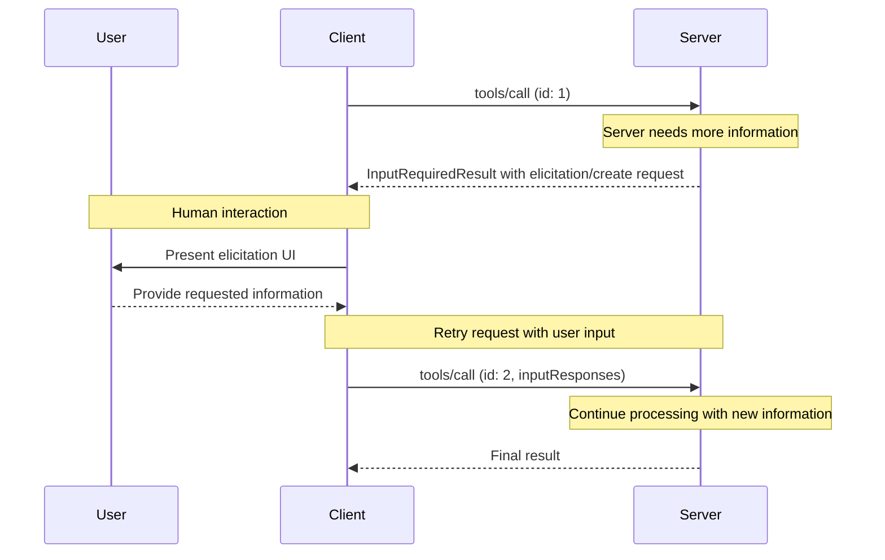
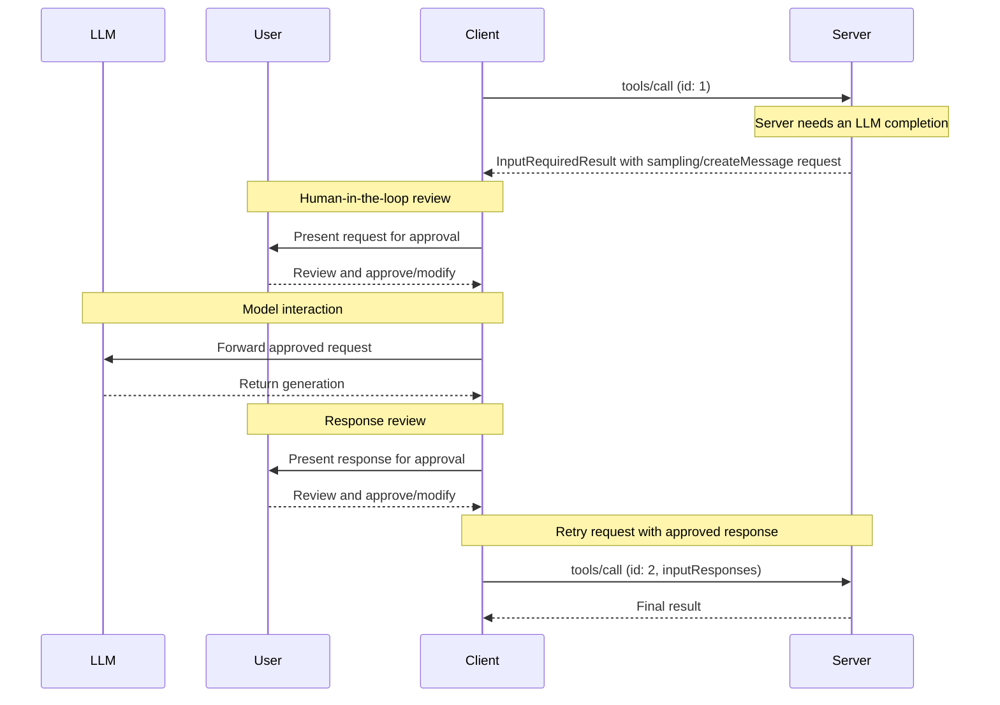

<BiRow>
<template #en>

MCP clients are instantiated by host applications to communicate with particular MCP servers. The host application, like Claude.ai or an IDE, manages the overall user experience and coordinates multiple clients. Each client handles one direct communication with one server.

</template>
<template #zh>

MCP 客户端由宿主应用实例化，用于与特定的 MCP 服务器通信。宿主应用（如 Claude.ai 或某个 IDE）负责整体用户体验，并协调多个客户端。每个客户端只处理与单个服务器之间的直接通信。

</template>
</BiRow>

<BiRow>
<template #en>

Understanding the distinction is important: the *host* is the application users interact with, while *clients* are the protocol-level components that enable server connections.

</template>
<template #zh>

理解这一区别很重要：*宿主*（host）是用户直接交互的应用，而*客户端*（client）是实现服务器连接的协议层组件。

</template>
</BiRow>

<BiRow>
<template #en>

## Core Client Features

</template>
<template #zh>

## 客户端核心功能

</template>
</BiRow>

<BiRow>
<template #en>

In addition to making use of context provided by servers, clients may provide several features to servers. These client features allow server authors to build richer interactions.

</template>
<template #zh>

客户端除了利用服务器提供的上下文之外，还可以向服务器提供若干功能。这些客户端功能让服务器作者能够构建更丰富的交互。

</template>
</BiRow>

<BiRow>
<template #en>

| Feature         | Explanation                                                                                                                                                                                                                                                   | Example                                                                                                                                |
| --------------- | ------------------------------------------------------------------------------------------------------------------------------------------------------------------------------------------------------------------------------------------------------------- | -------------------------------------------------------------------------------------------------------------------------------------- |
| **Elicitation** | Elicitation enables servers to request specific information from users during interactions, providing a structured way for servers to gather information on demand.                                                                                           | A server booking travel may ask for the user's preferences on airplane seats, room type or their contact number to finalize a booking. |
| **Roots**       | Roots allow clients to specify which directories servers should focus on, communicating intended scope through a coordination mechanism. Roots are [deprecated](https://modelcontextprotocol.io/specification/2026-07-28/deprecated) as of protocol version `2026-07-28`.                    | A server for booking travel may be given access to a specific directory, from which it can read a user's calendar.                     |
| **Sampling**    | Sampling allows servers to request LLM completions through the client, enabling an agentic workflow. This approach puts the client in complete control of user permissions and security measures. Sampling is deprecated as of protocol version `2026-07-28`. | A server for booking travel may send a list of flights to an LLM and request that the LLM pick the best flight for the user.           |

</template>
<template #zh>

| 功能                    | 说明                                                                                                                                                                                              | 示例                                                                                              |
| ----------------------- | --------------------------------------------------------------------------------------------------------------------------------------------------------------------------------------------------------------------------------------- | ------------------------------------------------------------------------------------------------- |
| **征询（elicitation）** | 征询让服务器能在交互过程中向用户征求特定信息，为服务器提供了一种按需收集信息的结构化方式。                                                                                                                  | 预订旅行的服务器可以询问用户的机票座位偏好、房型或联系电话，以完成预订。                                   |
| **根目录（roots）**     | 根目录允许客户端指定服务器应关注哪些目录，通过一种协调机制传达预期范围。根目录自协议版本 `2026-07-28` 起[已弃用](https://modelcontextprotocol.io/specification/2026-07-28/deprecated)。                        | 预订旅行的服务器可以被授权访问某个特定目录，并从中读取用户的日历。                                         |
| **采样（sampling）**    | 采样允许服务器通过客户端请求 LLM 补全，从而实现智能体工作流。这种方式让客户端完全掌控用户权限与安全措施。采样自协议版本 `2026-07-28` 起已弃用。                                                              | 预订旅行的服务器可以把一份航班列表发给 LLM，请 LLM 为用户挑选最佳航班。                                     |

</template>
</BiRow>

<BiRow>
<template #en>

### Elicitation

</template>
<template #zh>

### 征询

</template>
</BiRow>

<BiRow>
<template #en>

Elicitation enables servers to request specific information from users during interactions, creating more dynamic and responsive workflows.

</template>
<template #zh>

征询让服务器能够在交互过程中向用户征求特定信息，构建更动态、响应更及时的工作流。

</template>
</BiRow>

<BiRow>
<template #en>

#### Overview

</template>
<template #zh>

#### 概述

</template>
</BiRow>

<BiRow>
<template #en>

Elicitation provides a structured way for servers to gather necessary information on demand. Instead of requiring all information up front or failing when data is missing, servers can pause their operations to request specific inputs from users. This creates more flexible interactions where servers adapt to user needs rather than following rigid patterns.

</template>
<template #zh>

征询为服务器提供了一种按需收集所需信息的结构化方式。服务器不必预先要求用户提供全部信息，也不必在数据缺失时直接失败，而是可以暂停操作，向用户征求特定输入。由此形成更灵活的交互：服务器顺应用户需求调整，而不是拘泥于固定模式。

</template>
</BiRow>

<BiRow>
<template #en>

Elicitation supports two modes:

</template>
<template #zh>

征询支持两种模式：

</template>
</BiRow>

<BiRow>
<template #en>

* **Form mode**: The server asks the client to collect structured data from the user. The request includes a schema that the client uses to build an input form and validate the response.
* **URL mode**: The server provides a URL for the user to open. The interaction happens out of band and its data never passes through the client, which makes this mode suitable for sensitive flows such as credential entry or third-party OAuth authorization.

</template>
<template #zh>

* **表单模式（form mode）**：服务器请求客户端向用户收集结构化数据。请求中包含一个 schema，客户端用它构建输入表单并校验响应。
* **URL 模式（URL mode）**：服务器提供一个供用户打开的 URL。交互在带外（out of band）进行，数据绝不会经过客户端，因此该模式适用于凭据输入、第三方 OAuth 授权等敏感流程。

</template>
</BiRow>

<BiRow>
<template #en>

Elicitation follows the [Multi Round-Trip Requests](https://modelcontextprotocol.io/specification/2026-07-28/basic/patterns/mrtr) (MRTR) pattern. When a server needs user input while processing a request such as `tools/call`, it responds with an `InputRequiredResult` whose `inputRequests` field carries one or more `elicitation/create` requests. The client gathers the input and retries the original request, attaching the collected `inputResponses` and echoing back any `requestState` the server included.

</template>
<template #zh>

征询遵循[多次往返请求](https://modelcontextprotocol.io/specification/2026-07-28/basic/patterns/mrtr)（Multi Round-Trip Requests，MRTR）模式。当服务器在处理 `tools/call` 之类请求的过程中需要用户输入时，会返回一个 `InputRequiredResult`，其 `inputRequests` 字段携带一个或多个 `elicitation/create` 请求。客户端收集输入后重试原始请求，附上收集到的 `inputResponses`，并回传服务器附带的所有 `requestState`。

</template>
</BiRow>

<BiRow>
<template #en>

**Elicitation flow:**

</template>
<template #zh>

**征询流程：**

</template>
</BiRow>

<BiRow>
<template #en>



</template>
<template #zh>


</template>
</BiRow>

<BiRow>
<template #en>

The flow enables dynamic information gathering. Servers can request specific data when needed, users provide information through appropriate UI, and servers complete the retried request with the newly acquired context.

</template>
<template #zh>

这一流程实现了动态的信息收集：服务器可以在需要时请求特定数据，用户通过合适的 UI 提供信息，服务器再借助新获取的上下文完成重试请求的处理。

</template>
</BiRow>

<BiRow>
<template #en>

**Elicitation request example (delivered inside `InputRequiredResult.inputRequests`):**

</template>
<template #zh>

**征询请求示例（内嵌于 `InputRequiredResult.inputRequests` 中送达）：**

</template>
</BiRow>

<BiRow>
<template #en>

```typescript
{
  method: "elicitation/create",
  params: {
mode: "form",
message: "Please confirm your Barcelona vacation booking details:",
requestedSchema: {
  type: "object",
  properties: {
    confirmBooking: {
      type: "boolean",
      description: "Confirm the booking (Flights + Hotel = $3,000)"
    },
    seatPreference: {
      type: "string",
      enum: ["window", "aisle", "no preference"],
      description: "Preferred seat type for flights"
    },
    roomType: {
      type: "string",
      enum: ["sea view", "city view", "garden view"],
      description: "Preferred room type at hotel"
    },
    travelInsurance: {
      type: "boolean",
      default: false,
      description: "Add travel insurance ($150)"
    }
  },
  required: ["confirmBooking"]
}
  }
}
```

</template>
<template #zh>

```typescript
{
  method: "elicitation/create",
  params: {
mode: "form",
message: "Please confirm your Barcelona vacation booking details:",
requestedSchema: {
  type: "object",
  properties: {
    confirmBooking: {
      type: "boolean",
      description: "Confirm the booking (Flights + Hotel = $3,000)"
    },
    seatPreference: {
      type: "string",
      enum: ["window", "aisle", "no preference"],
      description: "Preferred seat type for flights"
    },
    roomType: {
      type: "string",
      enum: ["sea view", "city view", "garden view"],
      description: "Preferred room type at hotel"
    },
    travelInsurance: {
      type: "boolean",
      default: false,
      description: "Add travel insurance ($150)"
    }
  },
  required: ["confirmBooking"]
}
  }
}
```

</template>
</BiRow>

<BiRow>
<template #en>

#### Example: Holiday Booking Approval

</template>
<template #zh>

#### 示例：度假预订审批

</template>
</BiRow>

<BiRow>
<template #en>

A travel booking server demonstrates elicitation's power through the final booking confirmation process. When a user has selected their ideal vacation package to Barcelona, the server needs to gather final approval and any missing details before proceeding.

</template>
<template #zh>

旅行预订服务器以最后的预订确认环节为例，展示了征询的强大之处。当用户选定心仪的巴塞罗那度假套餐后，服务器需要先征得最终确认、补齐缺失的细节，才能继续。

</template>
</BiRow>

<BiRow>
<template #en>

The server elicits booking confirmation with a structured request that includes the trip summary (Barcelona flights June 15-22, beachfront hotel, total \$3,000) and fields for any additional preferences—such as seat selection, room type, or travel insurance options.

</template>
<template #zh>

服务器用一个结构化请求来征询预订确认，其中包含行程摘要（6 月 15-22 日的巴塞罗那航班、海滨酒店、总计 \$3,000），并附带可填写额外偏好的字段——例如座位选择、房型或旅行保险选项。

</template>
</BiRow>

<BiRow>
<template #en>

As the booking progresses, the server elicits contact information needed to complete the reservation. It might ask for traveler details for flight bookings, special requests for the hotel, or emergency contact information.

</template>
<template #zh>

随着预订推进，服务器还会征询完成预订所需的联系方式，例如航班预订所需的旅客信息、对酒店的特殊要求，或紧急联系人信息。

</template>
</BiRow>

<BiRow>
<template #en>

#### User Interaction Model

</template>
<template #zh>

#### 用户交互模型

</template>
</BiRow>

<BiRow>
<template #en>

Elicitation interactions are designed to be clear, contextual, and respectful of user autonomy:

</template>
<template #zh>

征询交互的设计目标是清晰、贴合上下文，并尊重用户的自主权：

</template>
</BiRow>

<BiRow>
<template #en>

**Request presentation**: Clients display elicitation requests with clear context about which server is asking, why the information is needed, and how it will be used. The request message explains the purpose while the schema provides structure and validation.

</template>
<template #zh>

**请求呈现**：客户端展示征询请求时，会清楚交代是哪个服务器在询问、为何需要这些信息以及将如何使用。请求消息说明用途，schema 则提供结构与校验。

</template>
</BiRow>

<BiRow>
<template #en>

**Response options**: Users can provide the requested information through appropriate UI controls (text fields, dropdowns, checkboxes), decline to provide information with optional explanation, or cancel the entire operation. Clients validate responses against the provided schema before returning them to servers.

</template>
<template #zh>

**响应选项**：用户可以通过合适的 UI 控件（文本框、下拉框、复选框）提供所需信息，可以拒绝提供并附上可选的说明，也可以取消整个操作。客户端会先按提供的 schema 校验响应，再返回给服务器。

</template>
</BiRow>

<BiRow>
<template #en>

**URL handling**: For URL mode, clients show the full URL and gather explicit consent before opening it, and never fetch the URL automatically. The client only learns whether the user consented. The interaction itself stays between the user and the target site.

</template>
<template #zh>

**URL 处理**：在 URL 模式下，客户端会展示完整 URL，征得用户明确同意后才打开，且绝不自动抓取该 URL。客户端只会知道用户是否同意，交互本身只发生在用户与目标站点之间。

</template>
</BiRow>

<BiRow>
<template #en>

**Privacy considerations**: Servers must not use form mode to request sensitive information such as passwords, API keys, access tokens, or payment credentials. Those interactions belong in URL mode, which keeps the data out of band so it never passes through the client or the LLM context. Clients warn about suspicious requests and let users review form data before sending.

</template>
<template #zh>

**隐私考量**：服务器不得使用表单模式索取密码、API key、access token 或支付凭据等敏感信息。这类交互应使用 URL 模式，让数据留在带外，绝不经过客户端或 LLM 上下文。客户端会对可疑请求发出警告，并让用户在发送前检查表单数据。

</template>
</BiRow>

<BiRow>
<template #en>

### Roots

</template>
<template #zh>

### 根目录

</template>
</BiRow>

<BiRow>
<template #en>

> **注意：**
> Roots are [deprecated](https://modelcontextprotocol.io/specification/2026-07-28/deprecated) as of protocol
  version `2026-07-28` and scheduled for removal. New implementations should
  pass directories or files via tool parameters, resource URIs, or server
  configuration instead.

</template>
<template #zh>

> **注意：**
> 根目录自协议版本 `2026-07-28` 起[已弃用](https://modelcontextprotocol.io/specification/2026-07-28/deprecated)并列入移除计划。新实现应改用工具参数、资源 URI 或服务器配置来传递目录或文件。

</template>
</BiRow>

<BiRow>
<template #en>

Roots define filesystem boundaries for server operations, allowing clients to specify which directories servers should focus on.

</template>
<template #zh>

根目录为服务器的操作划定文件系统边界，让客户端可以指定服务器应关注哪些目录。

</template>
</BiRow>

<BiRow>
<template #en>

#### Overview

</template>
<template #zh>

#### 概述

</template>
</BiRow>

<BiRow>
<template #en>

Roots are a mechanism for clients to communicate filesystem access boundaries to servers. They consist of file URIs that indicate directories where servers can operate, helping servers understand the scope of available files and folders. While roots communicate intended boundaries, they do not enforce security restrictions. Actual security must be enforced at the operating system level, via file permissions and/or sandboxing.

</template>
<template #zh>

根目录是客户端向服务器传达文件系统访问边界的机制，由一组文件 URI 组成，指明服务器可以在哪些目录中操作，帮助服务器理解可用文件与文件夹的范围。根目录传达的是预期边界，并不强制实施安全限制。真正的安全必须在操作系统层面通过文件权限和/或沙箱来保障。

</template>
</BiRow>

<BiRow>
<template #en>

**Root structure:**

</template>
<template #zh>

**根目录结构：**

</template>
</BiRow>

<BiRow>
<template #en>

```json
{
  "uri": "file:///Users/agent/travel-planning",
  "name": "Travel Planning Workspace"
}
```

</template>
<template #zh>

```json
{
  "uri": "file:///Users/agent/travel-planning",
  "name": "Travel Planning Workspace"
}
```

</template>
</BiRow>

<BiRow>
<template #en>

Roots are exclusively filesystem paths and always use the `file://` URI scheme. They help servers understand project boundaries, workspace organization, and accessible directories. The roots list can change as users work with different projects or folders. Servers pick up the updated boundaries the next time they request the roots list.

</template>
<template #zh>

根目录专指文件系统路径，且始终使用 `file://` URI 方案。它们帮助服务器理解项目边界、工作区组织结构和可访问的目录。随着用户切换不同的项目或文件夹，根目录列表也会变化；服务器会在下一次请求根目录列表时获知更新后的边界。

</template>
</BiRow>

<BiRow>
<template #en>

#### Example: Travel Planning Workspace

</template>
<template #zh>

#### 示例：旅行规划工作区

</template>
</BiRow>

<BiRow>
<template #en>

A travel agent working with multiple client trips benefits from roots to organize filesystem access. Consider a workspace with different directories for various aspects of travel planning.

</template>
<template #zh>

一个同时打理多位客户行程的旅行智能体，可以借助根目录来组织文件系统访问。设想一个工作区，为旅行规划的各个方面分别设有不同目录。

</template>
</BiRow>

<BiRow>
<template #en>

The client provides filesystem roots to the travel planning server:

</template>
<template #zh>

客户端向旅行规划服务器提供以下文件系统根目录：

</template>
</BiRow>

<BiRow>
<template #en>

* `file:///Users/agent/travel-planning` - Main workspace containing all travel files
* `file:///Users/agent/travel-templates` - Reusable itinerary templates and resources
* `file:///Users/agent/client-documents` - Client passports and travel documents

</template>
<template #zh>

* `file:///Users/agent/travel-planning` - 主工作区，存放所有旅行文件
* `file:///Users/agent/travel-templates` - 可复用的行程模板与资源
* `file:///Users/agent/client-documents` - 客户的护照与旅行证件

</template>
</BiRow>

<BiRow>
<template #en>

When the agent creates a Barcelona itinerary, well-behaved servers respect these boundaries—accessing templates, saving the new itinerary, and referencing client documents within the specified roots. Servers typically access files within roots by using relative paths from the root directories or by utilizing file search tools that respect the root boundaries.

</template>
<template #zh>

当智能体创建巴塞罗那行程时，行为良好的服务器会遵守这些边界——在指定的根目录内访问模板、保存新行程、引用客户证件。服务器访问根目录内的文件时，通常使用以根目录为基准的相对路径，或借助遵守根目录边界的文件搜索工具。

</template>
</BiRow>

<BiRow>
<template #en>

If the agent opens an archive folder like `file:///Users/agent/archive/2023-trips`, the client adds it to the roots list, and the server sees the new boundary on its next `roots/list` request.

</template>
<template #zh>

如果智能体打开了类似 `file:///Users/agent/archive/2023-trips` 的归档文件夹，客户端会把它加入根目录列表，服务器在下一次 `roots/list` 请求时就会看到新边界。

</template>
</BiRow>

<BiRow>
<template #en>

For a complete implementation of a server that respects roots, see the [filesystem server](https://github.com/modelcontextprotocol/servers/tree/main/src/filesystem) in the official servers repository.

</template>
<template #zh>

想要了解尊重根目录的服务器完整实现，请参阅官方 servers 仓库中的[文件系统服务器](https://github.com/modelcontextprotocol/servers/tree/main/src/filesystem)。

</template>
</BiRow>

<BiRow>
<template #en>

#### Design Philosophy

</template>
<template #zh>

#### 设计理念

</template>
</BiRow>

<BiRow>
<template #en>

Roots serve as a coordination mechanism between clients and servers, not a security boundary. The specification requires that servers "SHOULD respect root boundaries," and not that they "MUST enforce" them, because servers run code the client cannot control.

</template>
<template #zh>

根目录是客户端与服务器之间的协调机制，而非安全边界。规范要求服务器「SHOULD respect root boundaries」（应当尊重根目录边界），而非「MUST enforce」（必须强制执行），因为服务器运行的代码是客户端无法控制的。

</template>
</BiRow>

<BiRow>
<template #en>

Roots work best when servers are trusted or vetted, users understand their advisory nature, and the goal is preventing accidents rather than stopping malicious behavior. They excel at context scoping (telling servers where to focus), accident prevention (helping well-behaved servers stay in bounds), and workflow organization (such as managing project boundaries automatically).

</template>
<template #zh>

根目录最适合这样的场景：服务器可信或经过审核，用户理解其建议性质，且目标是防止误操作而非阻止恶意行为。它擅长上下文范围圈定（告诉服务器该聚焦哪里）、防止误操作（帮助行为良好的服务器守住边界）以及组织工作流（例如自动管理项目边界）。

</template>
</BiRow>

<BiRow>
<template #en>

#### User Interaction Model

</template>
<template #zh>

#### 用户交互模型

</template>
</BiRow>

<BiRow>
<template #en>

Roots are typically managed automatically by host applications based on user actions, though some applications may expose manual root management:

</template>
<template #zh>

根目录通常由宿主应用根据用户操作自动管理，不过有些应用也提供手动管理根目录的入口：

</template>
</BiRow>

<BiRow>
<template #en>

**Automatic root detection**: When users open folders, clients automatically expose them as roots. Opening a travel workspace allows the client to expose that directory as a root, helping servers understand which itineraries and documents are in scope for the current work.

</template>
<template #zh>

**自动检测根目录**：用户打开文件夹时，客户端会自动将其暴露为根目录。打开一个旅行工作区，客户端就可以把该目录暴露为根目录，帮助服务器了解当前工作涉及哪些行程和文档。

</template>
</BiRow>

<BiRow>
<template #en>

**Manual root configuration**: Advanced users can specify roots through configuration. For example, adding `/travel-templates` for reusable resources while excluding directories with financial records.

</template>
<template #zh>

**手动配置根目录**：高级用户可以通过配置来指定根目录。例如，添加 `/travel-templates` 以纳入可复用资源，同时排除包含财务记录的目录。

</template>
</BiRow>

<BiRow>
<template #en>

### Sampling

</template>
<template #zh>

### 采样

</template>
</BiRow>

<BiRow>
<template #en>

> **注意：**
> Sampling is [deprecated](https://modelcontextprotocol.io/specification/2026-07-28/deprecated) as of protocol
  version `2026-07-28` and scheduled for removal. New implementations should
  integrate directly with LLM provider APIs instead.

</template>
<template #zh>

> **注意：**
> 采样自协议版本 `2026-07-28` 起[已弃用](https://modelcontextprotocol.io/specification/2026-07-28/deprecated)并列入移除计划。新实现应改为直接集成 LLM 提供商的 API。

</template>
</BiRow>

<BiRow>
<template #en>

Sampling allows servers to request language model completions through the client, enabling agentic behaviors while maintaining security and user control.

</template>
<template #zh>

采样允许服务器通过客户端请求语言模型补全，在保持安全与用户掌控的同时实现智能体行为。

</template>
</BiRow>

<BiRow>
<template #en>

#### Overview

</template>
<template #zh>

#### 概述

</template>
</BiRow>

<BiRow>
<template #en>

Sampling enables servers to perform AI-dependent tasks without directly integrating with or paying for AI models. Instead, servers can request that the client—which already has AI model access—handle these tasks on their behalf. This approach puts the client in complete control of user permissions and security measures. Because sampling requests occur within the context of other operations—like a tool analyzing data—and are processed as separate model calls, they maintain clear boundaries between different contexts, allowing for more efficient use of the context window.

</template>
<template #zh>

采样让服务器无需直接集成 AI 模型或为其付费，就能执行依赖 AI 的任务——服务器可以转而请求已拥有 AI 模型访问权限的客户端代为处理。这种方式让客户端完全掌控用户权限与安全措施。采样请求发生在其他操作（如工具分析数据）的上下文之内，又作为独立的模型调用处理，因此在不同上下文之间保持了清晰边界，也让上下文窗口得到更高效的利用。

</template>
</BiRow>

<BiRow>
<template #en>

Sampling follows the same [Multi Round-Trip Requests](https://modelcontextprotocol.io/specification/2026-07-28/basic/patterns/mrtr) flow described under [elicitation](#elicitation), with the `InputRequiredResult` carrying a `sampling/createMessage` request.

</template>
<template #zh>

采样遵循[征询](#elicitation)一节所述的[多次往返请求](https://modelcontextprotocol.io/specification/2026-07-28/basic/patterns/mrtr)流程，只是 `InputRequiredResult` 携带的是 `sampling/createMessage` 请求。

</template>
</BiRow>

<BiRow>
<template #en>

Servers can also request tool use during sampling by including a `tools` array and an optional `toolChoice` field in the request. The tool definitions are scoped to that sampling request and do not need to correspond to tools the server exposes. Clients declare support through the `sampling.tools` capability, and servers must not send tool-enabled sampling requests to clients that have not declared it. See [sampling](https://modelcontextprotocol.io/specification/2026-07-28/client/sampling#tools-in-sampling) in the specification for details.

</template>
<template #zh>

服务器还可以在采样中请求使用工具，做法是在请求中加入 `tools` 数组和可选的 `toolChoice` 字段。这里的工具定义仅作用于该次采样请求，不必与服务器自身暴露的工具对应。客户端通过 `sampling.tools` 能力声明支持，服务器不得向未声明该能力的客户端发送带工具的采样请求。详见规范中的[采样](https://modelcontextprotocol.io/specification/2026-07-28/client/sampling#tools-in-sampling)。

</template>
</BiRow>

<BiRow>
<template #en>

**Sampling flow:**

</template>
<template #zh>

**采样流程：**

</template>
</BiRow>

<BiRow>
<template #en>



</template>
<template #zh>


</template>
</BiRow>

<BiRow>
<template #en>

The flow ensures security through multiple human-in-the-loop checkpoints. Users review and can modify both the initial request and the generated response before the client retries the original request with it.

</template>
<template #zh>

该流程通过多个人工介入（human-in-the-loop）检查点保障安全。用户可以先审阅并修改最初的请求与生成的响应，客户端再据此重试原始请求。

</template>
</BiRow>

<BiRow>
<template #en>

**Request parameters example:**

</template>
<template #zh>

**请求参数示例：**

</template>
</BiRow>

<BiRow>
<template #en>

```typescript
{
  messages: [
{
  role: "user",
  content: {
    type: "text",
    text: "Analyze these flight options and recommend the best choice:\n" +
          "[47 flights with prices, times, airlines, and layovers]\n" +
          "User preferences: morning departure, max 1 layover"
  }
}
  ],
  modelPreferences: {
hints: [{
  name: "claude-sonnet-4-20250514"  // Suggested model
}],
costPriority: 0.3,      // Less concerned about API cost
speedPriority: 0.2,     // Can wait for thorough analysis
intelligencePriority: 0.9  // Need complex trade-off evaluation
  },
  systemPrompt: "You are a travel expert helping users find the best flights based on their preferences",
  maxTokens: 1500
}
```

</template>
<template #zh>

```typescript
{
  messages: [
{
  role: "user",
  content: {
    type: "text",
    text: "Analyze these flight options and recommend the best choice:\n" +
          "[47 flights with prices, times, airlines, and layovers]\n" +
          "User preferences: morning departure, max 1 layover"
  }
}
  ],
  modelPreferences: {
hints: [{
  name: "claude-sonnet-4-20250514"  // Suggested model
}],
costPriority: 0.3,      // Less concerned about API cost
speedPriority: 0.2,     // Can wait for thorough analysis
intelligencePriority: 0.9  // Need complex trade-off evaluation
  },
  systemPrompt: "You are a travel expert helping users find the best flights based on their preferences",
  maxTokens: 1500
}
```

</template>
</BiRow>

<BiRow>
<template #en>

#### Example: Flight Analysis Tool

</template>
<template #zh>

#### 示例：航班分析工具

</template>
</BiRow>

<BiRow>
<template #en>

Consider a travel booking server with a tool called `findBestFlight` that uses sampling to analyze available flights and recommend the optimal choice. When a user asks "Book me the best flight to Barcelona next month," the tool needs AI assistance to evaluate complex trade-offs.

</template>
<template #zh>

设想一个旅行预订服务器，它有一个名为 `findBestFlight` 的工具，利用采样分析可用航班并推荐最优选择。当用户说「帮我订下个月飞巴塞罗那的最佳航班」时，这个工具需要 AI 协助来评估复杂的取舍。

</template>
</BiRow>

<BiRow>
<template #en>

The tool queries airline APIs and gathers 47 flight options. It then requests AI assistance to analyze these options: "Analyze these flight options and recommend the best choice: \[47 flights with prices, times, airlines, and layovers] User preferences: morning departure, max 1 layover."

</template>
<template #zh>

该工具查询各航空公司的 API，收集到 47 个航班选项，随后请求 AI 协助分析：「分析这些航班选项并推荐最佳选择：\[47 个航班的价格、时间、航空公司和中转信息] 用户偏好：早班出发、最多中转 1 次。」

</template>
</BiRow>

<BiRow>
<template #en>

The client initiates the sampling request, allowing the AI to evaluate trade-offs—like cheaper red-eye flights versus convenient morning departures. The tool uses this analysis to present the top three recommendations.

</template>
<template #zh>

客户端发起采样请求，让 AI 评估各种取舍——比如更便宜的红眼航班与更方便的早班出发之间的权衡。工具再依据这份分析给出前三个推荐。

</template>
</BiRow>

<BiRow>
<template #en>

#### User Interaction Model

</template>
<template #zh>

#### 用户交互模型

</template>
</BiRow>

<BiRow>
<template #en>

While not a requirement, sampling is designed to allow human-in-the-loop control. Users can maintain oversight through several mechanisms:

</template>
<template #zh>

尽管不是强制要求，采样在设计上支持人工介入控制。用户可以通过多种机制保持监督：

</template>
</BiRow>

<BiRow>
<template #en>

**Approval controls**: Sampling requests may require explicit user consent. Clients can show what the server wants to analyze and why. Users can approve, deny, or modify requests.

</template>
<template #zh>

**批准控制**：采样请求可以要求用户明确同意。客户端可以展示服务器想分析什么、为什么需要分析。用户可以批准、拒绝或修改请求。

</template>
</BiRow>

<BiRow>
<template #en>

**Transparency features**: Clients can display the exact prompt, model selection, and token limits, allowing users to review AI responses before they return to the server.

</template>
<template #zh>

**透明度特性**：客户端可以展示确切的提示词、所选模型和 token 上限，让用户在 AI 响应返回服务器之前先行审阅。

</template>
</BiRow>

<BiRow>
<template #en>

**Configuration options**: Users can set model preferences, configure auto-approval for trusted operations, or require approval for everything. Clients may provide options to redact sensitive information.

</template>
<template #zh>

**配置选项**：用户可以设置模型偏好、为可信操作配置自动批准，或要求一切操作均须批准。客户端还可以提供敏感信息脱敏选项。

</template>
</BiRow>

<BiRow>
<template #en>

**Security considerations**: Both clients and servers must handle sensitive data appropriately during sampling. Clients should implement rate limiting and validate all message content. The human-in-the-loop design ensures that server-requested AI interactions cannot compromise security or access sensitive data without explicit user consent.

</template>
<template #zh>

**安全考量**：客户端和服务器在采样过程中都必须妥善处理敏感数据。客户端应实施速率限制并校验所有消息内容。人工介入的设计确保服务器发起的 AI 交互在未获得用户明确同意的情况下，既无法危及安全，也无法访问敏感数据。

</template>
</BiRow>
