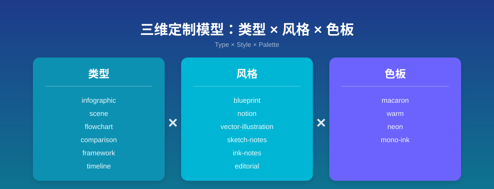
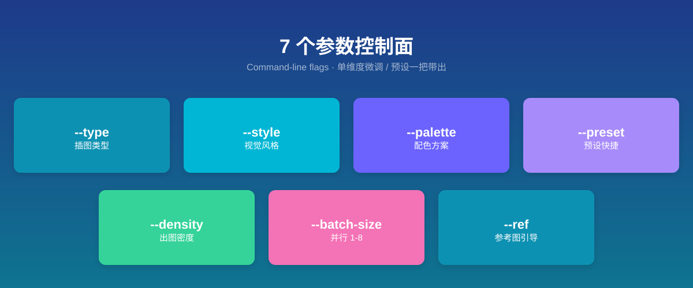
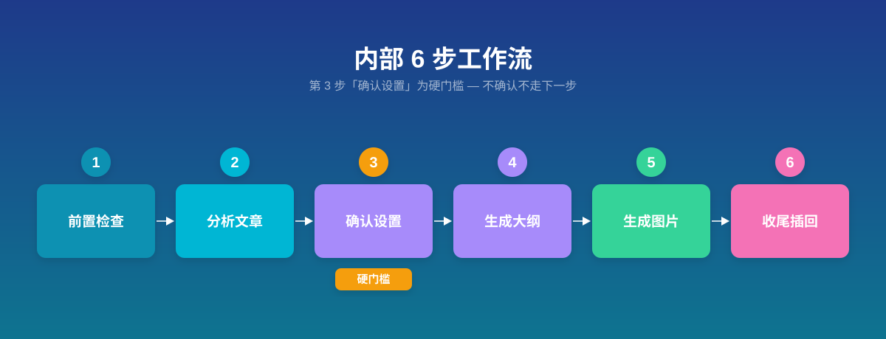

## 它是什么

`baoyu-article-illustrator` 是一个「文章配图」skill：你给它一篇写好的文章，它读完之后自动判断哪些地方该配图、按统一风格批量生成插图、再把图片插回原文对应段落。整个过程围绕「类型 × 风格 × 色板」三个维度组织，保证一篇文章里的多张图视觉调性一致，而不是东拼西凑。



## 解决什么问题 / 何时用

写完一篇文章后想配图，常常会遇到这些麻烦：不知道哪里该放图、一张张想内容太耗精力、手挑风格很难统一。这个 skill 把「读文章 → 定位配图点 → 按统一风格出图 → 插回原文」打包成一次调用，专门解决「给一篇成品文章批量配风格一致的插图」这件事。

适合在这些场景下想起它：

- 你有一篇写好的 Markdown 文章（或一段粘贴进来的正文），想给它配几张插图
- 想让一篇文章里所有插图的风格、配色保持统一
- 不想手动一张张构思内容、写提示词，希望 skill 帮你分析文章后自动安排

触发它的关键词包括「为文章配图」「给这篇文章加插图」「illustrate article」「add images」「generate images for article」。

## 怎么调用

既可以用自然语言（直接说「为这篇文章配图」并把文件路径给出来），也可以用 slash command 显式触发。常用形式是 `/baoyu-article-illustrator <文章路径>`，再用一组可选参数微调。

### 输入方式

| 方式 | 怎么给 | 图片默认存哪 |
|------|--------|--------------|
| 文件路径 | 把 `.md` 文件路径作为参数传入 | 由偏好里的 `default_output_dir` 决定（首次运行会让你选） |
| 粘贴内容 | 不给路径，直接把正文粘进来 | `illustrations/{topic-slug}/` |

### 参数

| 参数 | 作用 |
|------|------|
| `--type <名称>` | 插图类型，控制信息结构：`infographic`（数据/技术）、`scene`（叙事/情感）、`flowchart`（流程）、`comparison`（对比）、`framework`（架构/模型）、`timeline`（历史/演进） |
| `--style <名称>` | 视觉风格，控制渲染方式：`blueprint`、`notion`、`vector-illustration`、`sketch-notes`、`ink-notes`、`editorial`、`watercolor`、`screen-print` 等 |
| `--palette <名称>` | 配色方案（可选），覆盖风格自带颜色：`macaron`、`warm`、`neon`、`mono-ink` 等 |
| `--preset <名称>` | 预设快捷方式，一条命令带出「类型 + 风格（+ 色板）」组合，如 `hand-drawn-edu`、`tech-explainer`、`storytelling` |
| `--density <级别>` | 出图密度：`minimal`（1-2 张）、`balanced`（3-5 张）、`per-section`（推荐，按章节配）、`rich`（6 张以上） |
| `--batch-size <n>` | 本次并行出图数，范围 1-8，默认 4 |
| `--ref <文件…>` | 参考图，用来引导某张图的风格、构图、配色或主体 |

三个维度可以自由组合，例如 `--type infographic --style vector-illustration --palette macaron`；也可以图省事用 `--preset edu-visual` 一把带出。显式传的 `--type` / `--style` 会覆盖预设里的对应维度。



## 用法示例

### 示例 1：典型用法——给一篇技术文章配图

**场景**：你写了一篇 API 设计的文章，里面有不少数据和系统指标，想配几张偏技术、风格统一的图。

**触发**：

```bash
/baoyu-article-illustrator api-design.md --type infographic --style blueprint
```

或者用预设等价表达：

```bash
/baoyu-article-illustrator api-design.md --preset tech-explainer
```

**会发生什么**：skill 读完文章后，会先用一次提问和你确认类型、密度、风格、色板等设置；确认后生成一份 `outline.md`（列出每张图的位置、用途、视觉内容、文件名），再为每张图写好 prompt 文件并批量出图，最后把 `` 这样的引用插回原文对应段落，并给出完成报告。

### 示例 2：进阶——预设加单维度覆盖，或直接粘贴内容

**场景**：你想用某个预设省事，但又想单独把风格换成另一种；或者文章还没存成文件，直接拿正文配图。

**触发**：

```bash
# 用预设的「类型」，但把风格单独换成 notion
/baoyu-article-illustrator article.md --preset tech-explainer --style notion

# 不给路径，直接粘贴正文
/baoyu-article-illustrator
[这里粘贴文章正文]
```

**会发生什么**：第一种会按预设出 `infographic` 类型的图，但风格改用 `notion`；第二种因为没有文件路径，会进入粘贴模式，图片统一存到 `illustrations/{topic-slug}/` 目录，正文也会一并保存进去留档。

### 示例 3：边界——这些事它会拒绝

**场景**：你想让它直接吐一段 SVG 或 HTML 当「图」应付过去，或者出图后发现图上的文字拼错了，想用脚本在位图上涂改掩盖。

**会发生什么**：这两种都会被 skill 明确拒绝。它有两条硬规则——绝不用 SVG、HTML、canvas 等代码方式替代位图出图；也绝不在已生成的位图上用代码涂抹、覆盖、重写文字。文字错了只能改 prompt 文件、重新生成一张新图（旧的保留下来便于对比）。

## 内部工作流概览

一次完整运行大致经历这几步（用大白话说，不是照搬源文档的步骤编号）：

1. **前置检查与偏好加载**：先读 `EXTEND.md` 偏好文件。如果是第一次跑、找不到这个文件，会先拦着你做一次首次配置（选水印、默认风格、输出目录、保存位置），生成 `EXTEND.md` 后才进入正流程。同时确认用哪个出图后端。
2. **分析文章**：判断文章的内容类型（技术/教程/方法论/叙事）、配图目的、核心论点，以及哪些位置放图最有价值。一个关键原则是：遇到隐喻要可视化它背后的概念，而不是把比喻字面画出来。
3. **确认设置（硬门槛）**：用一次提问把类型、密度、风格、色板（必要时还有语言）摆出来让你确认。这一步是强制的，没确认不会往下走——除非你在当次消息里明说「直接生成 / 不用确认 / 跳过确认 / 按默认出图」。
4. **生成大纲**：产出一份 `outline.md`，写清每张图放在哪、为什么放、画什么、文件名叫什么。
5. **生成图片**：先把每张图的完整 prompt 写成独立文件存到 `prompts/` 下，然后才出图。出图按批次并行（默认一批 4 张），单张失败会重试一次，不会牵连其他图。
6. **收尾**：把图片引用按相对路径插回文章对应段落，并打印一份完成报告（文章路径、类型、密度、风格、色板、出图张数）。



## 适用人群 / 前置依赖

适合经常写技术博客、知识科普、教程或叙事类文章，又想给文章配风格统一插图的人。它尤其擅长处理「一篇文章要多张图且要保持调性一致」的需求。

使用前需要留意几件事：

- **需要一个可用的位图出图后端**。skill 会按优先级自动选：先看当前运行时有没有原生出图工具（如 Codex 的 `imagegen`、Cursor 的 `GenerateImage`、Hermes 的 `image_generate`），没有再回退到已安装的非原生后端（如 `baoyu-image-gen`）；都没有时会直接告诉你并询问怎么办。
- **首次运行需要做一次偏好配置**，生成 `EXTEND.md`（内容包括水印、默认风格、输出目录、保存位置）。
- **运行在支持内置用户输入工具（如 `AskUserQuestion`）的 agent 运行时里体验最佳**；如果没有这类工具，会退化为编号问答。

## 常见问题 / 故障排查

- **第一次跑被拦下来问一堆设置**：那是首次配置流程（生成 `EXTEND.md`），填完水印、风格、输出目录、保存位置才会进入正流程，之后同一套偏好就不会再问。想改的话直接编辑 `EXTEND.md`，或者对它说「重新配置 baoyu-article-illustrator preferences」触发重配。
- **想换个出图后端**：编辑 `EXTEND.md` 的 `preferred_image_backend` 字段。常用取值有 `auto`（默认，自动选）、`codex-imagegen`（钉死用 Codex 内置）、`baoyu-image-gen`（钉死用这个 skill）、`ask`（每次都问你）。
- **生成的图上文字拼错或糊了**：按硬规则，不能拿 ImageMagick、Pillow、SVG 之类的代码在位图上涂改修补。正确做法是改写 prompt 文件、换一个新的输出路径重新生成一张，把旧的有问题的图留作对比。
- **确认环节想跳过**：必须在当前这条消息里明说，比如「直接生成」「不用确认」「跳过确认」「按默认出图」。只靠预设或文件路径不算授权跳过。
- **出图好像有点慢**：部分后端（如 glm-image）前 1-2 次尝试偶尔会空转重试，属于正常现象，等它重试完成即可；也可以用 `--batch-size` 调整并行出图数。

## 能做 / 不能做边界

**能做**：

- 读完文章自动定位该配图的位置，按「类型 × 风格 × 色板」三维批量出图
- 支持预设快捷、单维度覆盖、参考图引导、多种输出目录策略
- 自动把图片引用插回原文对应段落
- 跨多种运行时（Codex / Cursor / Hermes / 其他）自动选用原生出图后端

**不能做**：

- 不会用 SVG、HTML、canvas 等代码方式替代位图出图（硬规则）
- 不会在已生成的位图上用代码涂抹、覆盖、重写文字（硬规则，文字错了只能改 prompt 重出）
- 不会在 prompt 文件落盘之前就开始出图（prompt 文件是硬性前置）
- 不会跳过确认环节，除非你在当次消息里明确要求跳过


## 小结

如果你有一篇写好的文章、想要一批风格统一的插图，把它交给 `baoyu-article-illustrator` 就够了——它会读完文章、安排好每张图的位置与内容、按你确认的风格批量出图，最后把图稳稳地插回原文。
