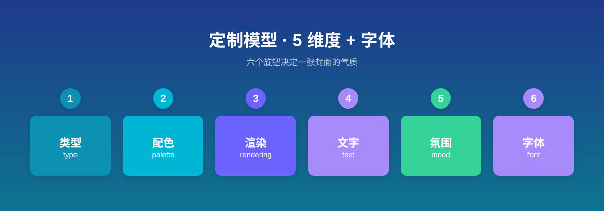
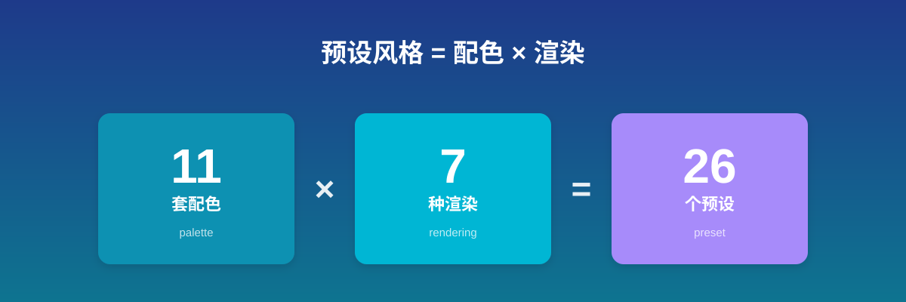
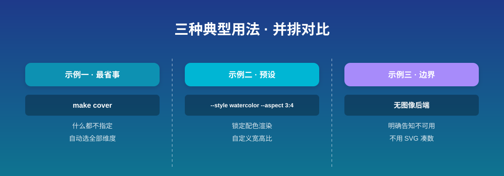
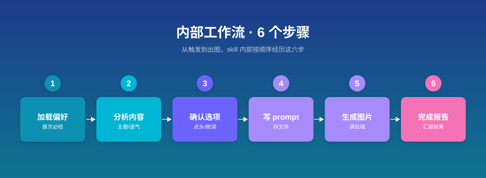
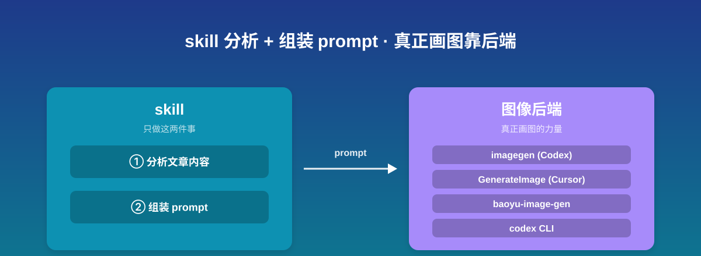
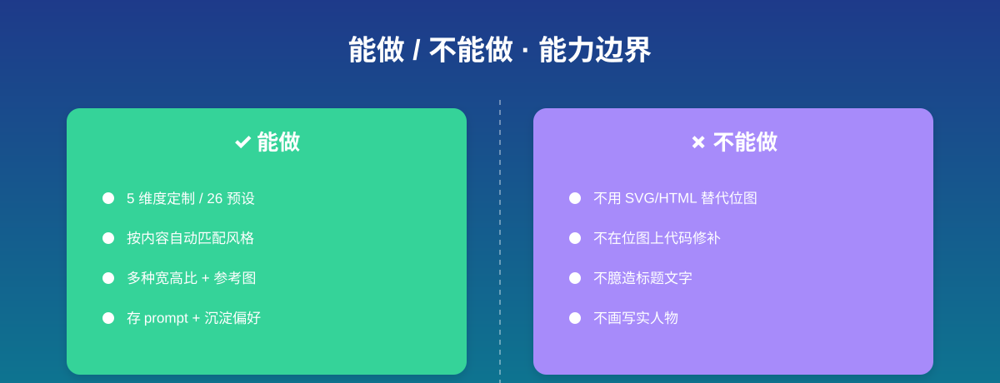

## 这个 skill 能做什么

baoyu-cover-image 是一个文章封面图生成器。它读取你的文章内容，通过 5 个维度（类型、配色、渲染风格、文字、氛围）外加字体来定制封面，最后调用图像生成后端产出一张位图封面。内置 11 套配色、7 种渲染风格，以及 26 个一键调用的预设风格组合，支持 16:9、2.35:1、1:1、4:3、3:2、3:4 等多种宽高比。

## 什么时候会用到它

写完一篇文章、需要配一张有质感且贴合文章气质的封面图时。它尤其适合不想用千篇一律的模板图、希望按内容主题自动匹配视觉风格的人——比如技术文章想要冷色数字风格、个人随笔想要暖色手绘风、教育内容想要马卡龙色配粉笔风。

## 怎么调用

这是一个第三方 skill（来自 JimLiu 的 baoyu-skills 仓库），通过自然语言触发，没有固定的 slash 命令。当你安装并启用该 skill 后，对 Claude 说类似下面的话即可触发：

- "generate cover image"（生成封面图）
- "create article cover"（给这篇文章做个封面）
- "make cover"（做个封面）

触发后，skill 会进入它的工作流（见下文）。

### 参数（可选）

你可以在一句话里带上参数来精确控制，也可以什么都不带让它自动选择。完整参数如下：

| 参数 | 作用 | 取值 |
|------|------|------|
| `--type` | 封面类型 | hero / conceptual / typography / metaphor / scene / minimal |
| `--palette` | 配色 | warm / elegant / cool / dark / earth / vivid / pastel / mono / retro / duotone / macaron |
| `--rendering` | 渲染风格 | flat-vector / hand-drawn / painterly / digital / pixel / chalk / screen-print |
| `--style` | 预设风格组合（一次定配色+渲染） | elegant / blueprint / chalkboard / pixel-art / watercolor 等 26 个 |
| `--text` | 文字密度 | none / title-only / title-subtitle / text-rich |
| `--mood` | 氛围强度 | subtle / balanced / bold |
| `--font` | 字体 | clean / handwritten / serif / display |
| `--aspect` | 宽高比 | 16:9（默认）/ 2.35:1 / 4:3 / 3:2 / 1:1 / 3:4 |
| `--lang` | 标题语言 | en / zh / ja 等 |
| `--no-title` | 不要标题（等同 `--text none`） | — |
| `--quick` | 跳过确认，直接用自动选择出图 | — |
| `--ref <文件>` | 提供参考图，用于风格 / 构图引导 | — |

关于 `--style`：它是「配色 + 渲染」的预设速记，省去你分别指定两个维度。常用的有 `elegant`（优雅手绘）、`blueprint`（冷色蓝图）、`chalkboard`（黑板粉笔）、`pixel-art`（像素风）、`watercolor`（水彩）、`minimal`（极简单色）、`nature`（自然大地色手绘）等共 26 个。预设可以被显式参数覆盖——比如 `--style blueprint --rendering hand-drawn` 会保留蓝图配色，但把渲染换成手绘。

### 关于自动选择

如果你不指定某个维度，skill 会根据文章内容的关键词信号自动挑选。例如检测到「架构、系统、API、技术」会选 conceptual 类型配 cool 配色；检测到「故事、旅行、生活」会选 scene 类型配 warm 配色；检测到「教育、教程」会选 macaron 配色配 chalk 渲染。这套规则覆盖全部 5 个维度，所以最省事的做法是什么参数都不带，让它读完文章自己定，你只需在确认环节点头或微调。

## 用法示例

### 示例一：最省事——什么都不指定

**场景**：刚写完一篇博客，想最快拿到一张配得上的封面，懒得逐项挑参数。

**触发**："给这篇文章生成封面图"（或 "make cover"），把文章内容贴给它或指明文章路径。

**会发生什么**：skill 先加载你的偏好（第一次用会强制走一遍首次设置，见下文）。然后分析文章的主题、语气、关键词，自动选出 5 个维度加字体的组合，在确认环节把推荐方案连同理由一次性摆给你看（类型为什么选这个、配色为什么选这套）。你确认后，它写出 prompt 文件、调用图像后端出图，最后给你一份完成报告（含主题、各维度取值、标题、输出路径）。

### 示例二：用预设风格 + 自定义宽高比

**场景**：你知道想要什么调子——比如想要水彩质感、竖图发小红书。

**触发**："make cover --style watercolor --aspect 3:4"

**会发生什么**：`--style watercolor` 直接锁定为 earth 配色加 painterly 渲染，`--aspect 3:4` 定竖屏比例。确认环节会基于这个预设展示方案（其余未指定的维度如类型、文字、氛围仍走自动选择）。生成后图片落到你设定的输出目录，按 3:4 比例输出。如果你信任它的自动选择、还想跳过确认，可在任意调用上叠加 `--quick`，它会绕过确认环节直接出图。

### 示例三（边界）：它不会用代码画图代替真出图

**场景**：你所在的环境没有任何可用的位图图像生成后端（既没有 Codex 的 imagegen、Cursor 的 GenerateImage，也没装 baoyu-image-gen），你想让它"先用 SVG 凑合画一个"。

**会发生什么**：skill 会明确告诉你当前没有可用的光栅图像后端，并询问你接下来怎么办。它**不会**偷偷用 SVG、HTML、canvas 或任何代码方式渲染一张图来交差——哪怕内容看起来像图表也不行，这是它写死的边界。解决办法是先装好一个图像后端再调用。

## 它内部会经历哪几步

理解它的流程，能帮你预判它的行为：

1. **加载偏好（首次必经）**：先找 `EXTEND.md` 偏好文件。第一次用找不到时，它会强制你走一遍首次设置（问你水印、默认类型 / 配色 / 渲染、默认宽高比、输出目录、是否快速模式、偏好存哪），存好才继续——这一步是阻塞的，没完成不会问你文章内容。
2. **分析内容**：保存你给的参考图（如果有）、保存源文章、分析主题与语气、检测语言、确定输出目录。
3. **确认选项**：把 5 个维度加字体的推荐方案摆给你看，等你点头或改。这一步默认必走，除非你显式说"跳过确认 / 直接生成"，或带上 `--quick`。
4. **写 prompt**：把完整最终 prompt 存成文件（作为可复现的记录），再调用后端。
5. **生成图片**：按规则选定图像后端（运行时原生工具优先，否则回退到已装的非原生后端，有多个就问你一次），调它出图。失败会自动重试一次。
6. **完成报告**：汇报主题、各维度取值、标题、语言、水印、参考图数量、文件位置。

## 适合谁用 / 需要准备什么

**适合**：经常写文章、需要配封面图、希望封面贴合内容气质的人。无论写技术博客、个人随笔还是教育教程，它都有对应的视觉风格。

**前置依赖（关键）**：你必须有一个可用的**位图图像生成后端**。skill 本身只负责分析内容和组装 prompt，真正画图靠后端。常见的后端有：

- Codex 的 `imagegen`（如果你在 Codex 运行时里）
- Cursor 的 `GenerateImage`（如果你在 Cursor 里）
- 其他运行时原生图像工具
- 已安装的非原生后端，如 `baoyu-image-gen` 技能、`codex` CLI（需先 `codex login`）

如果以上一个都没有，skill 会停下问你怎么办——它不会用 SVG / HTML 代码图凑数。

## 常见问题

- **第一次用被问一堆问题**：那是首次设置，问完就存进 `EXTEND.md`，以后不再问。问的全是默认偏好（水印、类型、配色、渲染、宽高比、输出目录、快速模式、保存位置），可放心选推荐项。
- **每次都要确认很烦**：在偏好里设 `quick_mode: true`，或每次带上 `--quick`，就跳过确认直接出图。
- **想换图像后端**：改 `EXTEND.md` 里的 `preferred_image_backend`（`auto` 自动选 / 指定某个 / `ask` 每次问你）。
- **生成的标题文字错了或糊了**：不能让它用代码在图上修补覆盖——它的规则是重新生成。改 prompt、换个低文字密度的方案（如 `--text none`），或重出一张。
- **想重新配置偏好**：删掉 `EXTEND.md`，或说"重新配置 baoyu-cover-image preferences"，下次运行会重新触发首次设置。

## 能做 / 不能做

**能做**：

- 按 5 个维度加字体定制封面，或用 26 个预设风格一键定型
- 根据文章内容自动匹配视觉风格（不指定参数也能出方案）
- 支持 16:9、2.35:1、1:1、4:3、3:2、3:4 等多种宽高比
- 接受参考图做风格 / 构图引导（若图中含人物，按后端是否支持 `--ref` 分两种处理方式）
- 把每次的 prompt 存成文件，方便复现和换后端
- 通过偏好文件沉淀你的默认习惯

**不能做**：

- 不用 SVG、HTML、canvas 或任何代码方式代替位图出图（哪怕内容像图表也不行）
- 不在已生成的位图上用代码修补、覆盖、重写标题文字（错就重生成）
- 不臆造标题——标题严格取自你的文章或输入
- 不画写实人物——人物只用简化剪影

## 小结

baoyu-cover-image 把"给文章配封面"这件费心事自动化了：它读懂你的文章、按内容气质匹配视觉风格、组装 prompt、调用图像后端出图。你要做的主要是在确认环节点头或微调，以及确保有一个可用的图像后端。懒得挑参数就什么都不带让它自动选，想要特定调子就用 `--style` 预设或逐项指定。
