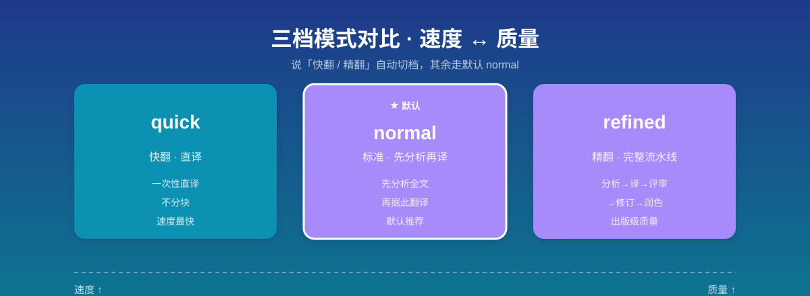
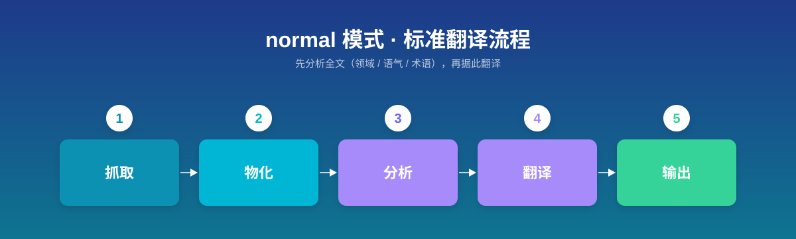
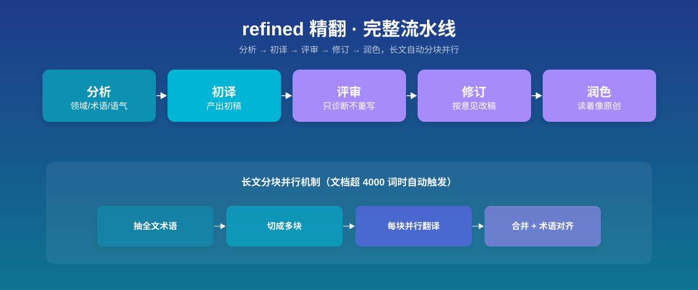
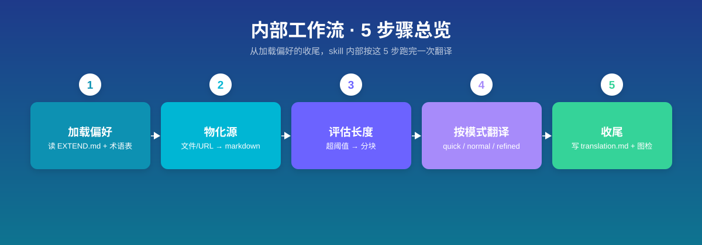

输入一篇文章、一个文件或一条 URL，产出一份读起来像母语写作者原创的目标语言译文。提供「快翻 / 标准 / 精翻」三档模式，支持自定义术语表，长文自动分块并行翻译。

## 它解决什么问题 / 什么时候用

机器翻译最让人头疼的不是「翻错」，而是「翻译腔」——句子生硬、术语前后不一致、长文章翻到后半段就丢了前文语境。当你想把一篇英文博客译成中文、把日文文档本地化、或对一份重要稿件做出版级精翻时，就轮到这个 skill 出场。它会在落笔前先分析全文的领域、术语和语气，再据此翻译；精翻模式还会跑一遍「初译 → 评审 → 修订 → 润色」完整流水线。只要你的意图是「翻译 / 精翻 / 快翻 / 改成中文 / 本地化 / 这篇文章翻译一下」，它都会接管。


## 怎么调用

**触发方式**：自然语言关键词即可，常用入口包括：

- `翻译 article.md` / `把这篇文章翻译一下 <URL>`
- `精翻` / `快翻` / `改成中文` / `改成英文` / `本地化` / `translate to Chinese`

**可指定的选项**（在请求里用自然语言带出即可）：

| 选项 | 作用 | 默认值 |
|------|------|--------|
| 模式 | `quick`（直译）/ `normal`（先分析再译）/ `refined`（分析→译→评审→修订→润色） | `normal` |
| 目标语言 | 译成哪种语言（`zh-CN` / `en` / `ja` …） | `zh-CN` |
| 受众 | `general` / `technical` / `academic` / `business` 或自定义描述，影响译者注密度 | `general` |
| 风格 | `storytelling` / `formal` / `technical` / `elegant` 等 9 种预设或自定义 | `storytelling` |
| 术语表 | 自定义术语对照（EXTEND.md 配置或 `--glossary` 文件） | 内置英→中术语表 |

**模式自动识别**：说「快翻 / quick / 直接翻译」→ quick；说「精翻 / refined / proofread / publication quality」→ refined；其余走默认 normal。



> 首次使用时，skill 会强制先问你一遍偏好（目标语言 / 模式 / 受众 / 风格 / 保存位置），存成 EXTEND.md 后才开工——这是设计如此，不是卡住。

## 用法示例

### 示例 1：典型用法（默认标准模式翻译一篇博客）

**场景**：看到一篇不错的英文技术博客，想译成中文存档。

**触发**：

```
把这篇文章翻译一下 https://example.com/why-transformers-work
```

**会发生什么**：skill 进入默认的 normal 模式，先把源文抓下来物化、建好输出目录，接着分析全文（领域 / 语气 / 术语 / 翻译难点）并组装翻译指令，再据此翻译。最终在输出目录产出 `translation.md`（完整译文），完成后提示你「回复 继续润色 可进一步评审打磨」。中间产物（`01-analysis.md`、`02-prompt.md`）也保留在输出目录里。



### 示例 2：进阶用法（精翻一篇长技术文档 + 指定受众与风格）

**场景**：要交付一份正式的技术架构文档，要求出版级质量、面向开发者、文风克制。

**触发**：

```
精翻 docs/architecture.md，面向开发者，风格 technical
```

**会发生什么**：触发 refined 模式。因为说了「精翻」，skill 走完整流水线：分析 → 初译 → 评审（只诊断不重写，查准确性 / 翻译腔 / 译者注）→ 修订（按评审意见改）→ 润色。文档超过分块阈值（默认 4000 词）时会先抽出全文术语、切成多块、每块派一个子代理并行翻译，再合并；术语靠共享的 `02-prompt.md` 保证前后一致。输出目录里会留下 `01-analysis.md` 到 `05-revision.md` 全套中间稿，以及最终 `translation.md`。



### 示例 3：边界用法（让它直接改掉图片里的外文）

**场景**：文章里嵌了几张带英文标注的架构图，想让译文版连图也一起本地化。

**触发**：

```
翻译这篇文章，顺便把图里的英文标注也替换成中文
```

**会发生什么**：skill 只翻译正文文字，**不会**自动改写或替换图片里的文字。它会在译文末尾列出一份「可能需要本地化的图片」清单（标注哪张图疑似仍含源语言文字），把后续图片处理留给你手动完成。

## 内部工作流概览

1. **加载偏好**：读 EXTEND.md（首次没有则强制问你一遍并存盘），合并内置术语表与自定义术语表
2. **物化源 + 建目录**：文件直接用，内联文本 / URL 存成 `translate/<slug>.md`；在源文件旁建 `<源名>-<目标语言>/` 输出目录（已存在则自动备份，绝不覆盖）
3. **评估长度**：超阈值（默认 4000 词）→ 抽术语、分块、并行翻译再合并；否则整篇译
4. **按模式翻译**：quick 直译；normal 分析后再译；refined 分析 → 初译 → 评审 → 修订 → 润色
5. **收尾**：最终译文固定写到 `translation.md`，并做一遍「图片语言」检查，列出可能仍含源语言文字的图片



## 适用人群 / 前置依赖

**适合谁**：写作者、博主、技术文档维护者、研究者——任何需要把外文内容译成中文（或反向）且在意「读起来像原创」的人。

**前置依赖**：需要 `bun` 或 `npx`（二选一）。装了 `bun` 直接用；没有则用 `npx -y bun` 兜底。分块翻译依赖脚本 `scripts/main.ts`。

## 常见问题 / 故障排查

- **第一次用被问一堆问题，是不是出错了？** 不是。首次找不到 EXTEND.md 时会强制走偏好设置（目标语言 / 模式 / 受众 / 风格 / 保存位置），答完存盘才开始翻译。之后改偏好可直接编辑 EXTEND.md，或删掉它重新触发设置。
- **quick 模式翻长文章，术语前后不一致？** quick 不分块、一次性直译，长内容容易术语漂移。skill 会主动提醒「这篇约 N 词，quick 不分块，切 normal 效果更好」，要不要切由你定。
- **输出目录已经存在会被覆盖吗？** 不会。旧目录会被重命名为 `<名>.backup-时间戳/` 备份，再建新目录。
- **术语表怎么生效？** 优先级从高到低：CLI `--glossary` 文件 > EXTEND.md 语言对术语 > EXTEND.md 内联术语 > EXTEND.md 外部术语文件 > 内置术语表；后者被前者覆盖。

## 能做 / 不能做

**能做**：

- 三档模式翻译，精翻走完整「分析 → 译 → 评审 → 修订 → 润色」流水线
- 自定义术语表（EXTEND.md 内联 / 外部文件 / CLI），长文自动抽术语 + 分块并行翻译
- 保留全部 markdown 格式；处理 frontmatter（源字段加 `source` 前缀，译文作为新顶层字段）
- 按受众自动加「粗体括号」译者注；译完做图片语言检查并提醒

**不能做**：

- 不自动本地化图片里的文字（只列出待处理清单）
- quick 模式不分块（长文术语一致性弱于 normal / refined）
- 不会编辑或改动你的源文件（只读源、产物写到新建的输出目录）

## 小结

三档模式 + 术语表 + 分块并行，把「翻译」从直译拔高到「读着像母语原创」。
